# My Project

[English](#english) | [简体中文](#简体中文) | [繁体中文](#繁体中文)

<a name="english"></a>
## English Version

This is the English description of my project...

<a name="简体中文"></a>

---
## 简体中文版
# 量化策略管理与监控系统 - 核心架构开发文档

## 1. 概述

本项目的核心是构建一个高度动态化、可扩展的量化策略管理与监控系统，该系统从批量部署、运行、监控、追踪、留档五个方面自动化了量化策略的开发、部署以及评估。其基石是 **“一标签，一模型” (One Label, One Model)** 的设计理念。该系统允许开发者或高级用户通过创建Django模型的方式，从零开始定义全新的策略监控项目，包括其数据结构（标签）、组织方式（容器）以及复杂的数据交互逻辑（事件驱动的触发器）。

### 1.1 核心概念
*   **角色 (Character)**: 定义一个量化策略的蓝图。例如：`套利策略`、`均值回归策略`、`定投策略`。
*   **容器 (Container)**: 用于对量化策略进行逻辑分组。例如：`基础信息`、`模型参数`、`评估指标`。一个角色由多个容器构成。
*   **标签 (Label)**: 角色最基础的数据单元，代表一个具体的属性。例如：`交易频率`、`最大回撤`、`上次交易时间`、`夏普比率`。每个标签都是一个独立的Django模型。标签被放置在容器中。

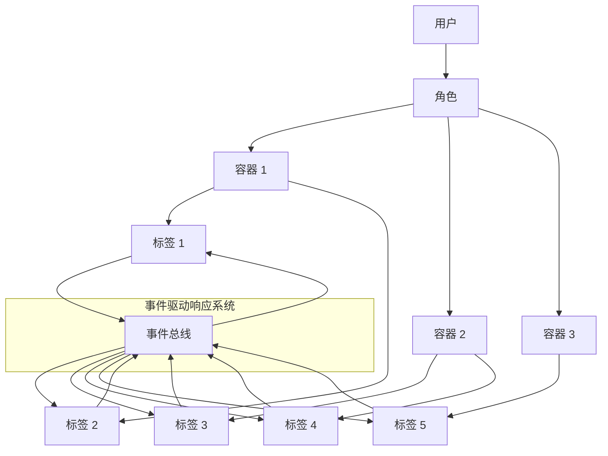
### 1.2 架构关系
```
用户 (User)
│
└── 拥有多个 (1:N) → 角色 (BaseCharacter Subclass)
    │
    └── 包含多个 (1:N) → 容器实例 (BaseContainer Subclass)
        │
        └── 包含一个 (1:N) → 标签实例 (BaseLabel Subclass)
```
**关系约束**:
*   一个**角色模板类**对应一种角色类型。
*   一个**角色实例**通过 `OneToOneField` 关联多个**容器实例**。
*   一个**容器实例**通过 `OneToOneField` 关联多个**标签实例**。
*   一个**标签模型**定义一种数据类型（如 `交易频率`）。
*   一个**标签实例**只能属于一个**容器**。其 `used_in_container` 字段记录了所属容器的类名。
*   一个**容器实例**只能属于一个**角色**。其 `used_in_character` 字段记录了所属角色模板的类名。

### 1.3 总览


---

## 2. 核心模型详解：数据库结构

### 2.1 标签模型 (`BaseLabel`)

**位置**: `labels/models/base_label.py`
**职责**: 所有标签模型的抽象基类。定义了标签的基本结构和行为。

**核心字段**:
*   `label_name` (`LabelNameField`): 标签的名称，如“交易频率”、“上次交易时间”。
*   `label_value` (`LabelTextField`): 标签的值。**注意**: 在实际的自定义标签中，您应重写此字段为更合适的类型（如 `IntegerField`, `CharField`）。
*   `label_type` (`LabelChoiceField`): 标签的交互类型，该字段会体现在WebUI中（如：只读、可互动）。
*   `label_display_format` (`LabelDisplayFormatField`): 控制标签在前端如何展示的格式字符串。默认格式为`'<标签名>: <分隔><标签值>'`。开发者可通过组合`<标签名>`、`<标签值>`和`<分隔>`（用于视觉分组）来自定义显示样式，系统会自动替换占位符。此字段在保存时会进行验证，确保格式有效。
*   `used_in_container` (`LabelsContainerField`): **一个字符串字段**，用于记录此标签实例所属容器的类名。这是一个关键的元数据字段，用于维护标签与容器的归属关系，并在容器清理(`clean()`)时进行验证。

**核心方法**:
*   `get_name()`, `get_value()`:  final方法，获取标签的名称和值。
*   `trigger_0()`, `trigger_1()`: 空方法。预期在子类中重写，用于定义标签被触发时的行为。通常成对出现，代表互斥的操作（如`买入/卖出`）。
*   `save()`: 重写了Django模型的保存方法。当一个新的标签实例被创建时（`self._state.adding` 为 `True`），它会自动在全局的 `InstanceHashTable` 中注册一条记录。**这个机制是实现动态架构和跨模型实例追踪的关键**，它使得系统能够感知和管理所有创建的实例，无论它们属于哪个具体的模型。
*   `delete()`: 重写了Django模型的删除方法。在删除标签实例自身之前，会先从 `InstanceHashTable` 中注销对应的记录，保持哈希表的数据一致性。

**继承与使用**:  
要创建一个新的自定义标签，必须继承此 `BaseLabel` 抽象类，并至少重写 `label_value` 字段以定义正确的数据类型。同时，应根据需要实现 `trigger_0` 和 `trigger_1` 方法来完成交互逻辑。

### 2.2 预设标签字段 (`label_field.py`)

**位置**: `labels/models/label_field.py`  
**职责**: 提供一系列预设的Django模型字段类，这些字段已配置了适用于标签系统的默认元数据（如`verbose_name`）。它们主要用于在定义具体标签模型时，快速、规范地声明字段。

**字段列表及说明**:

- `LabelNameField`: 继承自 `CharField`。用于标签名称，默认 `verbose_name='标签名称'`。
    
- `LabelCharField`: 继承自 `CharField`。用于短文本值，默认 `verbose_name='标签值'`。
    
- `LabelTextField`: 继承自 `TextField`。用于长文本值，默认 `verbose_name='标签值'`。
    
- `LabelIntegerField`: 继承自 `IntegerField`。用于整数值，默认 `verbose_name='标签值'`。
    
- `LabelFloatField`: 继承自 `FloatField`。用于浮点数值，默认 `verbose_name='标签值'`。
    
- `LabelDateField`, `LabelDateTimeField`, `LabelTimeField`, `LabelDurationField`: 分别继承自相应的日期时间字段，默认 `verbose_name='标签值'`。
    
- `LabelUUIDField`: 继承自 `UUIDField`。用于生成唯一标识符，默认配置为 `editable=False`, `unique=True`, `default=uuid.uuid4`。通常用于需要唯一ID的场景。
    
- `LabelChoiceField`: 继承自 `CharField`。用于定义标签类型，预先设置了 `choices=[('timer','计时器'),('counter','步进器'),('read_only','只读')]` 以及相应的 `verbose_name` 和 `help_text`。
    
- `LabelsContainerField`: 继承自 `CharField`。用于 `BaseLabel.used_in_container`，默认 `verbose_name='所属容器'`，并包含帮助文本。
    
- `LabelDisplayFormatField`: 继承自 `CharField`。用于定义展示格式，包含自定义验证逻辑，确保格式字符串包含必要的占位符且符合规则。
    

**使用建议**:  
在定义具体的标签模型时，可以直接使用这些预设字段，它们提供了符合标签系统约定的默认配置，有助于保持整个项目字段定义的一致性。例如，在自定义一个“最大回撤”标签时，其 `label_value` 应重写为 `LabelFloatField(default=100)` 而不是普通的 `models.IntegerField`。
### 2.3 容器模型 (`BaseContainer`)

**位置**: `containers/models/base_container.py`
**职责**: 所有容器模型的抽象基类。充当标签的逻辑分组和物理载体。

**核心字段**:
*   `container_name` (`CharField`): 容器的名称。
*   `container_type` (`CharField`): 容器的类型（如：展示、交互、隐藏）。
*   `used_in_character` (`ContainerCharacterField`): **一个字符串字段**，用于记录此容器实例所属角色模板的类名。
*   **注意**: 容器通过具体的 `OneToOneField` 字段（定义在子类中）来关联标签实例。

**核心方法**:
*   `clean()`: 重写。在保存容器前进行验证。它会检查容器想要关联的所有标签实例的 `used_in_container` 字段。如果某个标签已被其他容器占用，则会抛出 `ValidationError`。验证通过后，它会将这些标签的 `used_in_container` 字段设置为当前容器的类名，标记其为“已使用”。
*   `save()`: 类似 `BaseLabel`，用于实例注册。
*   `delete()`: 重写。非常重要！当容器被删除时，它会执行级联删除：
    1.  **遍历所有通过 `OneToOneField` 关联到它的标签实例**，并删除这些标签实例。
    2.  从 `InstanceHashTable` 中注销自己。
    3.  最后删除自身。
*   `__get_all_label_from_container()`: 一个私有方法，用于获取当前容器实例关联的所有标签实例的列表。`clean()` 和 `delete()` 方法都依赖它。

**容器关联字段**:
`container_label_field.py` 中的 `ContainerLabelField` 是一个便捷类，它预设了 `on_delete=models.SET_NULL`, `null=True`, `related_name='+'` 的 `OneToOneField`，用于在容器子类中关联标签模型。

#### 2.3.1 容器模型删除级联示意图
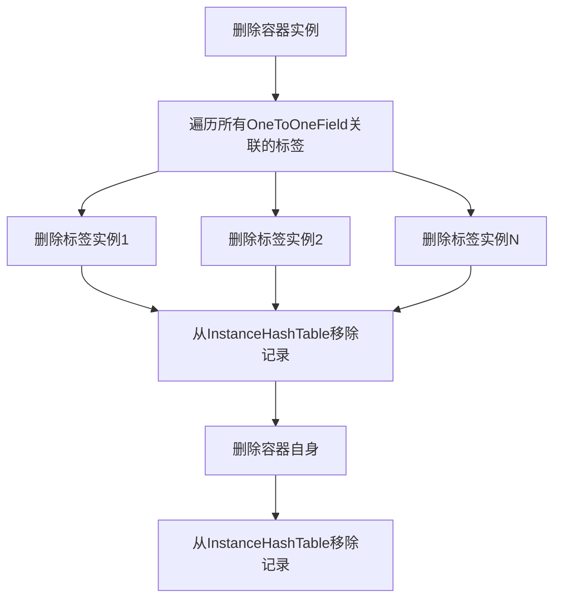


### 2.4 角色模型 (`BaseCharacter`)

**位置**: `characters/models/base_character.py`
**职责**: 所有角色模板模型的抽象基类。代表一个完整的、可实例化的角色类型。

**核心字段**:
*   `character_name` (`CharField`): 角色模板的名称。
*   `user` (`ForeignKey` to `User`): 创建并拥有此角色实例的用户。

**核心方法**:
*   `clean()`: 重写。逻辑与 `BaseContainer.clean()` 类似。验证所有关联的容器实例的 `used_in_character` 字段，确保它们未被其他角色占用，并通过后将其标记为已使用。
*   `save()`: 用于实例注册。
*   `delete()`: 重写。从 `InstanceHashTable` 中注销自己。**注意**: 它默认不会级联删除容器和标签。如果需要此功能，需要在子类或删除视图逻辑中实现。
*   `__get_all_containers_from_character()`: 私有方法，用于获取当前角色实例关联的所有容器实例的列表。

**角色关联字段**:
`CharacterContainerField` 是一个预设的 `OneToOneField`，用于在角色子类中关联容器模型。

---
## 3. 模型注册系统

### 3.1 模型注册机制 (`ModelRegister`)

**位置**: `api/models/register.py`
**职责**: 自动发现和注册所有自定义的标签、容器和角色模板模型，确保它们被系统正确识别和管理。

**核心属性**:
*   `registered_labels`: 存储所有已注册的标签模型类。
*   `registered_containers`: 存储所有已注册的容器模型类。
*   `registered_characters`: 存储所有已注册的角色模板模型类。

**核心方法**:
*   `load_all_characters()`: 
    *   **功能**: 扫描 `characters/models/characters` 目录下的所有Python文件，并导入它们。
    *   **机制**: 通过导入角色模型文件，会链式触发其中导入的容器和标签模型的装饰器注册。
    *   **注意**: 只有在角色模型中明确导入的容器和标签才会被注册和迁移。
*   `check_registered()`: 检查是否有至少一个注册的角色、容器和标签模型，如果没有则报错并退出。
*   `label_register()`, `container_register()`, `character_register()`: 装饰器函数，用于将模型类注册到对应的列表中。

**使用示例**:
```python
from api.models.register import ModelRegister

@ModelRegister.label_register
class MaxDrawdownLabel(BaseLabel):
    label_value = models.IntegerField(default=100, verbose_name='最大回撤')
    label_name = "最大回撤"

@ModelRegister.container_register  
class TradeInfoContainer(BaseContainer):
    trade_info_container = ContainerLabelField(to=MaxDrawdownLabel)

@ModelRegister.character_register
class SomeTradeModel(BaseCharacter):
    trade_info_container = CharacterContainerField(to=TradeInfoContainer)
```

**注册流程示意图**:
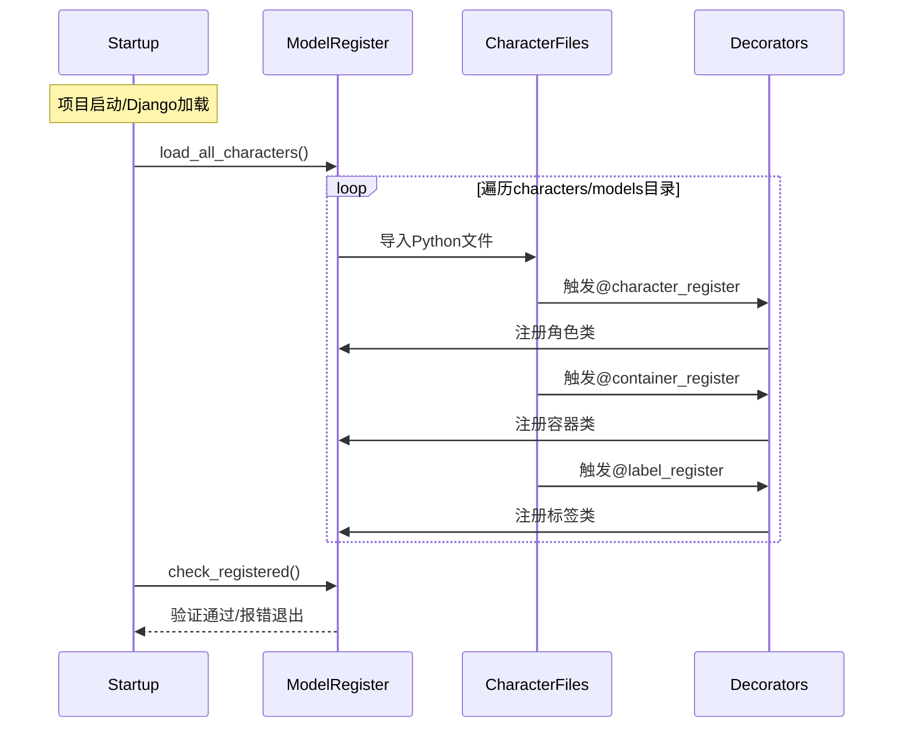

### 3.2 模型注册系统检查

确保 `admin.py` 被正确导入，以便注册所有模型到管理后台。

```python
# apps.py
from django.apps import AppConfig  
  
from api.models.register import ModelRegister  
  
  
class ApiConfig(AppConfig):  
    default_auto_field = 'django.db.models.BigAutoField'  
    name = 'api'  
    verbose_name = "主程序"  
  
    def ready(self):  
        ModelRegister.load_all_characters()  
        ModelRegister.check_registered()
```

**管理界面访问流程**:
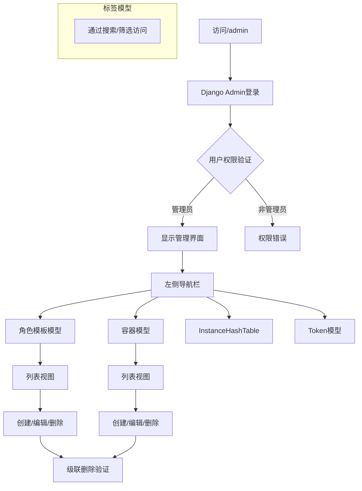

## 5. 事件系统与触发器集成

详细的实现： [[#6. 核心模块详解：事件引擎 (EventBus)]]
### 5.1 工作原理
1.  **定义触发器**: 在自定义标签模型类中，使用 `@LabelTriggerManager.register_trigger` 装饰器来装饰 `trigger_0` 和 `trigger_1` 方法，并指定其监听模式、监听的事件以及触发后要发布的事件。
2.  **注册触发器**: 项目启动时，`LabelTriggerManager` 会扫描所有标签类，将其触发器函数信息记录到全局字典 `trigger_hash_tabel` 中。
3.  **安装实例**: 当用户启动事件引擎（通过调用 `StartEventBusEngine` API）时，系统会遍历该用户的所有角色、容器、标签，并将每个标签**实例**安装到 `trigger_hash_tabel` 中对应类名的 `"instance"` 字段下。
4.  **安装事件总线**: 紧接着，`LabelTriggerManager.install_to_eventbus` 被调用。它会遍历 `trigger_hash_tabel`，根据第一步注册的监听信息，将每个触发器（其函数已被包装为一个能操作特定实例的Lambda）注册到该用户的 `EventBus` 实例中。
5.  **事件流**: 此后，任何代码通过 `EventBus.publish("某事件")` 发布事件时，相关监听器（即标签的触发器）就会被触发，从而改变标签的数据。

#### 5.1.1 事件引擎工作流程图
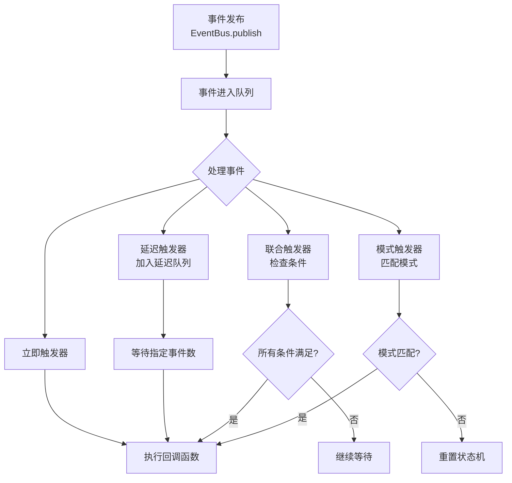


### 5.2 如何定义一个带触发器的标签

```python
# labels/models/my_labels.py
# labels/models/my_labels.py
from django.db import models
from labels.models.base_label import BaseLabel
from labels.models.label_trigger_manager import LabelTriggerManager
from api.event.event_engine import EventBus

class MaxDrawdownLabel(BaseLabel):
    # 重写 label_value 为浮点数类型，这才是"一标签一模型"的体现
    label_value = models.FloatField(default=0.0, verbose_name='最大回撤')
    label_name = "最大回撤" # 也可以固定死

    @LabelTriggerManager.register_trigger(
        listener_type=EventBus.IMMEDIATE,
        listen_event="market_crash", # 监听"市场暴跌"事件
        publish="risk_alert"    # 触发后发布"风险警报"事件
    )
    def trigger_0(self):
        """市场暴跌，更新最大回撤"""
        # 假设这里有一些计算逻辑
        new_drawdown = calculate_current_drawdown()
        if new_drawdown > self.label_value:
            self.label_value = new_drawdown
            self.save()
            print(f"{self.get_name()} 更新为: {self.get_value()}")

    @LabelTriggerManager.register_trigger(
        listener_type=EventBus.IMMEDIATE,
        listen_event="reset_drawdown", # 监听"重置回撤"事件
        publish="drawdown_reset"  # 触发后发布"回撤重置"事件
    )
    def trigger_1(self):
        """重置最大回撤"""
        self.label_value = 0.0
        self.save()
        print(f"{self.get_name()} 已重置")

```
**关键点**:
*   使用 `@LabelTriggerManager.register_trigger` 装饰器。
*   `listener_type`: 定义监听模式（即时、延迟、联合、模式）。
*   `listen_event`: 指定要监听的事件名称。
*   `publish`: （可选）指定该触发器执行成功后要发布的新事件名称，从而形成事件链。

### 5.2.1 触发器注册与安装序列图
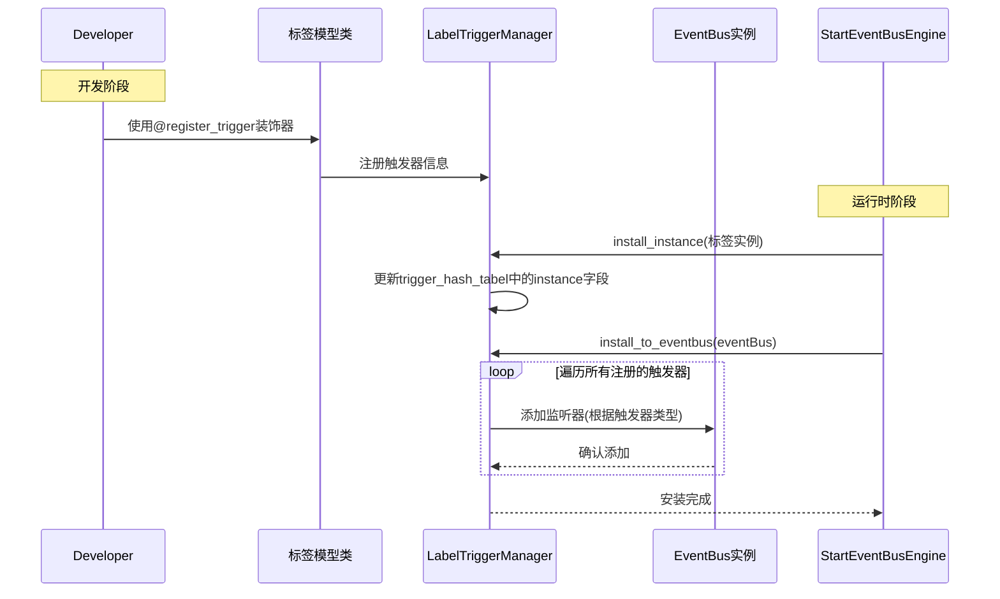
---

### 5.3 事件触发与响应序列图
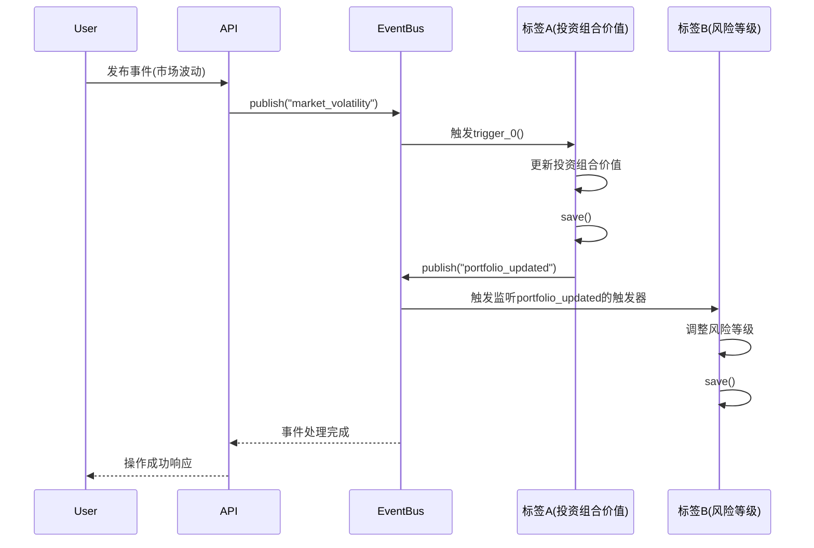

## 6. 使用流程 (How-To)

### 6.1 系统初始化与启动

在项目启动时，需要确保模型注册系统正确工作：

1.  **模型注册**: 在Django的 `apps.py` 或项目初始化代码中调用 `ModelRegister.load_all_characters()`。
2.  **注册检查**: 调用 `ModelRegister.check_registered()` 确保至少有一个角色、容器和标签被注册。
3.  **Admin配置**: 确保 `admin.py` 被正确导入，以便注册所有模型到管理后台。

```python
# apps.py
from django.apps import AppConfig  
  
from api.models.register import ModelRegister  
  
  
class ApiConfig(AppConfig):  
    default_auto_field = 'django.db.models.BigAutoField'  
    name = 'api'  
    verbose_name = "主程序"  
  
    def ready(self):  
        ModelRegister.load_all_characters()  
        ModelRegister.check_registered()
```

### 6.2 管理后台使用

1.  **访问管理后台**: 通过 `/admin` URL访问Django管理界面。
2.  **管理模型**: 
    *   角色模板和容器模型会显示在左侧导航栏中。
    *   标签模型不会显示在导航栏，但可以通过URL直接访问或通过关联的容器进行管理。
3.  **数据操作**: 
    *   可以创建、编辑、删除角色、容器和标签实例。
    *   删除操作会自动处理级联关系（如删除容器会删除关联的标签）。

### 6.3 创建一个全新的角色类型
假设我们要创建一个名为 `ArbitrageStrategy` 的角色。

**1. 定义标签模型**
创建 `labels/models/game_labels.py`：
```python
from django.db import models
from labels.models.base_label import BaseLabel

class SymbolPairLabel(BaseLabel):
    label_value = models.CharField(max_length=50, default="BTC/USD", verbose_name='交易对')
    label_name = "交易对"

class CapitalLabel(BaseLabel):
    label_value = models.FloatField(default=10000.0, verbose_name='初始资金')
    label_name = "初始资金"

class SharpeRatioLabel(BaseLabel):
    label_value = models.FloatField(default=0.0, verbose_name='夏普比率')
    label_name = "夏普比率"
```

**2. 定义容器模型**
创建 `containers/models/game_containers.py`：
```python
from django.db import models
from containers.models.base_container import BaseContainer
from containers.models.container_label_field import ContainerLabelField
from labels.models.quant_labels import SymbolPairLabel, CapitalLabel, SharpeRatioLabel

class BasicConfigContainer(BaseContainer):
    # 关联标签模型
    symbol_pair = ContainerLabelField(to=SymbolPairLabel)
    capital = ContainerLabelField(to=CapitalLabel)

class PerformanceContainer(BaseContainer):
    sharpe_ratio = ContainerLabelField(to=SharpeRatioLabel)
```

**3. 定义角色模型**
创建 `characters/models/game_character.py`：
```python
from django.db import models
from strategies.models.base_strategy import BaseStrategy
from strategies.models.strategy_container_field import StrategyContainerField
from containers.models.quant_containers import BasicConfigContainer, PerformanceContainer

class ArbitrageStrategy(BaseStrategy):
    # 关联容器模型
    basic_config = StrategyContainerField(to=BasicConfigContainer)
    performance = StrategyContainerField(to=PerformanceContainer)
```

**4. 更新数据库**
运行Django数据库迁移命令，创建新定义的模型所对应的数据表。
```bash
python manage.py makemigrations
python manage.py migrate
```

**5. （可选）为标签添加触发器**
编辑 `game_labels.py`，如前文所述，为 `HealthLabel` 等添加 `@LabelTriggerManager.register_trigger` 装饰的逻辑。

#### 6.3.1 创建新角色类型流程图
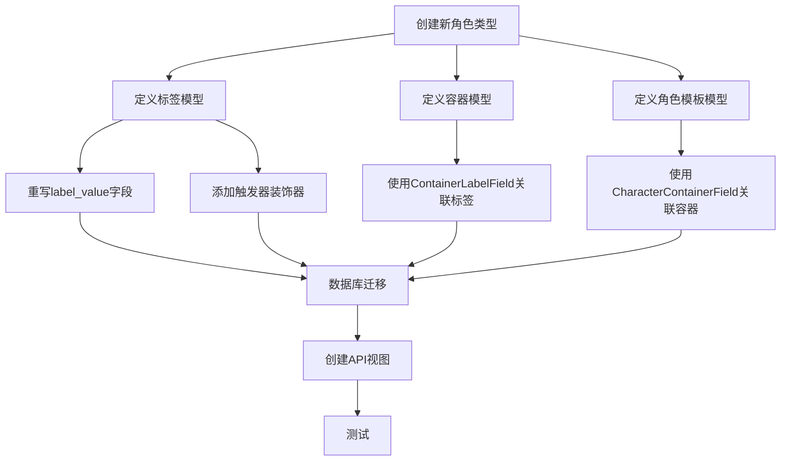

### 6.4 启动事件引擎
前端在用户登录后或需要启动交互功能时，应调用 `/api/eventbus/start/` (`StartEventBusEngine` 视图)。这个视图会：
1.  找到或创建对应用户的 `EventBus` 实例。
2.  遍历该用户的所有角色、容器、标签。
3.  调用 `LabelTriggerManager.install_instance` 为每个标签实例配置触发器。
4.  调用 `LabelTriggerManager.install_to_eventbus` 将所有配置好的触发器注册到事件总线上。

此后，事件驱动系统即可正常工作。

### 6.5 系统启动与事件引擎初始化图
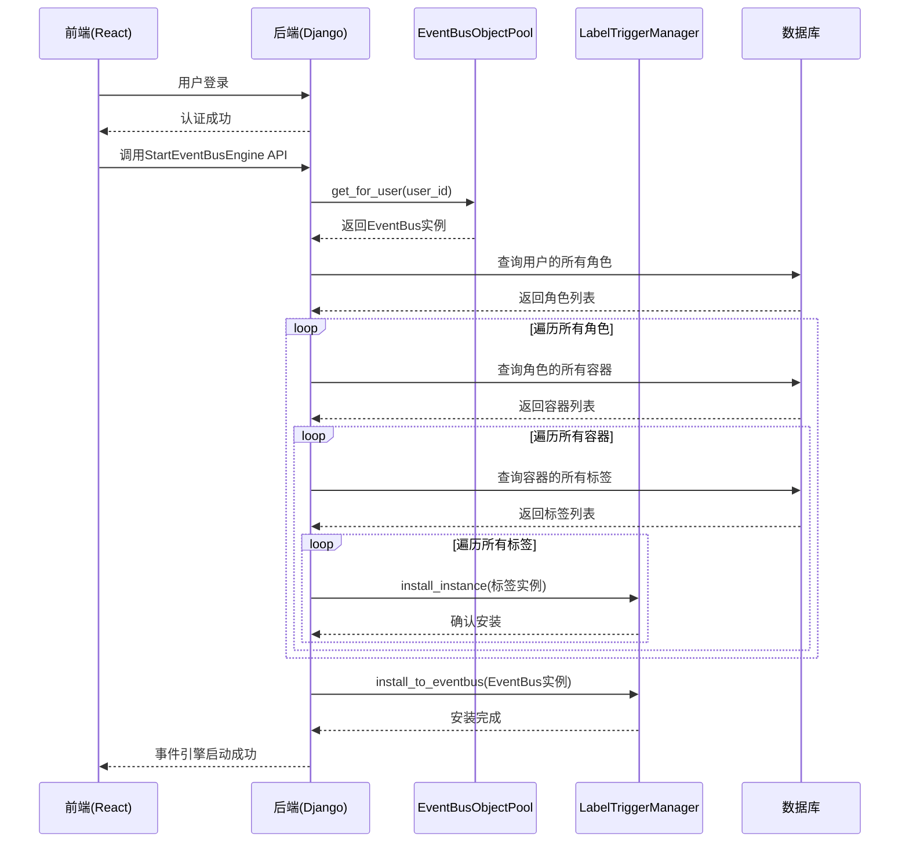
---

## 7. 插件开发指南

开发新策略监控项目，本质就是创建新的Django App（或在本项目的对应app下创建新模块），并遵循上述 `BaseCharacter`, `BaseContainer`, `BaseLabel` 的继承体系定义一套新的模型。

**步骤**:
1.  **规划**: 确定新角色需要哪些数据（标签），如何分组（容器）。
2.  **创建模型**:
    *   在 `labels/models/` 下创建 `your_plugin_labels.py`，定义所有标签模型。
    *   在 `containers/models/` 下创建 `your_plugin_containers.py`，定义容器模型并使用 `ContainerLabelField` 关联上一步的标签。
    *   在 `characters/models/` 下创建 `your_plugin_character.py`，定义角色模板模型并使用 `CharacterContainerField` 关联上一步的容器。
3.  **实现逻辑**:
    *   在标签模型中重写 `trigger_0` 和 `trigger_1` 方法，并使用 `LabelTriggerManager.register_trigger` 装饰器定义其事件行为。
4.  **注册迁移**: 确保新模型文件被正确导入，然后运行 `makemigrations` 和 `migrate`。
5.  **提供API** (可选): 如果需要，创建新的API视图来处理这个新角色类型的特定操作（如释放技能、更换装备）。

**注意事项**:
*   模型的定义和迁移是插件化的核心。
*   充分理解 `used_in_container` 和 `used_in_character` 字段的维护机制，避免在自定义的 `save` 或 `delete` 逻辑中破坏它。
*   触发器装饰器的参数配置是关键，需要清晰理解事件总线的工作模式。

好的，根据您提供的详细代码和描述，我将为您撰写事件引擎 (`EventBus`) 和标签触发器管理器 (`LabelTriggerManager`) 这两个核心模块的开发文档。这些文档将集成到您提供的初始文档结构中。

### 7.1 插件开发组件关系图
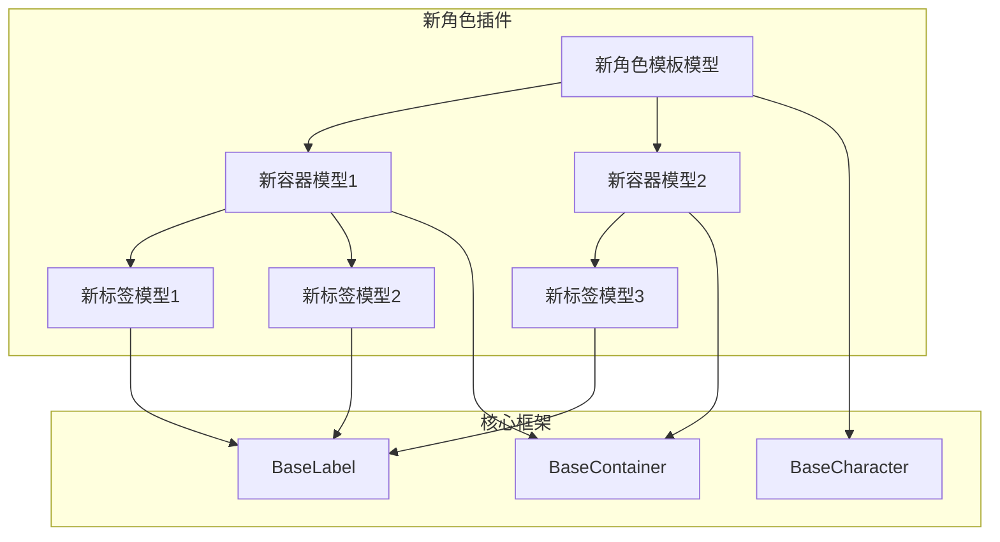
---


## 8. 核心模块详解：事件引擎 (EventBus)

**位置**: `api/event/event_engine.py`
**职责**: 提供一个强大的、基于队列的事件驱动架构核心。它负责事件的发布、存储、调度，并根据预定义的监听模式（Immediate, Delayed, Joint, Pattern）触发相应的回调函数。每个用户拥有独立的事件总线实例，通过 `EventBusObjectPool` 进行管理，确保了用户间的事件隔离。

### 8.1 核心类与数据结构

**`EventBus` 类**:

*   **`is_install` (Boolean)**: 标志位，指示该事件总线实例是否已被 `LabelTriggerManager.install_to_eventbus` 方法安装和配置过，防止重复安装。
*   **`event_count` (Integer)**: 全局事件计数器。从 0 开始递增，每次处理一个新事件时加 1。用于实现延迟触发。
*   **`event_bus` (Queue)**: 一个先进先出 (FIFO) 的事件队列，用于存储所有待处理的事件字符串。`maxsize=1000` 防止内存溢出。
*   **`immediate_listeners` (DefaultDict[str, List[Callable]])**: 立即监听器字典。键是事件名 (`source`)，值是一个回调函数列表。当对应事件被发布时，列表中的所有回调会被**立即同步执行**。
*   **`delayed_tasks` (List[Tuple[int, Callable]])**: 延迟任务**最小堆**。每个元素是一个元组 `(trigger_at, callback)`，其中 `trigger_at` 是一个绝对的事件计数（`event_count + delay`）。堆总是保证 `trigger_at` 最小的任务在堆顶。
*   **`joint_conditions` (List[JointCondition])**: 联合条件监听器列表。
*   **`pattern_matchers` (List[PatternMatcher])**: 模式匹配监听器列表。

**`JointCondition` 类**:
用于实现**联合触发**（所有指定事件都发生，顺序无关）。
*   **`required` (Set[str])**: 需要监听的所有事件的集合。
*   **`occurred` (Set[str])**: 已经发生的事件的集合。
*   **`callback` (Callable)**: 当 `occurred == required` 时要执行的回调函数。
*   **`on_event(event)`**: 处理新事件。如果事件在 `required` 中且未被记录，则加入 `occurred`。如果所有事件都已发生，则触发 `callback` 并重置状态。
*   **`reset()`**: 重置 `occurred` 集合。

**`PatternMatcher` 类**:
用于实现**模式触发**（事件序列匹配特定模式，支持 `*` 通配符）。
*   **`pattern` (List[str])**: 要匹配的事件模式列表，如 `["A", "*", "B"]`。
*   **`state` (Integer)**: 当前在模式序列中的匹配位置（状态机的状态）。
*   **`callback` (Callable)**: 当模式完全匹配时要执行的回调函数。
*   **`on_event(event)`**: 使用状态机逻辑处理新事件，尝试推进匹配状态。如果完全匹配 (`state == len(pattern)`)，则触发 `callback` 并重置状态。如果匹配失败，会尝试从当前事件重新开始匹配。
*   **`reset()`**: 重置状态机 (`state = 0`)。

**事件引擎 (EventBus) 内部数据结构与事件流**

**描述**: 此图展示了 EventBus 的核心数据结构和处理一个事件的内部流程。

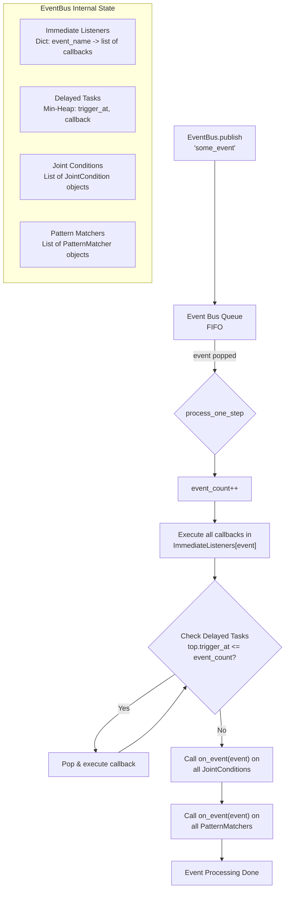

### 8.2 监听模式 (Listener Types)

1.  **`IMMEDIATE` (立即触发)**:
    *   **行为**: 监听特定事件 `source`。当 `source` 事件被处理时，所有关联的回调函数被立即调用。
    *   **应用**: 最常用，用于对事件做出即时反应，如受伤扣血、获得经验。

2.  **`DELAY` (延迟触发)**:
    *   **行为**: 监听特定事件 `source`。当 `source` 事件被处理时，并不立即执行回调，而是计算一个未来的触发点 `trigger_at = current_event_count + delay`，并将任务放入最小堆。系统会在处理每个事件后检查堆顶，如果 `trigger_at <= current_event_count`，则执行回调。
    *   **实现**: 借用了立即触发器。当 `source` 事件发生时，一个包装函数(`delayed_callback_wrapper`)被立即调用，它的作用仅仅是将真正的回调任务推入延迟堆。
    *   **应用**: 实现需要等待一段时间（以事件数为单位）后才生效的效果，如中毒后的持续伤害、buff/debuff 的持续时间。

3.  **`JOINT` (联合触发)**:
    *   **行为**: 监听一组事件 `sources`。要求集合中的所有事件**都至少发生一次**（顺序无关）。当最后一个缺失的事件发生时，回调被触发。触发后条件重置，可以再次触发。
    *   **应用**: 完成一个需要多个步骤的任务，如收集多个道具后合成、同时按下多个键发动技能。

4.  **`PATTERN` (模式触发)**:
    *   **行为**: 监听一个事件序列 `pattern`。要求事件**按顺序**匹配给定的模式，`*` 可以匹配任意一个事件。匹配成功后触发回调，然后重置状态机。
    *   **应用**: 实现连招系统、解锁特定成就（需要按顺序执行操作）、解析命令行指令。

### 8.3 核心方法流程

**`publish(event: str)`**:
1.  将事件字符串 `event` 放入 `event_bus` 队列。
2.  记录日志。

**`process_one_step()`**: **事件处理的核心循环单元**。
1.  检查队列是否为空，空则返回 `True`（处理完成）。
2.  检查队列是否已满，满则返回 `False`（错误）。
3.  `event_count++`。
4.  从队列头 `get()` 一个事件。
5.  **立即触发**: 在 `immediate_listeners` 中查找该事件对应的回调列表，并顺序执行所有回调。
6.  **延迟触发**: 检查 `delayed_tasks` 堆顶，循环弹出并执行所有 `trigger_at <= event_count` 的任务。
7.  **联合触发**: 遍历 `joint_conditions`，对每个条件调用 `condition.on_event(current_event)`。
8.  **模式触发**: 遍历 `pattern_matchers`，对每个匹配器调用 `matcher.on_event(current_event)`。
9.  返回 `False`（表示还有更多事件待处理）。

**`process(maxStep=10000)`**:
循环调用 `process_one_step()` 最多 `maxStep` 次，直到其返回 `True`（队列空）或达到循环上限（防止死循环）。

**监听器注册方法 (`add_*_listener`)**:
这些方法用于编程式注册监听器，通常由 `LabelTriggerManager` 在安装阶段调用。
*   `add_immediate_listener(source, callback)`
*   `add_delayed_listener(source, delay, callback)`
*   `add_joint_listener(sources, callback)`
*   `add_pattern_listener(pattern, callback)`

**装饰器方法**:
提供更声明式的监听器注册方式，可用于其他部分的代码（不仅限于标签触发器）。
*   `@listen_immediately(source)`
*   `@listen_delayed(source, delay)`
*   `@listen_jointly(sources)`
*   `@listen_pattern_matcher(pattern)`
*   `@publish_event(event)`: **特殊装饰器**。它装饰一个函数，并返回一个包装函数。当被装饰的函数执行后，包装函数会自动发布指定的事件 `event`。这用于实现**事件链**（一个触发器的执行会导致新事件的发布）。

### 8.4 数据流
1.  **事件产生**: 由 API 视图（如 `LabelTriggerView`）、或其他后台逻辑调用 `event_bus_instance.publish("some_event")`。
2.  **事件入列**: 事件被加入 `event_bus` 队列。
3.  **事件处理**: `process_one_step()` 被循环调用（通常在API请求的上下文中，或由后台任务调用）。
4.  **触发回调**: 根据事件类型和监听器配置，相应的回调函数被查找并执行。这些回调函数是经过 `LabelTriggerManager` 包装的，最终会调用特定标签实例的 `trigger_0` 或 `trigger_1` 方法。
5.  **状态变更**: 标签实例的数据在触发器函数中被修改（`self.label_value -= 10`）并保存（`self.save()`），从而改变了角色的状态。
6.  **事件链**: 如果触发器装饰了 `@publish_event`，其执行后会发布新事件，回到步骤1，形成链式反应。

---

## 9. 核心模块详解：标签触发器管理器 (LabelTriggerManager)

**位置**: `labels/models/label_trigger_manager.py`
**职责**: 作为 `BaseLabel` 和 `EventBus` 之间的**桥梁**和**配置中心**。它提供了一个全局注册表，用于收集所有标签类的触发器信息，并提供方法将这些静态的触发器函数“安装”到动态的、用户专属的事件总线实例上，并将它们与具体的标签实例绑定。

### 9.1 核心数据结构: `trigger_hash_tabel`

这是一个全局的、模块级的字典，是管理器的核心。其结构设计精巧，包含了类级别的配置和实例引用。

```python
{
  "HealthLabel": { # Key: 标签类的名称 (str)
    "instance": health_label_instance_23, # Value: 该类的某个实例 (BaseLabel) | None
    "trigger_0": { # Key: 触发器方法名 (str)
      "func": <function HealthLabel.trigger_0 at 0x...>, # Value: 原始的触发器函数 (Callable)
      "listener_args": { # 该触发器的监听配置 (Dict)
        "listener_type": EventBus.IMMEDIATE, # 监听模式 (int)
        "listen_event": "take_damage",       # 监听的事件 (str/list)
        "delay": None                        # 延迟量，仅DELAY模式有效 (int/None)
      },
      "publish": "health_changed" # 触发后要发布的事件 (str/None)
    },
    "trigger_1": {
      "func": ...,
      "listener_args": {...},
      "publish": "health_changed"
    }
  },
  "ManaLabel": {
    "instance": ...,
    "trigger_0": {...},
    "trigger_1": {...}
  }
}
```
**重要提示**: 由于 `trigger_hash_tabel` 是全局的，而 `"instance"` 字段在 `install_instance` 阶段会被覆盖为*当前正在处理的那个用户*的某个标签实例，因此**绝对不能在业务逻辑中直接使用或依赖 `trigger_hash_tabel` 中 `"instance"` 的值**。它的存在只是为了后续的 `install_to_eventbus` 步骤提供临时存储。

### 9.2 核心方法流程

**`register_trigger(listener_type, listen_event, publish, delay)`**:
*   **这是一个装饰器工厂方法**。它在项目启动时，随着标签模型类的定义而被执行。
*   **流程**:
    1.  接收监听器参数。
    2.  返回一个装饰器函数。
    3.  装饰器函数接收被装饰的 `trigger_0` 或 `trigger_1` 方法 (`func`)。
    4.  通过分析 `func.__qualname__` 获取其所属的类名 (`func_class_name`) 和方法名 (`func_name`)。
    5.  在 `trigger_hash_tabel` 中创建或更新对应类名和方法名的条目，将函数引用和监听配置存储起来。
    6.  将该类的 `"instance"` 字段初始化为 `None`。
    7.  返回原始函数 `func`，不影响其正常行为。
*   **效果**: 项目启动后，所有被装饰过的触发器函数及其元信息都被自动注册到了全局查找表中。

**`install_instance(instance: BaseLabel)`**:
*   **调用时机**: 由 `StartEventBusEngine` 视图调用，遍历用户的所有标签实例时。
*   **流程**:
    1.  检查实例是否是 `BaseLabel` 子类。
    2.  获取实例的类名。
    3.  如果该类名在 `trigger_hash_tabel` 中存在，则用当前这个具体的**实例**覆盖该类的 `"instance"` 字段。
*   **目的**: 为下一步安装事件总线时，为每个触发器函数提供一个具体的操作对象（`self`）。

**`install_to_eventbus(eventBus: EventBus)`**:
*   **调用时机**: 紧接在 `install_instance` 循环之后，由 `StartEventBusEngine` 视图调用。
*   **流程**:
    1.  检查事件总线是否已被安装过，避免重复安装。
    2.  遍历 `trigger_hash_tabel` 中的每一个标签类条目。
    3.  获取该条目下的 `"instance"`。此时它应该是一个具体的实例，而不是 `None`。
    4.  遍历该条目下的 `"trigger_0"` 和 `"trigger_1"`。
    5.  **包装回调函数**:
        *   根据触发器配置中的 `publish` 参数，决定是否需要使用 `eventBus.publish_event(publish)` 装饰器来包装原始的 `trigger_` 函数。包装后的函数会在执行完原始逻辑后自动发布指定事件。经过`eventBus.publish_event(publish)` 包装的函数会用于更新`trigger_hash_tabel`中对应的`func`字段，确保在用户调用`call()`时，该所需的事件发布功能能生效
        *   创建一个 **Lambda 函数** `callback`。这个 Lambda 会捕获当前的触发器配置 (`current_trigger`) 和实例 (`instance`)，当被调用时，它会执行 `current_trigger["func"](instance)`。**这一步是关键**，它将一个普通的类方法 (`HealthLabel.trigger_0`) 和一个具体的实例 (`health_label_instance_23`) 绑定在了一起，形成了一个可以直接调用的函数对象。
    6.  **注册到事件总线**: 根据 `listener_args` 中的配置，调用事件总线对应的 `add_*_listener` 方法，将上一步创建好的 `callback` 函数注册进去。监听的事件源 (`listen_event`) 就是配置中指定的事件。
*   **最终状态**: 此后，全局 `trigger_hash_tabel` 的使命基本完成。事件总线 (`eventBus`) 内部已经存储了所有配置好的监听器回调。当相应事件被发布时，这些回调就会被执行，操作的就是之前安装的那些具体标签实例。

**`call(label_instance: BaseLabel, action: str)`**:
*   **调用时机**: 通常由 `LabelTriggerView` 等API视图调用，用于手动触发某个标签的某个动作。
*   **流程**:
    1.  校验实例。
    2.  根据实例的类名和指定的动作 (`'trigger_0'` 或 `'trigger_1'`)，从 `trigger_hash_tabel` 中找出对应的原始函数 (`func`)。
    3.  **直接调用**这个原始函数，并传入 `label_instance` 作为 `self` 参数：`func(label_instance)`。
*   **注意**: 这个方法**绕过了事件总线**。它直接触发标签的触发器逻辑，若原始函数 (`func`)在触发器配置中的 `publish` 参数不为None，则会向事件总线发布指定事件

### 9.3 标签触发器管理器 (LabelTriggerManager) 工作流程

**描述**: 此图展示了 `@register_trigger`, `install_instance`, `install_to_eventbus` 三个关键阶段的协作流程和数据变化。


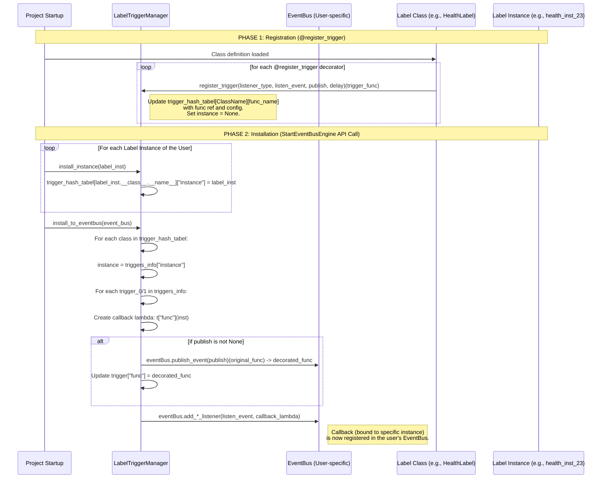

### 9.4 数据流与协作
1.  **启动时 (注册)**:
    *   导入标签模型 → 执行 `@register_trigger` 装饰器 → 填充 `trigger_hash_tabel`（静态信息）。
2.  **用户登录/启用时 (安装)**:
    *   调用 `StartEventBusEngine` API。
    *   该视图获取用户专属的 `EventBus`。
    *   遍历用户的所有标签实例 → 对每个实例调用 `install_instance` → 更新 `trigger_hash_tabel` 的 `"instance"` 字段（动态引用）。
    *   调用 `install_to_eventbus` → 读取 `trigger_hash_tabel` → 为每个触发器创建绑定了实例的回调 → 将该回调注册到用户的 `EventBus` 上。
3.  **运行时 (触发)**:
    *   **方式A (事件驱动)**: 某处代码 `publish("event_A")` → `EventBus` 找到监听 `"event_A"` 的回调并执行 → 回调函数（即绑定了实例的 `trigger_0`）执行 → 修改标签数据。
    *   **方式B (直接调用)**: API 调用 `LabelTriggerView` → 其内部调用 `LabelTriggerManager.call(instance, 'trigger_1')` → 直接执行标签实例的 `trigger_1` 方法。

### 9.5 事件链示例图 (## 投资组合更新触发风险评估)

**描述**: 此图展示了一个具体的事件链例子，帮助理解量化策略中的响应式风控机制。

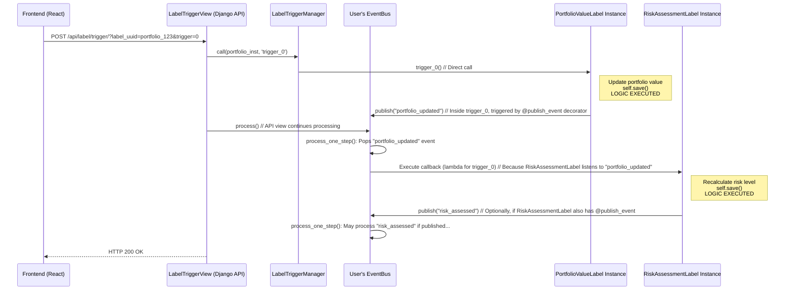


**解释**: 用例展示了量化策略中常见的连锁反应：当投资组合价值发生变化时，系统自动触发风险评估流程，确保风险控制与资产变动保持同步。

---

## 10. API 接口详解

### 10.1 启动事件引擎 `GET /api/eventbus/start/`

**视图**: `StartEventBusEngine`
**权限**: `IsAuthenticated`
**流程**:
1.  获取当前登录用户的 ID。
2.  从 `EventBusObjectPool` 中获取该用户专属的 `EventBus` 实例（不存在则创建）。
3.  **遍历用户数据**:
    *   通过 Django 模型的反向关系 (`user.<related_name>_character.all()`)，找到该用户创建的所有角色实例。
    *   对每个角色实例，使用反射 (`_meta.get_fields()`) 找到所有其关联的容器实例。
    *   对每个容器实例，使用反射找到所有其关联的标签实例。
4.  **安装触发器**: 对找到的每一个标签实例，调用 `LabelTriggerManager.install_instance(label_instance)`。
5.  **注册事件总线**: 调用 `LabelTriggerManager.install_to_eventbus(eventbus)`，完成所有触发器在事件总线上的最终注册。
6.  返回成功响应。

**作用**: 此调用是**激活用户事件驱动功能的必要条件**。它建立了用户数据（标签实例）和事件系统之间的连接。

**API 请求序列图 (启动事件引擎)**
**描述**: 此图详细展示了 `/api/eventbus/start/` API 的调用序列。

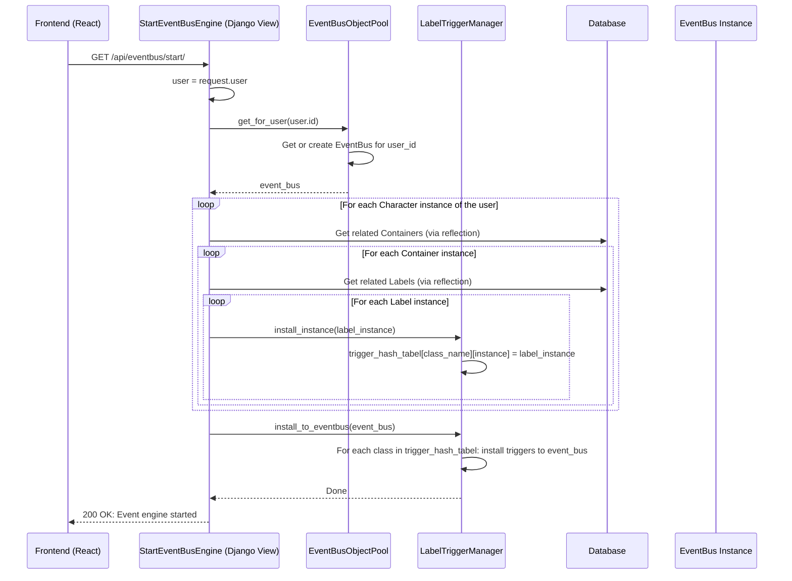

### 10.2 触发标签动作 `POST /api/label/trigger/?label_uuid=...&trigger=...`

**视图**: `LabelTriggerView`
**权限**: `IsAuthenticated`
**查询参数**:
*   `label_uuid` (必需): 要通过 `InstanceHashTable` 查找的目标标签实例的 UUID。
*   `trigger` (必需): 要触发的动作，必须是 `'0'` 或 `'1'`，分别对应 `trigger_0` 和 `trigger_1`。

**流程**:
1.  校验参数。
2.  检查对应用户的 `EventBus` 是否已通过 `StartEventBusEngine` 启动。
3.  使用 `InstanceHashTable.get_instance_by_uuid(label_uuid)` 通过 UUID 查找到具体的标签实例。**这是实现跨模型动态查找的关键**。
4.  调用 `LabelTriggerManager.call(label_instance, f'trigger_{trigger}')` **直接执行**指定的触发器方法。
5.  手动调用 `eventbus.process()` **处理事件队列**。这一步至关重要，因为直接调用 `call()` 可能触发了一些事件（例如，触发器函数内部可能调用了 `publish`），需要让事件总线处理这些新产生的事件，才能看到完整的链式反应效果。
6.  返回操作结果。

**作用**: 为前端提供一个通用的接口，手动触发某个标签的特定动作，并推动事件链的进行。例如，前端一个"执行回测"按钮可以调用此 API 来触发一个策略的"夏普比率"标签的 `trigger_0`（计算绩效指标）动作，这可能进一步触发风险评估和报表生成等后续事件。

(有关第10章API接口的文档随项目更新中，上次更新日期： 29-8-2025)


---

