# 量化策略管理与监控系统 | Quantitative Strategy Management and Monitoring System Platform

**The project is Perry Wong's graduation project at the Hong Kong University of Science and Technology. Perry Wong holds all rights to this project, and prior to using and distributing it, please refer to the project's open-source license.**

[简体中文](#简体中文) | [繁体中文](#繁体中文) | [English](#english)
---

<a name="简体中文"></a>

---
## 简体中文版
# 量化策略管理与监控系统 - 核心架构开发文档

## 1. 概述

本项目的核心是构建一个高度动态化、可扩展的量化策略管理与监控系统，该系统从批量部署、运行、监控、追踪、留档五个方面自动化了量化策略的开发、部署以及评估。其基石是 **“一标签，一模型” (One Label, One Model)** 的设计理念。该系统允许开发者或高级用户通过创建Django模型的方式，从零开始定义全新的策略监控项目，包括其数据结构（标签）、组织方式（容器）以及复杂的数据交互逻辑（事件驱动的触发器）。

### 1.1 核心概念
*   **角色 (Character)**: 定义一个量化策略的蓝图。例如：`套利策略`、`均值回归策略`、`定投策略`。
*   **容器 (Container)**: 用于对量化策略进行逻辑分组。例如：`基础信息`、`模型参数`、`评估指标`。一个角色由多个容器构成。
*   **标签 (Label)**: 角色最基础的数据单元，代表一个具体的属性。例如：`交易频率`、`最大回撤`、`上次交易时间`、`夏普比率`。每个标签都是一个独立的Django模型。标签被放置在容器中。

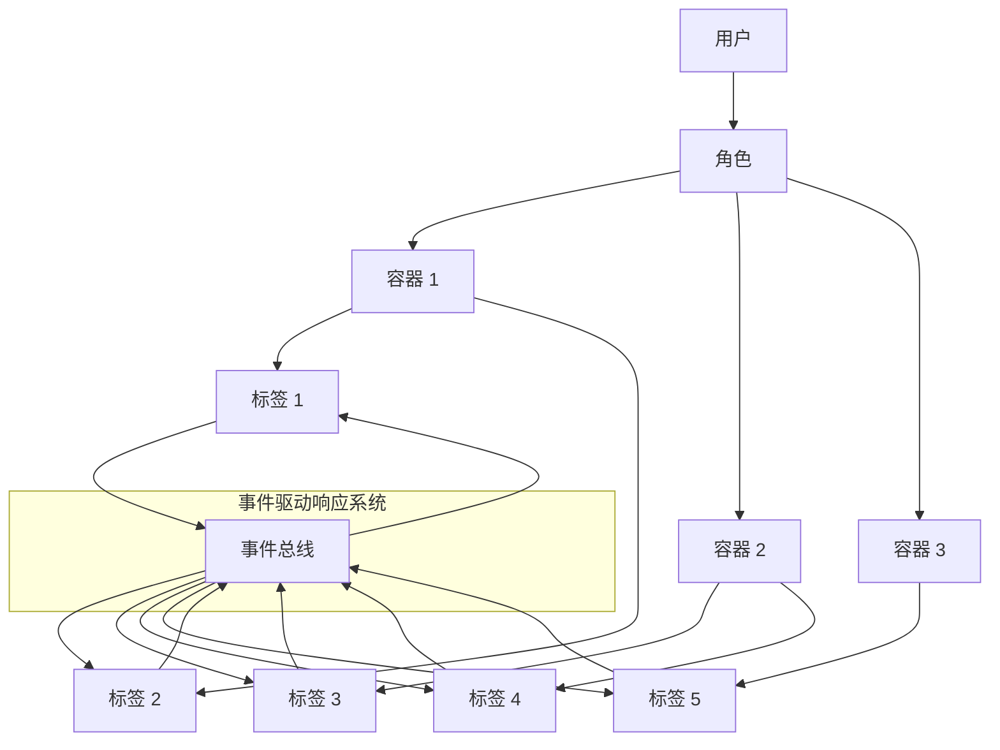
```mermaid
graph TB
    User[用户] --> Character[角色]
    Character --> Container1[容器 1]
    Character --> Container2[容器 2]
    Character --> Container3[容器 3]
    
    Container1 --> Label1[标签 1]
    Container1 --> Label2[标签 2]
    Container2 --> Label3[标签 3]
    Container2 --> Label4[标签 4]
    Container3 --> Label5[标签 5]
    
    Label1 --> EventBus[事件总线]
    Label2 --> EventBus
    Label3 --> EventBus
    Label4 --> EventBus
    Label5 --> EventBus
    
    EventBus --> Label1
    EventBus --> Label2
    EventBus --> Label3
    EventBus --> Label4
    EventBus --> Label5
    
    subgraph "事件驱动响应系统"
        EventBus
    end
```
### 1.2 架构关系
```
用户 (User)
│
└── 拥有多个 (1:N) → 角色 (BaseCharacter Subclass)
    │
    └── 包含多个 (1:N) → 容器实例 (BaseContainer Subclass)
        │
        └── 包含一个 (1:N) → 标签实例 (BaseLabel Subclass)
```
**关系约束**:
*   一个**角色模板类**对应一种角色类型。
*   一个**角色实例**通过 `OneToOneField` 关联多个**容器实例**。
*   一个**容器实例**通过 `OneToOneField` 关联多个**标签实例**。
*   一个**标签模型**定义一种数据类型（如 `交易频率`）。
*   一个**标签实例**只能属于一个**容器**。其 `used_in_container` 字段记录了所属容器的类名。
*   一个**容器实例**只能属于一个**角色**。其 `used_in_character` 字段记录了所属角色模板的类名。

### 1.3 总览


```mermaid
classDiagram
    direction LR
    class User {
        +id
        +username
        +...
    }

    class BaseCharacter {
        +character_name
        +user (FK)
        +used_in_character (meta)
        +save()
        +delete()
        +clean()
    }

    class BaseContainer {
        +container_name
        +container_type
        +used_in_container (meta)
        +save()
        +delete()
        +clean()
    }

    class BaseLabel {
        +label_name
        +label_value
        +used_in_container (meta)
        +trigger_0()
        +trigger_1()
        +save()
        +delete()
    }

    class InstanceHashTable {
        +uuid
        +content_type (FK)
        +object_id
        +get_instance_by_uuid()
    }

    User "1" -- "*" BaseCharacter : owns
    BaseCharacter "1" -- "*" BaseContainer : contains
    BaseContainer "1" -- "*" BaseLabel : contains
    
    BaseCharacter ..> InstanceHashTable : registers in
    BaseContainer ..> InstanceHashTable : registers in
    BaseLabel ..> InstanceHashTable : registers in

    note for BaseCharacter "used_in_character: Records the class name of the container's owner"
    note for BaseContainer "used_in_container: Records the class name of the label's owner\nused_in_character: Records the class name of the character's owner"
    note for BaseLabel "used_in_container: Records the class name of the container it belongs to"
```
---

## 2. 核心模型详解：数据库结构

### 2.1 标签模型 (`BaseLabel`)

**位置**: `labels/models/base_label.py`
**职责**: 所有标签模型的抽象基类。定义了标签的基本结构和行为。

**核心字段**:
*   `label_name` (`LabelNameField`): 标签的名称，如“交易频率”、“上次交易时间”。
*   `label_value` (`LabelTextField`): 标签的值。**注意**: 在实际的自定义标签中，您应重写此字段为更合适的类型（如 `IntegerField`, `CharField`）。
*   `label_type` (`LabelChoiceField`): 标签的交互类型，该字段会体现在WebUI中（如：只读、可互动）。
*   `label_display_format` (`LabelDisplayFormatField`): 控制标签在前端如何展示的格式字符串。默认格式为`'<标签名>: <分隔><标签值>'`。开发者可通过组合`<标签名>`、`<标签值>`和`<分隔>`（用于视觉分组）来自定义显示样式，系统会自动替换占位符。此字段在保存时会进行验证，确保格式有效。
*   `used_in_container` (`LabelsContainerField`): **一个字符串字段**，用于记录此标签实例所属容器的类名。这是一个关键的元数据字段，用于维护标签与容器的归属关系，并在容器清理(`clean()`)时进行验证。

**核心方法**:
*   `get_name()`, `get_value()`:  final方法，获取标签的名称和值。
*   `trigger_0()`, `trigger_1()`: 空方法。预期在子类中重写，用于定义标签被触发时的行为。通常成对出现，代表互斥的操作（如`买入/卖出`）。
*   `save()`: 重写了Django模型的保存方法。当一个新的标签实例被创建时（`self._state.adding` 为 `True`），它会自动在全局的 `InstanceHashTable` 中注册一条记录。**这个机制是实现动态架构和跨模型实例追踪的关键**，它使得系统能够感知和管理所有创建的实例，无论它们属于哪个具体的模型。
*   `delete()`: 重写了Django模型的删除方法。在删除标签实例自身之前，会先从 `InstanceHashTable` 中注销对应的记录，保持哈希表的数据一致性。

**继承与使用**:  
要创建一个新的自定义标签，必须继承此 `BaseLabel` 抽象类，并至少重写 `label_value` 字段以定义正确的数据类型。同时，应根据需要实现 `trigger_0` 和 `trigger_1` 方法来完成交互逻辑。

### 2.2 预设标签字段 (`label_field.py`)

**位置**: `labels/models/label_field.py`  
**职责**: 提供一系列预设的Django模型字段类，这些字段已配置了适用于标签系统的默认元数据（如`verbose_name`）。它们主要用于在定义具体标签模型时，快速、规范地声明字段。

**字段列表及说明**:

- `LabelNameField`: 继承自 `CharField`。用于标签名称，默认 `verbose_name='标签名称'`。
    
- `LabelCharField`: 继承自 `CharField`。用于短文本值，默认 `verbose_name='标签值'`。
    
- `LabelTextField`: 继承自 `TextField`。用于长文本值，默认 `verbose_name='标签值'`。
    
- `LabelIntegerField`: 继承自 `IntegerField`。用于整数值，默认 `verbose_name='标签值'`。
    
- `LabelFloatField`: 继承自 `FloatField`。用于浮点数值，默认 `verbose_name='标签值'`。
    
- `LabelDateField`, `LabelDateTimeField`, `LabelTimeField`, `LabelDurationField`: 分别继承自相应的日期时间字段，默认 `verbose_name='标签值'`。
    
- `LabelUUIDField`: 继承自 `UUIDField`。用于生成唯一标识符，默认配置为 `editable=False`, `unique=True`, `default=uuid.uuid4`。通常用于需要唯一ID的场景。
    
- `LabelChoiceField`: 继承自 `CharField`。用于定义标签类型，预先设置了 `choices=[('timer','计时器'),('counter','步进器'),('read_only','只读')]` 以及相应的 `verbose_name` 和 `help_text`。
    
- `LabelsContainerField`: 继承自 `CharField`。用于 `BaseLabel.used_in_container`，默认 `verbose_name='所属容器'`，并包含帮助文本。
    
- `LabelDisplayFormatField`: 继承自 `CharField`。用于定义展示格式，包含自定义验证逻辑，确保格式字符串包含必要的占位符且符合规则。
    

**使用建议**:  
在定义具体的标签模型时，可以直接使用这些预设字段，它们提供了符合标签系统约定的默认配置，有助于保持整个项目字段定义的一致性。例如，在自定义一个“最大回撤”标签时，其 `label_value` 应重写为 `LabelFloatField(default=100)` 而不是普通的 `models.IntegerField`。
### 2.3 容器模型 (`BaseContainer`)

**位置**: `containers/models/base_container.py`
**职责**: 所有容器模型的抽象基类。充当标签的逻辑分组和物理载体。

**核心字段**:
*   `container_name` (`CharField`): 容器的名称。
*   `container_type` (`CharField`): 容器的类型（如：展示、交互、隐藏）。
*   `used_in_character` (`ContainerCharacterField`): **一个字符串字段**，用于记录此容器实例所属角色模板的类名。
*   **注意**: 容器通过具体的 `OneToOneField` 字段（定义在子类中）来关联标签实例。

**核心方法**:
*   `clean()`: 重写。在保存容器前进行验证。它会检查容器想要关联的所有标签实例的 `used_in_container` 字段。如果某个标签已被其他容器占用，则会抛出 `ValidationError`。验证通过后，它会将这些标签的 `used_in_container` 字段设置为当前容器的类名，标记其为“已使用”。
*   `save()`: 类似 `BaseLabel`，用于实例注册。
*   `delete()`: 重写。非常重要！当容器被删除时，它会执行级联删除：
    1.  **遍历所有通过 `OneToOneField` 关联到它的标签实例**，并删除这些标签实例。
    2.  从 `InstanceHashTable` 中注销自己。
    3.  最后删除自身。
*   `__get_all_label_from_container()`: 一个私有方法，用于获取当前容器实例关联的所有标签实例的列表。`clean()` 和 `delete()` 方法都依赖它。

**容器关联字段**:
`container_label_field.py` 中的 `ContainerLabelField` 是一个便捷类，它预设了 `on_delete=models.SET_NULL`, `null=True`, `related_name='+'` 的 `OneToOneField`，用于在容器子类中关联标签模型。

#### 2.3.1 容器模型删除级联示意图
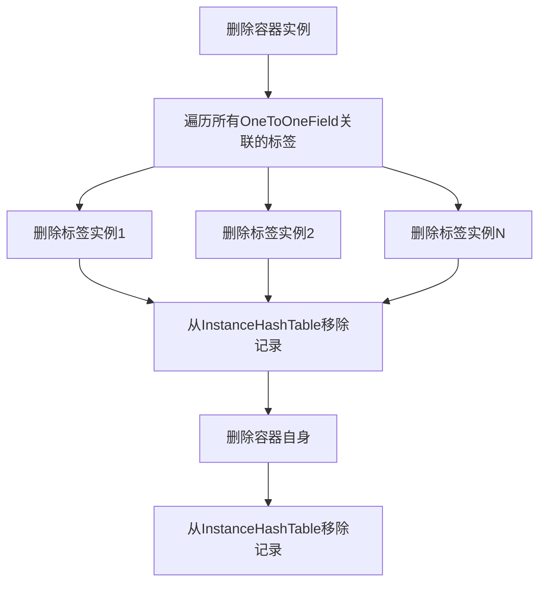
```mermaid
flowchart TD
    A[删除容器实例] --> B[遍历所有OneToOneField关联的标签]
    B --> C[删除标签实例1]
    B --> D[删除标签实例2]
    B --> E[删除标签实例N]
    C --> F[从InstanceHashTable移除记录]
    D --> F
    E --> F
    F --> G[删除容器自身]
    G --> H[从InstanceHashTable移除记录]
```


### 2.4 角色模型 (`BaseCharacter`)

**位置**: `characters/models/base_character.py`
**职责**: 所有角色模板模型的抽象基类。代表一个完整的、可实例化的角色类型。

**核心字段**:
*   `character_name` (`CharField`): 角色模板的名称。
*   `user` (`ForeignKey` to `User`): 创建并拥有此角色实例的用户。

**核心方法**:
*   `clean()`: 重写。逻辑与 `BaseContainer.clean()` 类似。验证所有关联的容器实例的 `used_in_character` 字段，确保它们未被其他角色占用，并通过后将其标记为已使用。
*   `save()`: 用于实例注册。
*   `delete()`: 重写。从 `InstanceHashTable` 中注销自己。**注意**: 它默认不会级联删除容器和标签。如果需要此功能，需要在子类或删除视图逻辑中实现。
*   `__get_all_containers_from_character()`: 私有方法，用于获取当前角色实例关联的所有容器实例的列表。

**角色关联字段**:
`CharacterContainerField` 是一个预设的 `OneToOneField`，用于在角色子类中关联容器模型。

---
## 3. 模型注册系统

### 3.1 模型注册机制 (`ModelRegister`)

**位置**: `api/models/register.py`
**职责**: 自动发现和注册所有自定义的标签、容器和角色模板模型，确保它们被系统正确识别和管理。

**核心属性**:
*   `registered_labels`: 存储所有已注册的标签模型类。
*   `registered_containers`: 存储所有已注册的容器模型类。
*   `registered_characters`: 存储所有已注册的角色模板模型类。

**核心方法**:
*   `load_all_characters()`: 
    *   **功能**: 扫描 `characters/models/characters` 目录下的所有Python文件，并导入它们。
    *   **机制**: 通过导入角色模型文件，会链式触发其中导入的容器和标签模型的装饰器注册。
    *   **注意**: 只有在角色模型中明确导入的容器和标签才会被注册和迁移。
*   `check_registered()`: 检查是否有至少一个注册的角色、容器和标签模型，如果没有则报错并退出。
*   `label_register()`, `container_register()`, `character_register()`: 装饰器函数，用于将模型类注册到对应的列表中。

**使用示例**:
```python
from api.models.register import ModelRegister

@ModelRegister.label_register
class MaxDrawdownLabel(BaseLabel):
    label_value = models.IntegerField(default=100, verbose_name='最大回撤')
    label_name = "最大回撤"

@ModelRegister.container_register  
class TradeInfoContainer(BaseContainer):
    trade_info_container = ContainerLabelField(to=MaxDrawdownLabel)

@ModelRegister.character_register
class SomeTradeModel(BaseCharacter):
    trade_info_container = CharacterContainerField(to=TradeInfoContainer)
```

**注册流程示意图**:
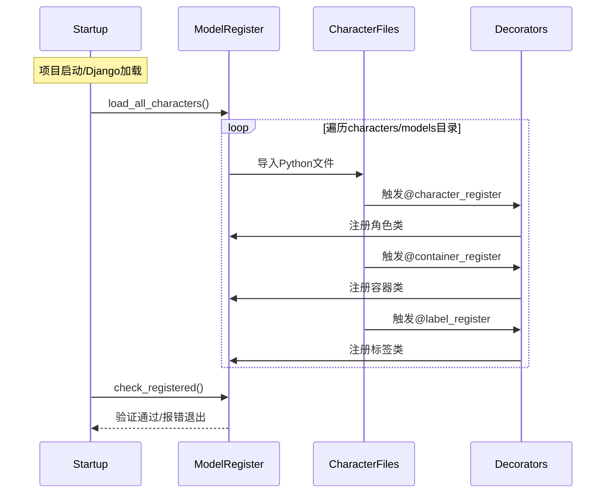
```mermaid
sequenceDiagram
    participant Startup
    participant ModelRegister
    participant CharacterFiles
    participant Decorators
    
    Note over Startup: 项目启动/Django加载
    Startup->>ModelRegister: load_all_characters()
    
    loop 遍历characters/models目录
        ModelRegister->>CharacterFiles: 导入Python文件
        CharacterFiles->>Decorators: 触发@character_register
        Decorators->>ModelRegister: 注册角色类
        
        CharacterFiles->>Decorators: 触发@container_register
        Decorators->>ModelRegister: 注册容器类
        
        CharacterFiles->>Decorators: 触发@label_register  
        Decorators->>ModelRegister: 注册标签类
    end
    
    Startup->>ModelRegister: check_registered()
    ModelRegister-->>Startup: 验证通过/报错退出
```

### 3.2 模型注册系统检查

确保 `admin.py` 被正确导入，以便注册所有模型到管理后台。

```python
# apps.py
from django.apps import AppConfig  
  
from api.models.register import ModelRegister  
  
  
class ApiConfig(AppConfig):  
    default_auto_field = 'django.db.models.BigAutoField'  
    name = 'api'  
    verbose_name = "主程序"  
  
    def ready(self):  
        ModelRegister.load_all_characters()  
        ModelRegister.check_registered()
```

**管理界面访问流程**:
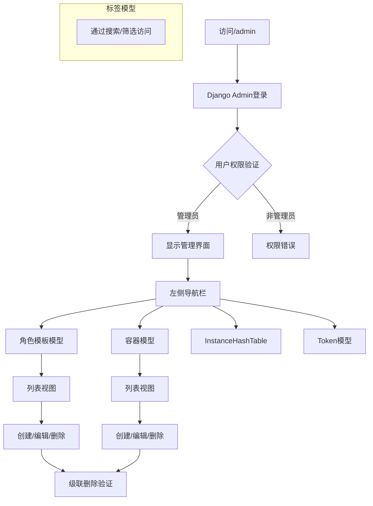
```mermaid
flowchart TD
    A[访问/admin] --> B[Django Admin登录]
    B --> C{用户权限验证}
    C -- 管理员 --> D[显示管理界面]
    C -- 非管理员 --> E[权限错误]
    
    D --> F[左侧导航栏]
    F --> G[角色模板模型]
    F --> H[容器模型]
    F --> I[InstanceHashTable]
    F --> J[Token模型]
    
    subgraph "标签模型"
        K[通过搜索/筛选访问]
    end
    
    G --> L[列表视图]
    L --> M[创建/编辑/删除]
    
    H --> N[列表视图]
    N --> O[创建/编辑/删除]
    
    M --> P[级联删除验证]
    O --> P
```

## 5. 事件系统与触发器集成

详细的实现： [[#6. 核心模块详解：事件引擎 (EventBus)]]
### 5.1 工作原理
1.  **定义触发器**: 在自定义标签模型类中，使用 `@LabelTriggerManager.register_trigger` 装饰器来装饰 `trigger_0` 和 `trigger_1` 方法，并指定其监听模式、监听的事件以及触发后要发布的事件。
2.  **注册触发器**: 项目启动时，`LabelTriggerManager` 会扫描所有标签类，将其触发器函数信息记录到全局字典 `trigger_hash_tabel` 中。
3.  **安装实例**: 当用户启动事件引擎（通过调用 `StartEventBusEngine` API）时，系统会遍历该用户的所有角色、容器、标签，并将每个标签**实例**安装到 `trigger_hash_tabel` 中对应类名的 `"instance"` 字段下。
4.  **安装事件总线**: 紧接着，`LabelTriggerManager.install_to_eventbus` 被调用。它会遍历 `trigger_hash_tabel`，根据第一步注册的监听信息，将每个触发器（其函数已被包装为一个能操作特定实例的Lambda）注册到该用户的 `EventBus` 实例中。
5.  **事件流**: 此后，任何代码通过 `EventBus.publish("某事件")` 发布事件时，相关监听器（即标签的触发器）就会被触发，从而改变标签的数据。

#### 5.1.1 事件引擎工作流程图
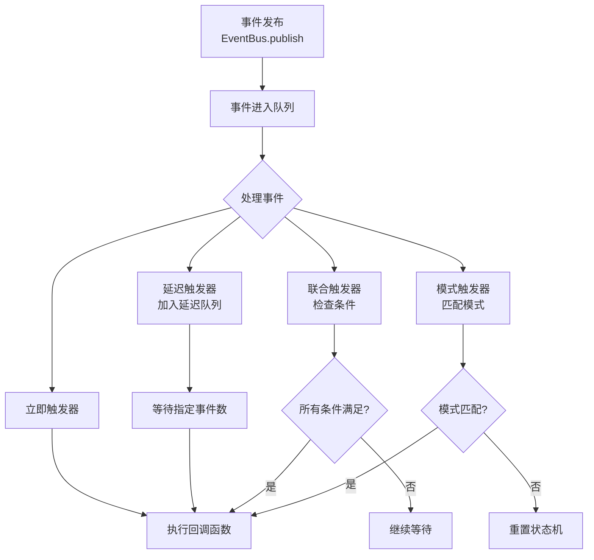
```mermaid
flowchart TD
    A[事件发布<br>EventBus.publish] --> B[事件进入队列]
    B --> C{处理事件}
    C --> D[立即触发器]
    C --> E[延迟触发器<br>加入延迟队列]
    C --> F[联合触发器<br>检查条件]
    C --> G[模式触发器<br>匹配模式]
    
    D --> H[执行回调函数]
    E --> I[等待指定事件数]
    I --> H
    F --> J{所有条件满足?}
    J -- 是 --> H
    J -- 否 --> K[继续等待]
    
    G --> L{模式匹配?}
    L -- 是 --> H
    L -- 否 --> M[重置状态机]
```


### 5.2 如何定义一个带触发器的标签

```python
# labels/models/my_labels.py
# labels/models/my_labels.py
from django.db import models
from labels.models.base_label import BaseLabel
from labels.models.label_trigger_manager import LabelTriggerManager
from api.event.event_engine import EventBus

class MaxDrawdownLabel(BaseLabel):
    # 重写 label_value 为浮点数类型，这才是"一标签一模型"的体现
    label_value = models.FloatField(default=0.0, verbose_name='最大回撤')
    label_name = "最大回撤" # 也可以固定死

    @LabelTriggerManager.register_trigger(
        listener_type=EventBus.IMMEDIATE,
        listen_event="market_crash", # 监听"市场暴跌"事件
        publish="risk_alert"    # 触发后发布"风险警报"事件
    )
    def trigger_0(self):
        """市场暴跌，更新最大回撤"""
        # 假设这里有一些计算逻辑
        new_drawdown = calculate_current_drawdown()
        if new_drawdown > self.label_value:
            self.label_value = new_drawdown
            self.save()
            print(f"{self.get_name()} 更新为: {self.get_value()}")

    @LabelTriggerManager.register_trigger(
        listener_type=EventBus.IMMEDIATE,
        listen_event="reset_drawdown", # 监听"重置回撤"事件
        publish="drawdown_reset"  # 触发后发布"回撤重置"事件
    )
    def trigger_1(self):
        """重置最大回撤"""
        self.label_value = 0.0
        self.save()
        print(f"{self.get_name()} 已重置")

```
**关键点**:
*   使用 `@LabelTriggerManager.register_trigger` 装饰器。
*   `listener_type`: 定义监听模式（即时、延迟、联合、模式）。
*   `listen_event`: 指定要监听的事件名称。
*   `publish`: （可选）指定该触发器执行成功后要发布的新事件名称，从而形成事件链。

### 5.2.1 触发器注册与安装序列图
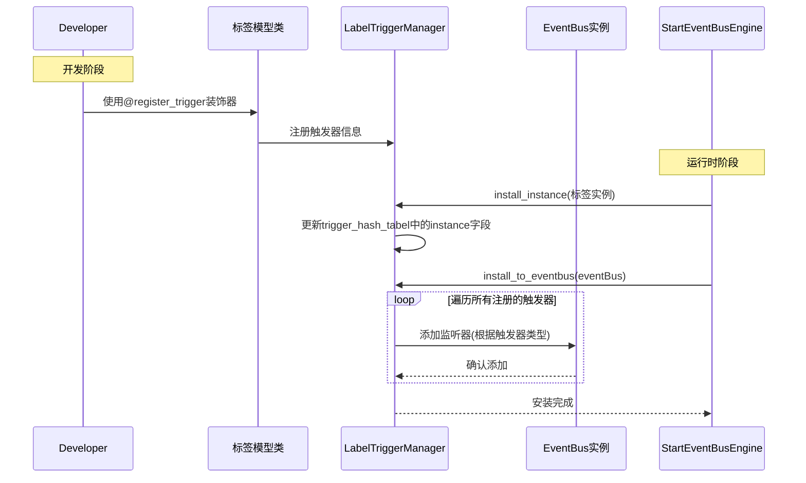
```mermaid
sequenceDiagram
    participant Developer
    participant LabelModel as 标签模型类
    participant TriggerManager as LabelTriggerManager
    participant EventBusInst as EventBus实例
    participant APIView as StartEventBusEngine
    
    Note over Developer: 开发阶段
    Developer->>LabelModel: 使用@register_trigger装饰器
    LabelModel->>TriggerManager: 注册触发器信息
    
    Note over APIView: 运行时阶段
    APIView->>TriggerManager: install_instance(标签实例)
    TriggerManager->>TriggerManager: 更新trigger_hash_tabel中的instance字段
    
    APIView->>TriggerManager: install_to_eventbus(eventBus)
    
    loop 遍历所有注册的触发器
        TriggerManager->>EventBusInst: 添加监听器(根据触发器类型)
        EventBusInst-->>TriggerManager: 确认添加
    end
    
    TriggerManager-->>APIView: 安装完成
```
---

### 5.3 事件触发与响应序列图
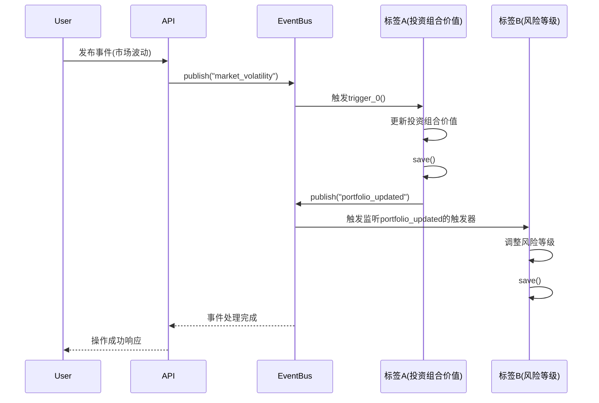
```mermaid
sequenceDiagram
    participant User
    participant API
    participant EventBus
    participant LabelA as 标签A(投资组合价值)
    participant LabelB as 标签B(风险等级)
    
    User->>API: 发布事件(市场波动)
    API->>EventBus: publish("market_volatility")
    
    EventBus->>LabelA: 触发trigger_0()
    LabelA->>LabelA: 更新投资组合价值
    LabelA->>LabelA: save()
    LabelA->>EventBus: publish("portfolio_updated")
    
    EventBus->>LabelB: 触发监听portfolio_updated的触发器
    LabelB->>LabelB: 调整风险等级
    LabelB->>LabelB: save()
    
    EventBus-->>API: 事件处理完成
    API-->>User: 操作成功响应
```

## 6. 使用流程 (How-To)

### 6.1 系统初始化与启动

在项目启动时，需要确保模型注册系统正确工作：

1.  **模型注册**: 在Django的 `apps.py` 或项目初始化代码中调用 `ModelRegister.load_all_characters()`。
2.  **注册检查**: 调用 `ModelRegister.check_registered()` 确保至少有一个角色、容器和标签被注册。
3.  **Admin配置**: 确保 `admin.py` 被正确导入，以便注册所有模型到管理后台。

```python
# apps.py
from django.apps import AppConfig  
  
from api.models.register import ModelRegister  
  
  
class ApiConfig(AppConfig):  
    default_auto_field = 'django.db.models.BigAutoField'  
    name = 'api'  
    verbose_name = "主程序"  
  
    def ready(self):  
        ModelRegister.load_all_characters()  
        ModelRegister.check_registered()
```

### 6.2 管理后台使用

1.  **访问管理后台**: 通过 `/admin` URL访问Django管理界面。
2.  **管理模型**: 
    *   角色模板和容器模型会显示在左侧导航栏中。
    *   标签模型不会显示在导航栏，但可以通过URL直接访问或通过关联的容器进行管理。
3.  **数据操作**: 
    *   可以创建、编辑、删除角色、容器和标签实例。
    *   删除操作会自动处理级联关系（如删除容器会删除关联的标签）。

### 6.3 创建一个全新的角色类型
假设我们要创建一个名为 `ArbitrageStrategy` 的角色。

**1. 定义标签模型**
创建 `labels/models/game_labels.py`：
```python
from django.db import models
from labels.models.base_label import BaseLabel

class SymbolPairLabel(BaseLabel):
    label_value = models.CharField(max_length=50, default="BTC/USD", verbose_name='交易对')
    label_name = "交易对"

class CapitalLabel(BaseLabel):
    label_value = models.FloatField(default=10000.0, verbose_name='初始资金')
    label_name = "初始资金"

class SharpeRatioLabel(BaseLabel):
    label_value = models.FloatField(default=0.0, verbose_name='夏普比率')
    label_name = "夏普比率"
```

**2. 定义容器模型**
创建 `containers/models/game_containers.py`：
```python
from django.db import models
from containers.models.base_container import BaseContainer
from containers.models.container_label_field import ContainerLabelField
from labels.models.quant_labels import SymbolPairLabel, CapitalLabel, SharpeRatioLabel

class BasicConfigContainer(BaseContainer):
    # 关联标签模型
    symbol_pair = ContainerLabelField(to=SymbolPairLabel)
    capital = ContainerLabelField(to=CapitalLabel)

class PerformanceContainer(BaseContainer):
    sharpe_ratio = ContainerLabelField(to=SharpeRatioLabel)
```

**3. 定义角色模型**
创建 `characters/models/game_character.py`：
```python
from django.db import models
from strategies.models.base_strategy import BaseStrategy
from strategies.models.strategy_container_field import StrategyContainerField
from containers.models.quant_containers import BasicConfigContainer, PerformanceContainer

class ArbitrageStrategy(BaseStrategy):
    # 关联容器模型
    basic_config = StrategyContainerField(to=BasicConfigContainer)
    performance = StrategyContainerField(to=PerformanceContainer)
```

**4. 更新数据库**
运行Django数据库迁移命令，创建新定义的模型所对应的数据表。
```bash
python manage.py makemigrations
python manage.py migrate
```

**5. （可选）为标签添加触发器**
编辑 `game_labels.py`，如前文所述，为 `HealthLabel` 等添加 `@LabelTriggerManager.register_trigger` 装饰的逻辑。

#### 6.3.1 创建新角色类型流程图
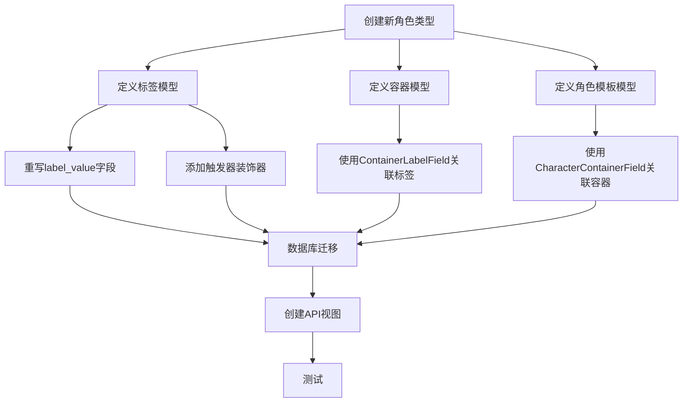
```mermaid
flowchart TD
    A[创建新角色类型] --> B[定义标签模型]
    A --> C[定义容器模型]
    A --> D[定义角色模板模型]
    
    B --> E[重写label_value字段]
    B --> F[添加触发器装饰器]
    
    C --> G[使用ContainerLabelField关联标签]
    
    D --> H[使用CharacterContainerField关联容器]
    
    E --> I[数据库迁移]
    F --> I
    G --> I
    H --> I
    
    I --> J[创建API视图]
    J --> K[测试]
```

### 6.4 启动事件引擎
前端在用户登录后或需要启动交互功能时，应调用 `/api/eventbus/start/` (`StartEventBusEngine` 视图)。这个视图会：
1.  找到或创建对应用户的 `EventBus` 实例。
2.  遍历该用户的所有角色、容器、标签。
3.  调用 `LabelTriggerManager.install_instance` 为每个标签实例配置触发器。
4.  调用 `LabelTriggerManager.install_to_eventbus` 将所有配置好的触发器注册到事件总线上。

此后，事件驱动系统即可正常工作。

### 6.5 系统启动与事件引擎初始化图
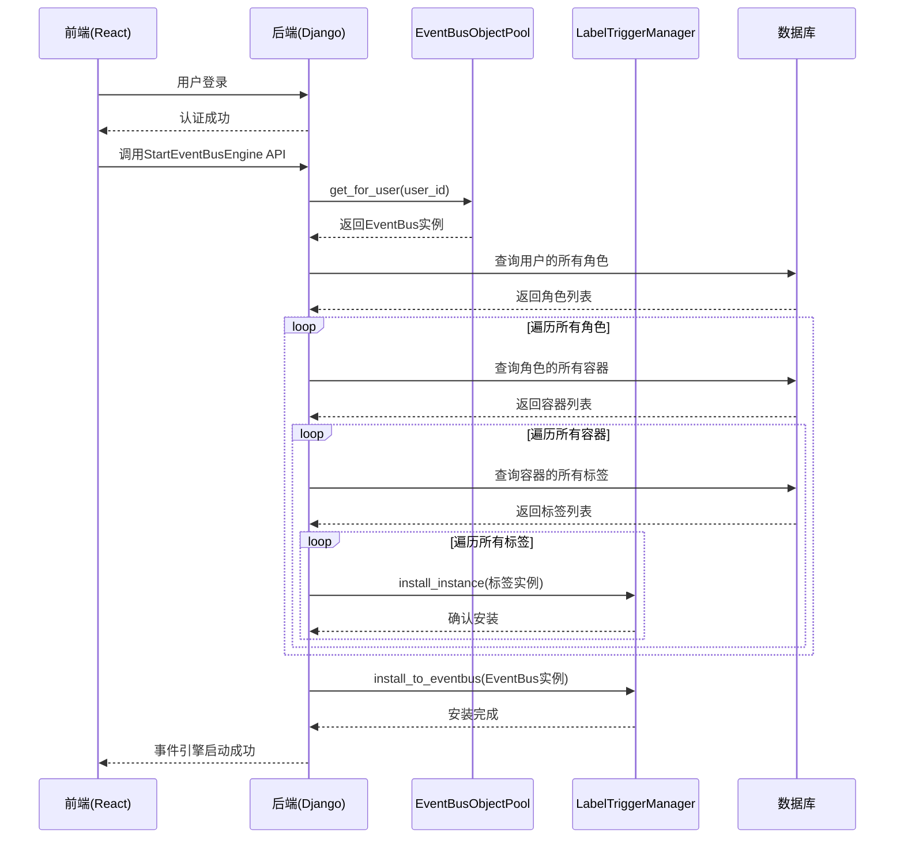
```mermaid
sequenceDiagram
    participant Frontend as 前端(React)
    participant Backend as 后端(Django)
    participant EventBusPool as EventBusObjectPool
    participant TriggerManager as LabelTriggerManager
    participant DB as 数据库
    
    Frontend->>Backend: 用户登录
    Backend-->>Frontend: 认证成功
    
    Frontend->>Backend: 调用StartEventBusEngine API
    
    Backend->>EventBusPool: get_for_user(user_id)
    EventBusPool-->>Backend: 返回EventBus实例
    
    Backend->>DB: 查询用户的所有角色
    DB-->>Backend: 返回角色列表
    
    loop 遍历所有角色
        Backend->>DB: 查询角色的所有容器
        DB-->>Backend: 返回容器列表
        
        loop 遍历所有容器
            Backend->>DB: 查询容器的所有标签
            DB-->>Backend: 返回标签列表
            
            loop 遍历所有标签
                Backend->>TriggerManager: install_instance(标签实例)
                TriggerManager-->>Backend: 确认安装
            end
        end
    end
    
    Backend->>TriggerManager: install_to_eventbus(EventBus实例)
    TriggerManager-->>Backend: 安装完成
    
    Backend-->>Frontend: 事件引擎启动成功
```
---

## 7. 插件开发指南

开发新策略监控项目，本质就是创建新的Django App（或在本项目的对应app下创建新模块），并遵循上述 `BaseCharacter`, `BaseContainer`, `BaseLabel` 的继承体系定义一套新的模型。

**步骤**:
1.  **规划**: 确定新角色需要哪些数据（标签），如何分组（容器）。
2.  **创建模型**:
    *   在 `labels/models/` 下创建 `your_plugin_labels.py`，定义所有标签模型。
    *   在 `containers/models/` 下创建 `your_plugin_containers.py`，定义容器模型并使用 `ContainerLabelField` 关联上一步的标签。
    *   在 `characters/models/` 下创建 `your_plugin_character.py`，定义角色模板模型并使用 `CharacterContainerField` 关联上一步的容器。
3.  **实现逻辑**:
    *   在标签模型中重写 `trigger_0` 和 `trigger_1` 方法，并使用 `LabelTriggerManager.register_trigger` 装饰器定义其事件行为。
4.  **注册迁移**: 确保新模型文件被正确导入，然后运行 `makemigrations` 和 `migrate`。
5.  **提供API** (可选): 如果需要，创建新的API视图来处理这个新角色类型的特定操作（如释放技能、更换装备）。

**注意事项**:
*   模型的定义和迁移是插件化的核心。
*   充分理解 `used_in_container` 和 `used_in_character` 字段的维护机制，避免在自定义的 `save` 或 `delete` 逻辑中破坏它。
*   触发器装饰器的参数配置是关键，需要清晰理解事件总线的工作模式。

好的，根据您提供的详细代码和描述，我将为您撰写事件引擎 (`EventBus`) 和标签触发器管理器 (`LabelTriggerManager`) 这两个核心模块的开发文档。这些文档将集成到您提供的初始文档结构中。

### 7.1 插件开发组件关系图
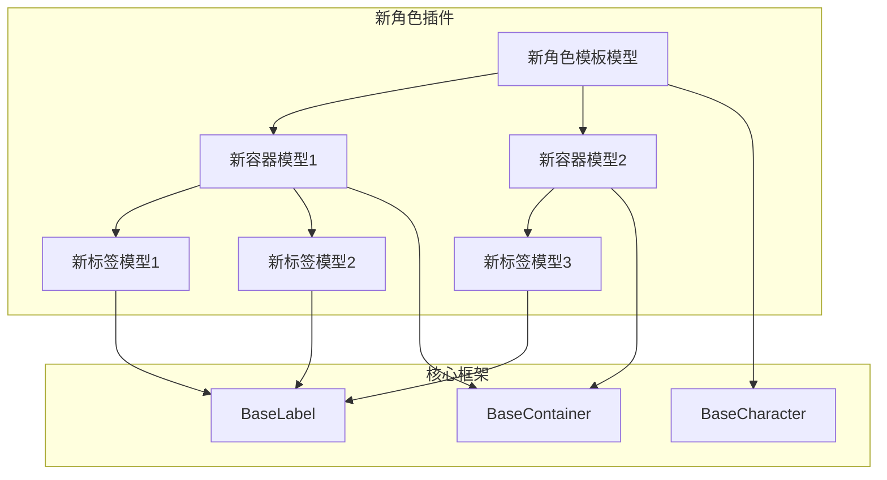
```mermaid
graph TB
    subgraph "新角色插件"
        NewCharacter[新角色模板模型]
        NewContainer1[新容器模型1]
        NewContainer2[新容器模型2]
        NewLabel1[新标签模型1]
        NewLabel2[新标签模型2]
        NewLabel3[新标签模型3]
        
        NewCharacter --> NewContainer1
        NewCharacter --> NewContainer2
        NewContainer1 --> NewLabel1
        NewContainer1 --> NewLabel2
        NewContainer2 --> NewLabel3
    end
    
    subgraph "核心框架"
        BaseCharacter[BaseCharacter]
        BaseContainer[BaseContainer]
        BaseLabel[BaseLabel]
    end
    
    NewCharacter --> BaseCharacter
    NewContainer1 --> BaseContainer
    NewContainer2 --> BaseContainer
    NewLabel1 --> BaseLabel
    NewLabel2 --> BaseLabel
    NewLabel3 --> BaseLabel
```
---


## 8. 核心模块详解：事件引擎 (EventBus)

**位置**: `api/event/event_engine.py`
**职责**: 提供一个强大的、基于队列的事件驱动架构核心。它负责事件的发布、存储、调度，并根据预定义的监听模式（Immediate, Delayed, Joint, Pattern）触发相应的回调函数。每个用户拥有独立的事件总线实例，通过 `EventBusObjectPool` 进行管理，确保了用户间的事件隔离。

### 8.1 核心类与数据结构

**`EventBus` 类**:

*   **`is_install` (Boolean)**: 标志位，指示该事件总线实例是否已被 `LabelTriggerManager.install_to_eventbus` 方法安装和配置过，防止重复安装。
*   **`event_count` (Integer)**: 全局事件计数器。从 0 开始递增，每次处理一个新事件时加 1。用于实现延迟触发。
*   **`event_bus` (Queue)**: 一个先进先出 (FIFO) 的事件队列，用于存储所有待处理的事件字符串。`maxsize=1000` 防止内存溢出。
*   **`immediate_listeners` (DefaultDict[str, List[Callable]])**: 立即监听器字典。键是事件名 (`source`)，值是一个回调函数列表。当对应事件被发布时，列表中的所有回调会被**立即同步执行**。
*   **`delayed_tasks` (List[Tuple[int, Callable]])**: 延迟任务**最小堆**。每个元素是一个元组 `(trigger_at, callback)`，其中 `trigger_at` 是一个绝对的事件计数（`event_count + delay`）。堆总是保证 `trigger_at` 最小的任务在堆顶。
*   **`joint_conditions` (List[JointCondition])**: 联合条件监听器列表。
*   **`pattern_matchers` (List[PatternMatcher])**: 模式匹配监听器列表。

**`JointCondition` 类**:
用于实现**联合触发**（所有指定事件都发生，顺序无关）。
*   **`required` (Set[str])**: 需要监听的所有事件的集合。
*   **`occurred` (Set[str])**: 已经发生的事件的集合。
*   **`callback` (Callable)**: 当 `occurred == required` 时要执行的回调函数。
*   **`on_event(event)`**: 处理新事件。如果事件在 `required` 中且未被记录，则加入 `occurred`。如果所有事件都已发生，则触发 `callback` 并重置状态。
*   **`reset()`**: 重置 `occurred` 集合。

**`PatternMatcher` 类**:
用于实现**模式触发**（事件序列匹配特定模式，支持 `*` 通配符）。
*   **`pattern` (List[str])**: 要匹配的事件模式列表，如 `["A", "*", "B"]`。
*   **`state` (Integer)**: 当前在模式序列中的匹配位置（状态机的状态）。
*   **`callback` (Callable)**: 当模式完全匹配时要执行的回调函数。
*   **`on_event(event)`**: 使用状态机逻辑处理新事件，尝试推进匹配状态。如果完全匹配 (`state == len(pattern)`)，则触发 `callback` 并重置状态。如果匹配失败，会尝试从当前事件重新开始匹配。
*   **`reset()`**: 重置状态机 (`state = 0`)。

**事件引擎 (EventBus) 内部数据结构与事件流**

**描述**: 此图展示了 EventBus 的核心数据结构和处理一个事件的内部流程。

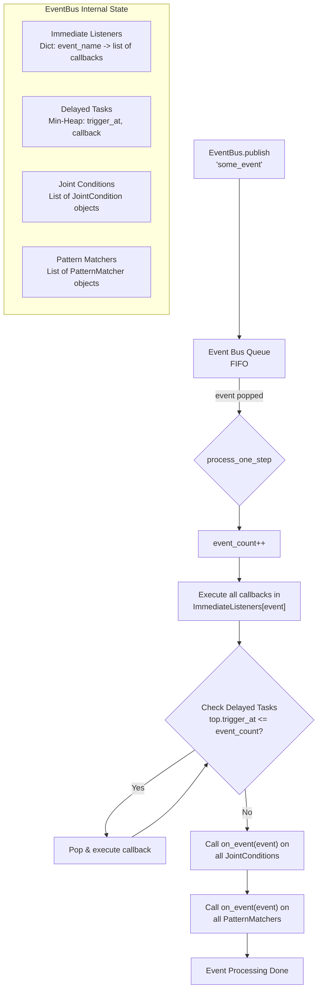
```mermaid
flowchart TD
    A[EventBus.publish<br>'some_event'] --> B[Event Bus Queue<br>FIFO]

    subgraph EventBusInternalState [EventBus Internal State]
        direction LR
        C[Immediate Listeners<br>Dict: event_name -> list of callbacks]
        D[Delayed Tasks<br>Min-Heap: trigger_at, callback]
        E[Joint Conditions<br>List of JointCondition objects]
        F[Pattern Matchers<br>List of PatternMatcher objects]
    end

    B -- event popped --> G{process_one_step}
    G --> H[event_count++]
    H --> I["Execute all callbacks in<br>ImmediateListeners[event]"]
    I --> J{Check Delayed Tasks<br>top.trigger_at <= event_count?}
    J -- Yes --> K[Pop & execute callback]
    K --> J
    J -- No --> L["Call on_event(event) on<br>all JointConditions"]
    L --> M["Call on_event(event) on<br>all PatternMatchers"]
    M --> N[Event Processing Done]
```

### 8.2 监听模式 (Listener Types)

1.  **`IMMEDIATE` (立即触发)**:
    *   **行为**: 监听特定事件 `source`。当 `source` 事件被处理时，所有关联的回调函数被立即调用。
    *   **应用**: 最常用，用于对事件做出即时反应，如受伤扣血、获得经验。

2.  **`DELAY` (延迟触发)**:
    *   **行为**: 监听特定事件 `source`。当 `source` 事件被处理时，并不立即执行回调，而是计算一个未来的触发点 `trigger_at = current_event_count + delay`，并将任务放入最小堆。系统会在处理每个事件后检查堆顶，如果 `trigger_at <= current_event_count`，则执行回调。
    *   **实现**: 借用了立即触发器。当 `source` 事件发生时，一个包装函数(`delayed_callback_wrapper`)被立即调用，它的作用仅仅是将真正的回调任务推入延迟堆。
    *   **应用**: 实现需要等待一段时间（以事件数为单位）后才生效的效果，如中毒后的持续伤害、buff/debuff 的持续时间。

3.  **`JOINT` (联合触发)**:
    *   **行为**: 监听一组事件 `sources`。要求集合中的所有事件**都至少发生一次**（顺序无关）。当最后一个缺失的事件发生时，回调被触发。触发后条件重置，可以再次触发。
    *   **应用**: 完成一个需要多个步骤的任务，如收集多个道具后合成、同时按下多个键发动技能。

4.  **`PATTERN` (模式触发)**:
    *   **行为**: 监听一个事件序列 `pattern`。要求事件**按顺序**匹配给定的模式，`*` 可以匹配任意一个事件。匹配成功后触发回调，然后重置状态机。
    *   **应用**: 实现连招系统、解锁特定成就（需要按顺序执行操作）、解析命令行指令。

### 8.3 核心方法流程

**`publish(event: str)`**:
1.  将事件字符串 `event` 放入 `event_bus` 队列。
2.  记录日志。

**`process_one_step()`**: **事件处理的核心循环单元**。
1.  检查队列是否为空，空则返回 `True`（处理完成）。
2.  检查队列是否已满，满则返回 `False`（错误）。
3.  `event_count++`。
4.  从队列头 `get()` 一个事件。
5.  **立即触发**: 在 `immediate_listeners` 中查找该事件对应的回调列表，并顺序执行所有回调。
6.  **延迟触发**: 检查 `delayed_tasks` 堆顶，循环弹出并执行所有 `trigger_at <= event_count` 的任务。
7.  **联合触发**: 遍历 `joint_conditions`，对每个条件调用 `condition.on_event(current_event)`。
8.  **模式触发**: 遍历 `pattern_matchers`，对每个匹配器调用 `matcher.on_event(current_event)`。
9.  返回 `False`（表示还有更多事件待处理）。

**`process(maxStep=10000)`**:
循环调用 `process_one_step()` 最多 `maxStep` 次，直到其返回 `True`（队列空）或达到循环上限（防止死循环）。

**监听器注册方法 (`add_*_listener`)**:
这些方法用于编程式注册监听器，通常由 `LabelTriggerManager` 在安装阶段调用。
*   `add_immediate_listener(source, callback)`
*   `add_delayed_listener(source, delay, callback)`
*   `add_joint_listener(sources, callback)`
*   `add_pattern_listener(pattern, callback)`

**装饰器方法**:
提供更声明式的监听器注册方式，可用于其他部分的代码（不仅限于标签触发器）。
*   `@listen_immediately(source)`
*   `@listen_delayed(source, delay)`
*   `@listen_jointly(sources)`
*   `@listen_pattern_matcher(pattern)`
*   `@publish_event(event)`: **特殊装饰器**。它装饰一个函数，并返回一个包装函数。当被装饰的函数执行后，包装函数会自动发布指定的事件 `event`。这用于实现**事件链**（一个触发器的执行会导致新事件的发布）。

### 8.4 数据流
1.  **事件产生**: 由 API 视图（如 `LabelTriggerView`）、或其他后台逻辑调用 `event_bus_instance.publish("some_event")`。
2.  **事件入列**: 事件被加入 `event_bus` 队列。
3.  **事件处理**: `process_one_step()` 被循环调用（通常在API请求的上下文中，或由后台任务调用）。
4.  **触发回调**: 根据事件类型和监听器配置，相应的回调函数被查找并执行。这些回调函数是经过 `LabelTriggerManager` 包装的，最终会调用特定标签实例的 `trigger_0` 或 `trigger_1` 方法。
5.  **状态变更**: 标签实例的数据在触发器函数中被修改（`self.label_value -= 10`）并保存（`self.save()`），从而改变了角色的状态。
6.  **事件链**: 如果触发器装饰了 `@publish_event`，其执行后会发布新事件，回到步骤1，形成链式反应。

---

## 9. 核心模块详解：标签触发器管理器 (LabelTriggerManager)

**位置**: `labels/models/label_trigger_manager.py`
**职责**: 作为 `BaseLabel` 和 `EventBus` 之间的**桥梁**和**配置中心**。它提供了一个全局注册表，用于收集所有标签类的触发器信息，并提供方法将这些静态的触发器函数“安装”到动态的、用户专属的事件总线实例上，并将它们与具体的标签实例绑定。

### 9.1 核心数据结构: `trigger_hash_tabel`

这是一个全局的、模块级的字典，是管理器的核心。其结构设计精巧，包含了类级别的配置和实例引用。

```python
{
  "HealthLabel": { # Key: 标签类的名称 (str)
    "instance": health_label_instance_23, # Value: 该类的某个实例 (BaseLabel) | None
    "trigger_0": { # Key: 触发器方法名 (str)
      "func": <function HealthLabel.trigger_0 at 0x...>, # Value: 原始的触发器函数 (Callable)
      "listener_args": { # 该触发器的监听配置 (Dict)
        "listener_type": EventBus.IMMEDIATE, # 监听模式 (int)
        "listen_event": "take_damage",       # 监听的事件 (str/list)
        "delay": None                        # 延迟量，仅DELAY模式有效 (int/None)
      },
      "publish": "health_changed" # 触发后要发布的事件 (str/None)
    },
    "trigger_1": {
      "func": ...,
      "listener_args": {...},
      "publish": "health_changed"
    }
  },
  "ManaLabel": {
    "instance": ...,
    "trigger_0": {...},
    "trigger_1": {...}
  }
}
```
**重要提示**: 由于 `trigger_hash_tabel` 是全局的，而 `"instance"` 字段在 `install_instance` 阶段会被覆盖为*当前正在处理的那个用户*的某个标签实例，因此**绝对不能在业务逻辑中直接使用或依赖 `trigger_hash_tabel` 中 `"instance"` 的值**。它的存在只是为了后续的 `install_to_eventbus` 步骤提供临时存储。

### 9.2 核心方法流程

**`register_trigger(listener_type, listen_event, publish, delay)`**:
*   **这是一个装饰器工厂方法**。它在项目启动时，随着标签模型类的定义而被执行。
*   **流程**:
    1.  接收监听器参数。
    2.  返回一个装饰器函数。
    3.  装饰器函数接收被装饰的 `trigger_0` 或 `trigger_1` 方法 (`func`)。
    4.  通过分析 `func.__qualname__` 获取其所属的类名 (`func_class_name`) 和方法名 (`func_name`)。
    5.  在 `trigger_hash_tabel` 中创建或更新对应类名和方法名的条目，将函数引用和监听配置存储起来。
    6.  将该类的 `"instance"` 字段初始化为 `None`。
    7.  返回原始函数 `func`，不影响其正常行为。
*   **效果**: 项目启动后，所有被装饰过的触发器函数及其元信息都被自动注册到了全局查找表中。

**`install_instance(instance: BaseLabel)`**:
*   **调用时机**: 由 `StartEventBusEngine` 视图调用，遍历用户的所有标签实例时。
*   **流程**:
    1.  检查实例是否是 `BaseLabel` 子类。
    2.  获取实例的类名。
    3.  如果该类名在 `trigger_hash_tabel` 中存在，则用当前这个具体的**实例**覆盖该类的 `"instance"` 字段。
*   **目的**: 为下一步安装事件总线时，为每个触发器函数提供一个具体的操作对象（`self`）。

**`install_to_eventbus(eventBus: EventBus)`**:
*   **调用时机**: 紧接在 `install_instance` 循环之后，由 `StartEventBusEngine` 视图调用。
*   **流程**:
    1.  检查事件总线是否已被安装过，避免重复安装。
    2.  遍历 `trigger_hash_tabel` 中的每一个标签类条目。
    3.  获取该条目下的 `"instance"`。此时它应该是一个具体的实例，而不是 `None`。
    4.  遍历该条目下的 `"trigger_0"` 和 `"trigger_1"`。
    5.  **包装回调函数**:
        *   根据触发器配置中的 `publish` 参数，决定是否需要使用 `eventBus.publish_event(publish)` 装饰器来包装原始的 `trigger_` 函数。包装后的函数会在执行完原始逻辑后自动发布指定事件。经过`eventBus.publish_event(publish)` 包装的函数会用于更新`trigger_hash_tabel`中对应的`func`字段，确保在用户调用`call()`时，该所需的事件发布功能能生效
        *   创建一个 **Lambda 函数** `callback`。这个 Lambda 会捕获当前的触发器配置 (`current_trigger`) 和实例 (`instance`)，当被调用时，它会执行 `current_trigger["func"](instance)`。**这一步是关键**，它将一个普通的类方法 (`HealthLabel.trigger_0`) 和一个具体的实例 (`health_label_instance_23`) 绑定在了一起，形成了一个可以直接调用的函数对象。
    6.  **注册到事件总线**: 根据 `listener_args` 中的配置，调用事件总线对应的 `add_*_listener` 方法，将上一步创建好的 `callback` 函数注册进去。监听的事件源 (`listen_event`) 就是配置中指定的事件。
*   **最终状态**: 此后，全局 `trigger_hash_tabel` 的使命基本完成。事件总线 (`eventBus`) 内部已经存储了所有配置好的监听器回调。当相应事件被发布时，这些回调就会被执行，操作的就是之前安装的那些具体标签实例。

**`call(label_instance: BaseLabel, action: str)`**:
*   **调用时机**: 通常由 `LabelTriggerView` 等API视图调用，用于手动触发某个标签的某个动作。
*   **流程**:
    1.  校验实例。
    2.  根据实例的类名和指定的动作 (`'trigger_0'` 或 `'trigger_1'`)，从 `trigger_hash_tabel` 中找出对应的原始函数 (`func`)。
    3.  **直接调用**这个原始函数，并传入 `label_instance` 作为 `self` 参数：`func(label_instance)`。
*   **注意**: 这个方法**绕过了事件总线**。它直接触发标签的触发器逻辑，若原始函数 (`func`)在触发器配置中的 `publish` 参数不为None，则会向事件总线发布指定事件

### 9.3 标签触发器管理器 (LabelTriggerManager) 工作流程

**描述**: 此图展示了 `@register_trigger`, `install_instance`, `install_to_eventbus` 三个关键阶段的协作流程和数据变化。


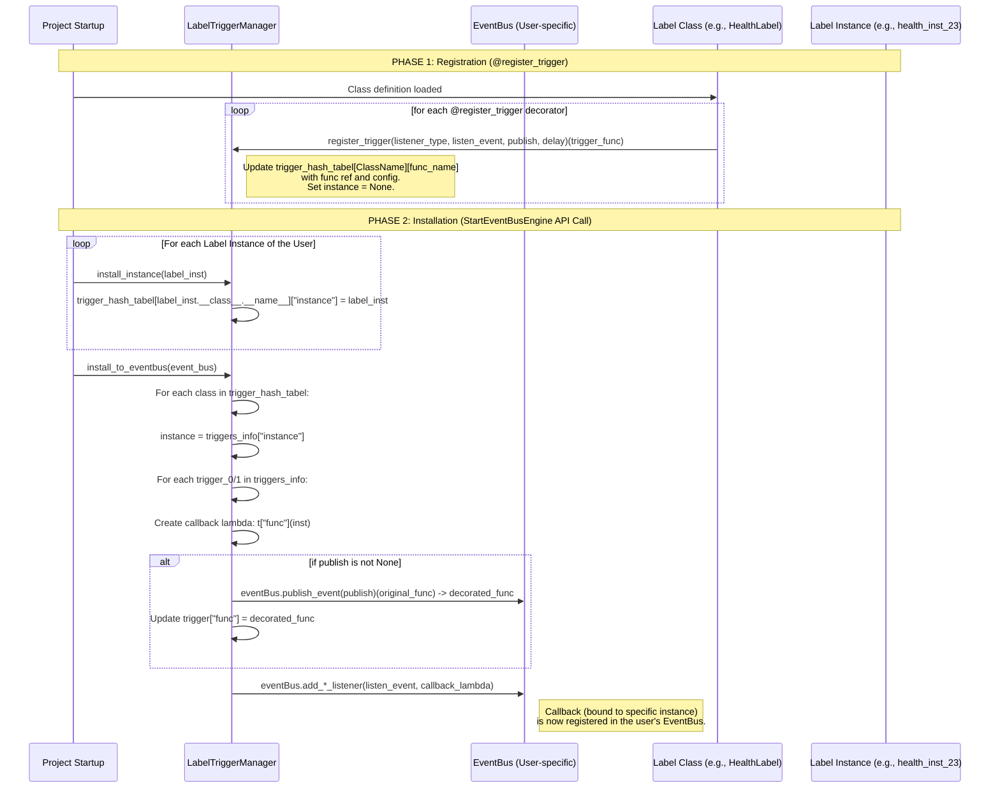
```mermaid
sequenceDiagram
    participant A as Project Startup
    participant LTM as LabelTriggerManager
    participant EB as EventBus (User-specific)
    participant LabelCls as Label Class (e.g., HealthLabel)
    participant LabelInst as Label Instance (e.g., health_inst_23)

    Note over A, LabelInst: PHASE 1: Registration (@register_trigger)
    A ->> LabelCls: Class definition loaded
    loop for each @register_trigger decorator
        LabelCls ->> LTM: register_trigger(listener_type, listen_event, publish, delay)(trigger_func)
        Note right of LTM: Update trigger_hash_tabel[ClassName][func_name]<br>with func ref and config.<br>Set instance = None.
    end

    Note over A, LabelInst: PHASE 2: Installation (StartEventBusEngine API Call)
    loop For each Label Instance of the User
        A ->> LTM: install_instance(label_inst)
        LTM ->> LTM: trigger_hash_tabel[label_inst.__class__.__name__]["instance"] = label_inst
    end

    A ->> LTM: install_to_eventbus(event_bus)
    LTM ->> LTM: For each class in trigger_hash_tabel:
    LTM ->> LTM: instance = triggers_info["instance"]
    LTM ->> LTM: For each trigger_0/1 in triggers_info:
    LTM ->> LTM: Create callback lambda: t["func"](inst)
    alt if publish is not None
        LTM ->> EB: eventBus.publish_event(publish)(original_func) -> decorated_func
        LTM ->> LTM: Update trigger["func"] = decorated_func
    end
    LTM ->> EB: eventBus.add_*_listener(listen_event, callback_lambda)
    Note right of EB: Callback (bound to specific instance)<br>is now registered in the user's EventBus.
```

### 9.4 数据流与协作
1.  **启动时 (注册)**:
    *   导入标签模型 → 执行 `@register_trigger` 装饰器 → 填充 `trigger_hash_tabel`（静态信息）。
2.  **用户登录/启用时 (安装)**:
    *   调用 `StartEventBusEngine` API。
    *   该视图获取用户专属的 `EventBus`。
    *   遍历用户的所有标签实例 → 对每个实例调用 `install_instance` → 更新 `trigger_hash_tabel` 的 `"instance"` 字段（动态引用）。
    *   调用 `install_to_eventbus` → 读取 `trigger_hash_tabel` → 为每个触发器创建绑定了实例的回调 → 将该回调注册到用户的 `EventBus` 上。
3.  **运行时 (触发)**:
    *   **方式A (事件驱动)**: 某处代码 `publish("event_A")` → `EventBus` 找到监听 `"event_A"` 的回调并执行 → 回调函数（即绑定了实例的 `trigger_0`）执行 → 修改标签数据。
    *   **方式B (直接调用)**: API 调用 `LabelTriggerView` → 其内部调用 `LabelTriggerManager.call(instance, 'trigger_1')` → 直接执行标签实例的 `trigger_1` 方法。

### 9.5 事件链示例图 (## 投资组合更新触发风险评估)

**描述**: 此图展示了一个具体的事件链例子，帮助理解量化策略中的响应式风控机制。

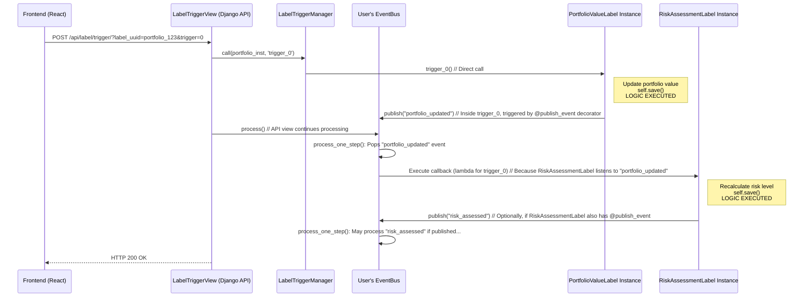
```mermaid
sequenceDiagram
    participant FE as Frontend (React)
    participant API as LabelTriggerView (Django API)
    participant LTM as LabelTriggerManager
    participant EB as User's EventBus
    participant P_Inst as PortfolioValueLabel Instance
    participant R_Inst as RiskAssessmentLabel Instance

    FE ->> API: POST /api/label/trigger/?label_uuid=portfolio_123&trigger=0
    API ->> LTM: call(portfolio_inst, 'trigger_0')
    LTM ->> P_Inst: trigger_0() // Direct call
    Note right of P_Inst: Update portfolio value<br>self.save()<br>LOGIC EXECUTED

    P_Inst ->> EB: publish("portfolio_updated") // Inside trigger_0, triggered by @publish_event decorator

    API ->> EB: process() // API view continues processing

    EB ->> EB: process_one_step(): Pops "portfolio_updated" event
    EB ->> R_Inst: Execute callback (lambda for trigger_0) // Because RiskAssessmentLabel listens to "portfolio_updated"
    Note right of R_Inst: Recalculate risk level<br>self.save()<br>LOGIC EXECUTED
    R_Inst ->> EB: publish("risk_assessed") // Optionally, if RiskAssessmentLabel also has @publish_event

    EB ->> EB: process_one_step(): May process "risk_assessed" if published...

    API -->> FE: HTTP 200 OK
```


**解释**: 用例展示了量化策略中常见的连锁反应：当投资组合价值发生变化时，系统自动触发风险评估流程，确保风险控制与资产变动保持同步。

---

## 10. API 接口详解

### 10.1 启动事件引擎 `GET /api/eventbus/start/`

**视图**: `StartEventBusEngine`
**权限**: `IsAuthenticated`
**流程**:
1.  获取当前登录用户的 ID。
2.  从 `EventBusObjectPool` 中获取该用户专属的 `EventBus` 实例（不存在则创建）。
3.  **遍历用户数据**:
    *   通过 Django 模型的反向关系 (`user.<related_name>_character.all()`)，找到该用户创建的所有角色实例。
    *   对每个角色实例，使用反射 (`_meta.get_fields()`) 找到所有其关联的容器实例。
    *   对每个容器实例，使用反射找到所有其关联的标签实例。
4.  **安装触发器**: 对找到的每一个标签实例，调用 `LabelTriggerManager.install_instance(label_instance)`。
5.  **注册事件总线**: 调用 `LabelTriggerManager.install_to_eventbus(eventbus)`，完成所有触发器在事件总线上的最终注册。
6.  返回成功响应。

**作用**: 此调用是**激活用户事件驱动功能的必要条件**。它建立了用户数据（标签实例）和事件系统之间的连接。

**API 请求序列图 (启动事件引擎)**
**描述**: 此图详细展示了 `/api/eventbus/start/` API 的调用序列。

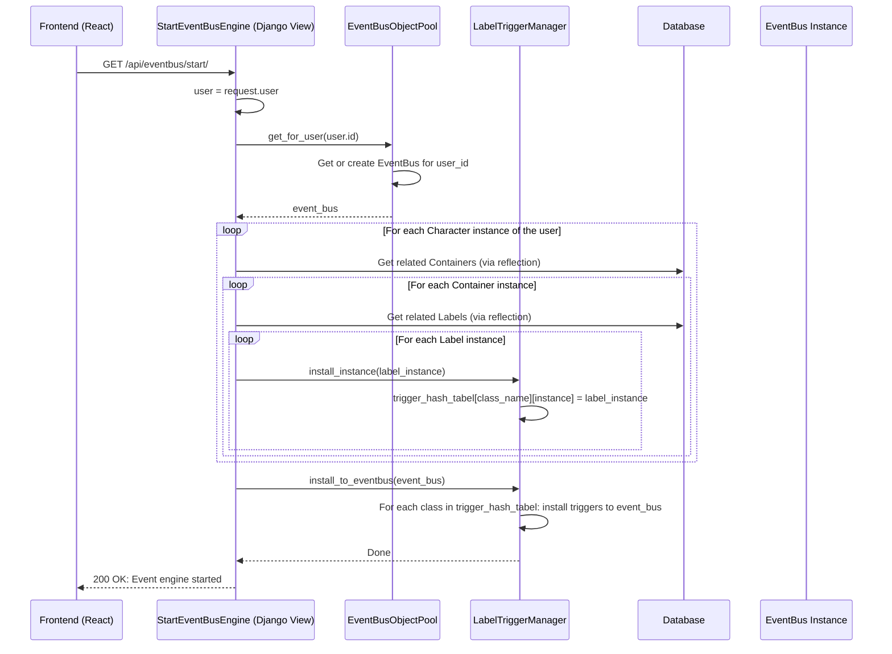
```mermaid
sequenceDiagram
    participant FE as Frontend (React)
    participant API as StartEventBusEngine (Django View)
    participant EBPool as EventBusObjectPool
    participant LTM as LabelTriggerManager
    participant DB as Database
    participant EB as EventBus Instance

    FE ->> API: GET /api/eventbus/start/
    API ->> API: user = request.user
    API ->> EBPool: get_for_user(user.id)
    EBPool ->> EBPool: Get or create EventBus for user_id
    EBPool -->> API: event_bus

    loop For each Character instance of the user
        API ->> DB: Get related Containers (via reflection)
        loop For each Container instance
            API ->> DB: Get related Labels (via reflection)
            loop For each Label instance
                API ->> LTM: install_instance(label_instance)
                LTM ->> LTM: trigger_hash_tabel[class_name][instance] = label_instance
            end
        end
    end

    API ->> LTM: install_to_eventbus(event_bus)
    LTM ->> LTM: For each class in trigger_hash_tabel: install triggers to event_bus
    LTM -->> API: Done

    API -->> FE: 200 OK: Event engine started
```

### 10.2 触发标签动作 `POST /api/label/trigger/?label_uuid=...&trigger=...`

**视图**: `LabelTriggerView`
**权限**: `IsAuthenticated`
**查询参数**:
*   `label_uuid` (必需): 要通过 `InstanceHashTable` 查找的目标标签实例的 UUID。
*   `trigger` (必需): 要触发的动作，必须是 `'0'` 或 `'1'`，分别对应 `trigger_0` 和 `trigger_1`。

**流程**:
1.  校验参数。
2.  检查对应用户的 `EventBus` 是否已通过 `StartEventBusEngine` 启动。
3.  使用 `InstanceHashTable.get_instance_by_uuid(label_uuid)` 通过 UUID 查找到具体的标签实例。**这是实现跨模型动态查找的关键**。
4.  调用 `LabelTriggerManager.call(label_instance, f'trigger_{trigger}')` **直接执行**指定的触发器方法。
5.  手动调用 `eventbus.process()` **处理事件队列**。这一步至关重要，因为直接调用 `call()` 可能触发了一些事件（例如，触发器函数内部可能调用了 `publish`），需要让事件总线处理这些新产生的事件，才能看到完整的链式反应效果。
6.  返回操作结果。

**作用**: 为前端提供一个通用的接口，手动触发某个标签的特定动作，并推动事件链的进行。例如，前端一个"执行回测"按钮可以调用此 API 来触发一个策略的"夏普比率"标签的 `trigger_0`（计算绩效指标）动作，这可能进一步触发风险评估和报表生成等后续事件。

(有关第10章API接口的文档随项目更新中，上次更新日期： 29-8-2025)


---

<a name="繁体中文"></a>

---
## 繁体中文版

# 量化策略管理與監控系統 - 核心架構開發文檔

## 1. 概述

本項目的核心是構建一個高度動態化、可擴展的量化策略管理與監控系統，該系統從批量部署、運行、監控、追踪、留檔五個方面自動化了量化策略的開發、部署以及評估。其基石是 **“一標簽，一模型” (One Label, One Model)** 的設計理念。該系統允許開發者或高級用戶通過創建Django模型的方式，從零開始定義全新的策略監控項目，包括其數據結構（標簽）、組織方式（容器）以及複雜的數據交互邏輯（事件驅動的觸發器）。

### 1.1 核心概念
*   **角色 (Character)**: 定義一個量化策略的藍圖。例如：`套利策略`、`均值回歸策略`、`定投策略`。
*   **容器 (Container)**: 用于對量化策略進行邏輯分組。例如：`基礎信息`、`模型參數`、`評估指標`。一個角色由多個容器構成。
*   **標簽 (Label)**: 角色最基礎的數據單元，代表一個具體的屬性。例如：`交易頻率`、`最大回撤`、`上次交易時間`、`夏普比率`。每個標簽都是一個獨立的Django模型。標簽被放置在容器中。


```mermaid
graph TB
    User[用戶] --> Character[角色]
    Character --> Container1[容器 1]
    Character --> Container2[容器 2]
    Character --> Container3[容器 3]
    
    Container1 --> Label1[標簽 1]
    Container1 --> Label2[標簽 2]
    Container2 --> Label3[標簽 3]
    Container2 --> Label4[標簽 4]
    Container3 --> Label5[標簽 5]
    
    Label1 --> EventBus[事件總綫]
    Label2 --> EventBus
    Label3 --> EventBus
    Label4 --> EventBus
    Label5 --> EventBus
    
    EventBus --> Label1
    EventBus --> Label2
    EventBus --> Label3
    EventBus --> Label4
    EventBus --> Label5
    
    subgraph "事件驅動響應系統"
        EventBus
    end
```
### 1.2 架構關係
```
用戶 (User)
│
└── 擁有多個 (1:N) → 角色 (BaseCharacter Subclass)
    │
    └── 包含多個 (1:N) → 容器實例 (BaseContainer Subclass)
        │
        └── 包含一個 (1:N) → 標簽實例 (BaseLabel Subclass)
```
**關係約束**:
*   一個**角色模板類**對應一種角色類型。
*   一個**角色實例**通過 `OneToOneField` 關聯多個**容器實例**。
*   一個**容器實例**通過 `OneToOneField` 關聯多個**標簽實例**。
*   一個**標簽模型**定義一種數據類型（如 `交易頻率`）。
*   一個**標簽實例**只能屬￿一個**容器**。其 `used_in_container` 字段記錄了所屬容器的類名。
*   一個**容器實例**只能屬￿一個**角色**。其 `used_in_character` 字段記錄了所屬角色模板的類名。

### 1.3 總覽

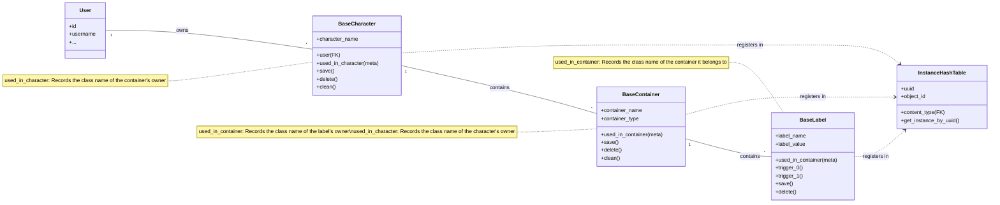
```mermaid
classDiagram
    direction LR
    class User {
        +id
        +username
        +...
    }

    class BaseCharacter {
        +character_name
        +user (FK)
        +used_in_character (meta)
        +save()
        +delete()
        +clean()
    }

    class BaseContainer {
        +container_name
        +container_type
        +used_in_container (meta)
        +save()
        +delete()
        +clean()
    }

    class BaseLabel {
        +label_name
        +label_value
        +used_in_container (meta)
        +trigger_0()
        +trigger_1()
        +save()
        +delete()
    }

    class InstanceHashTable {
        +uuid
        +content_type (FK)
        +object_id
        +get_instance_by_uuid()
    }

    User "1" -- "*" BaseCharacter : owns
    BaseCharacter "1" -- "*" BaseContainer : contains
    BaseContainer "1" -- "*" BaseLabel : contains
    
    BaseCharacter ..> InstanceHashTable : registers in
    BaseContainer ..> InstanceHashTable : registers in
    BaseLabel ..> InstanceHashTable : registers in

    note for BaseCharacter "used_in_character: Records the class name of the container's owner"
    note for BaseContainer "used_in_container: Records the class name of the label's owner\nused_in_character: Records the class name of the character's owner"
    note for BaseLabel "used_in_container: Records the class name of the container it belongs to"
```
---

## 2. 核心模型詳解：數據庫結構

### 2.1 標簽模型 (`BaseLabel`)

**位置**: `labels/models/base_label.py`
**職責**: 所有標簽模型的抽象基類。定義了標簽的基本結構和行爲。

**核心字段**:
*   `label_name` (`LabelNameField`): 標簽的名稱，如“交易頻率”、“上次交易時間”。
*   `label_value` (`LabelTextField`): 標簽的值。**注意**: 在實際的自定義標簽中，您應重寫此字段爲更合適的類型（如 `IntegerField`, `CharField`）。
*   `label_type` (`LabelChoiceField`): 標簽的交互類型，該字段會體現在WebUI中（如：只讀、可互動）。
*   `label_display_format` (`LabelDisplayFormatField`): 控制標簽在前端如何展示的格式字符串。默認格式爲`'<標簽名>: <分隔><標簽值>'`。開發者可通過組合`<標簽名>`、`<標簽值>`和`<分隔>`（用于視覺分組）來自定義顯示樣式，系統會自動替換占位符。此字段在保存時會進行驗證，確保格式有效。
*   `used_in_container` (`LabelsContainerField`): **一個字符串字段**，用于記錄此標簽實例所屬容器的類名。這是一個關鍵的元數據字段，用于維護標簽與容器的歸屬關係，幷在容器清理(`clean()`)時進行驗證。

**核心方法**:
*   `get_name()`, `get_value()`:  final方法，獲取標簽的名稱和值。
*   `trigger_0()`, `trigger_1()`: 空方法。預期在子類中重寫，用于定義標簽被觸發時的行爲。通常成對出現，代表互斥的操作（如`買入/賣出`）。
*   `save()`: 重寫了Django模型的保存方法。當一個新的標簽實例被創建時（`self._state.adding` 爲 `True`），它會自動在全域的 `InstanceHashTable` 中注册一條記錄。**這個機制是實現動態架構和跨模型實例追踪的關鍵**，它使得系統能够感知和管理所有創建的實例，無論它們屬￿哪個具體的模型。
*   `delete()`: 重寫了Django模型的删除方法。在删除標簽實例自身之前，會先從 `InstanceHashTable` 中注銷對應的記錄，保持哈希表的數據一致性。

**繼承與使用**:  
要創建一個新的自定義標簽，必須繼承此 `BaseLabel` 抽象類，幷至少重寫 `label_value` 字段以定義正確的數據類型。同時，應根據需要實現 `trigger_0` 和 `trigger_1` 方法來完成交互邏輯。

### 2.2 預設標簽字段 (`label_field.py`)

**位置**: `labels/models/label_field.py`  
**職責**: 提供一系列預設的Django模型字段類，這些字段已配置了適用于標簽系統的默認元數據（如`verbose_name`）。它們主要用于在定義具體標簽模型時，快速、規範地聲明字段。

**字段列表及說明**:

- `LabelNameField`: 繼承自 `CharField`。用于標簽名稱，默認 `verbose_name='標簽名稱'`。
    
- `LabelCharField`: 繼承自 `CharField`。用于短文本值，默認 `verbose_name='標簽值'`。
    
- `LabelTextField`: 繼承自 `TextField`。用于長文本值，默認 `verbose_name='標簽值'`。
    
- `LabelIntegerField`: 繼承自 `IntegerField`。用于整數值，默認 `verbose_name='標簽值'`。
    
- `LabelFloatField`: 繼承自 `FloatField`。用于浮點數值，默認 `verbose_name='標簽值'`。
    
- `LabelDateField`, `LabelDateTimeField`, `LabelTimeField`, `LabelDurationField`: 分別繼承自相應的日期時間字段，默認 `verbose_name='標簽值'`。
    
- `LabelUUIDField`: 繼承自 `UUIDField`。用于生成唯一標識符，默認配置爲 `editable=False`, `unique=True`, `default=uuid.uuid4`。通常用于需要唯一ID的場景。
    
- `LabelChoiceField`: 繼承自 `CharField`。用于定義標簽類型，預先設置了 `choices=[('timer','計時器'),('counter','步進器'),('read_only','只讀')]` 以及相應的 `verbose_name` 和 `help_text`。
    
- `LabelsContainerField`: 繼承自 `CharField`。用于 `BaseLabel.used_in_container`，默認 `verbose_name='所屬容器'`，幷包含幫助文本。
    
- `LabelDisplayFormatField`: 繼承自 `CharField`。用于定義展示格式，包含自定義驗證邏輯，確保格式字符串包含必要的占位符且符合規則。
    

**使用建議**:  
在定義具體的標簽模型時，可以直接使用這些預設字段，它們提供了符合標簽系統約定的默認配置，有助于保持整個項目字段定義的一致性。例如，在自定義一個“最大回撤”標簽時，其 `label_value` 應重寫爲 `LabelFloatField(default=100)` 而不是普通的 `models.IntegerField`。
### 2.3 容器模型 (`BaseContainer`)

**位置**: `containers/models/base_container.py`
**職責**: 所有容器模型的抽象基類。充當標簽的邏輯分組和物理載體。

**核心字段**:
*   `container_name` (`CharField`): 容器的名稱。
*   `container_type` (`CharField`): 容器的類型（如：展示、交互、隱藏）。
*   `used_in_character` (`ContainerCharacterField`): **一個字符串字段**，用于記錄此容器實例所屬角色模板的類名。
*   **注意**: 容器通過具體的 `OneToOneField` 字段（定義在子類中）來關聯標簽實例。

**核心方法**:
*   `clean()`: 重寫。在保存容器前進行驗證。它會檢查容器想要關聯的所有標簽實例的 `used_in_container` 字段。如果某個標簽已被其他容器占用，則會拋出 `ValidationError`。驗證通過後，它會將這些標簽的 `used_in_container` 字段設置爲當前容器的類名，標記其爲“已使用”。
*   `save()`: 類似 `BaseLabel`，用于實例注册。
*   `delete()`: 重寫。非常重要！當容器被删除時，它會執行級聯删除：
    1.  **遍歷所有通過 `OneToOneField` 關聯到它的標簽實例**，幷删除這些標簽實例。
    2.  從 `InstanceHashTable` 中注銷自己。
    3.  最後删除自身。
*   `__get_all_label_from_container()`: 一個私有方法，用于獲取當前容器實例關聯的所有標簽實例的列表。`clean()` 和 `delete()` 方法都依賴它。

**容器關聯字段**:
`container_label_field.py` 中的 `ContainerLabelField` 是一個便捷類，它預設了 `on_delete=models.SET_NULL`, `null=True`, `related_name='+'` 的 `OneToOneField`，用于在容器子類中關聯標簽模型。

#### 2.3.1 容器模型删除級聯示意圖
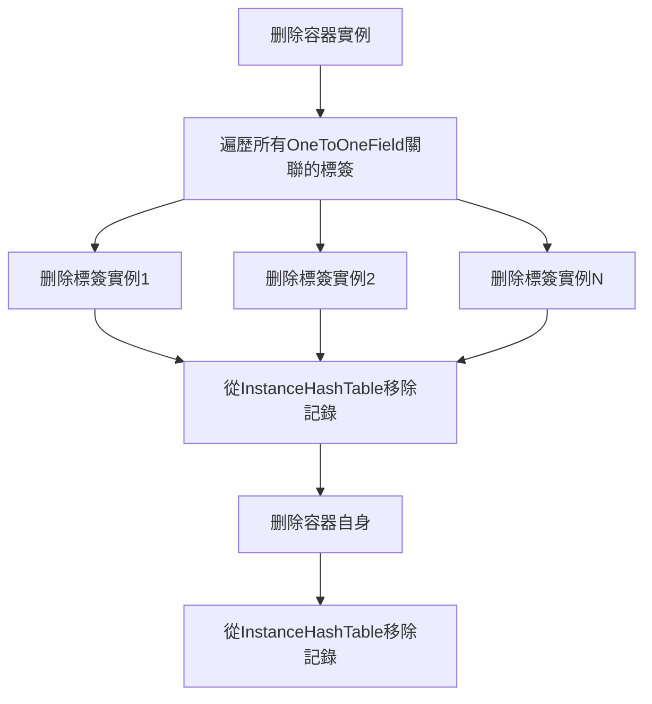
```mermaid
flowchart TD
    A[删除容器實例] --> B[遍歷所有OneToOneField關聯的標簽]
    B --> C[删除標簽實例1]
    B --> D[删除標簽實例2]
    B --> E[删除標簽實例N]
    C --> F[從InstanceHashTable移除記錄]
    D --> F
    E --> F
    F --> G[删除容器自身]
    G --> H[從InstanceHashTable移除記錄]
```


### 2.4 角色模型 (`BaseCharacter`)

**位置**: `characters/models/base_character.py`
**職責**: 所有角色模板模型的抽象基類。代表一個完整的、可實例化的角色類型。

**核心字段**:
*   `character_name` (`CharField`): 角色模板的名稱。
*   `user` (`ForeignKey` to `User`): 創建幷擁有此角色實例的用戶。

**核心方法**:
*   `clean()`: 重寫。邏輯與 `BaseContainer.clean()` 類似。驗證所有關聯的容器實例的 `used_in_character` 字段，確保它們未被其他角色占用，幷通過後將其標記爲已使用。
*   `save()`: 用于實例注册。
*   `delete()`: 重寫。從 `InstanceHashTable` 中注銷自己。**注意**: 它默認不會級聯删除容器和標簽。如果需要此功能，需要在子類或删除視圖邏輯中實現。
*   `__get_all_containers_from_character()`: 私有方法，用于獲取當前角色實例關聯的所有容器實例的列表。

**角色關聯字段**:
`CharacterContainerField` 是一個預設的 `OneToOneField`，用于在角色子類中關聯容器模型。

---
## 3. 模型注册系統

### 3.1 模型注册機制 (`ModelRegister`)

**位置**: `api/models/register.py`
**職責**: 自動發現和注册所有自定義的標簽、容器和角色模板模型，確保它們被系統正確識別和管理。

**核心屬性**:
*   `registered_labels`: 存儲所有已注册的標簽模型類。
*   `registered_containers`: 存儲所有已注册的容器模型類。
*   `registered_characters`: 存儲所有已注册的角色模板模型類。

**核心方法**:
*   `load_all_characters()`: 
    *   **功能**: 掃描 `characters/models/characters` 目錄下的所有Python文件，幷導入它們。
    *   **機制**: 通過導入角色模型文件，會鏈式觸發其中導入的容器和標簽模型的裝飾器注册。
    *   **注意**: 只有在角色模型中明確導入的容器和標簽才會被注册和遷移。
*   `check_registered()`: 檢查是否有至少一個注册的角色、容器和標簽模型，如果沒有則報錯幷退出。
*   `label_register()`, `container_register()`, `character_register()`: 裝飾器函數，用于將模型類注册到對應的列表中。

**使用示例**:
```python
from api.models.register import ModelRegister

@ModelRegister.label_register
class MaxDrawdownLabel(BaseLabel):
    label_value = models.IntegerField(default=100, verbose_name='最大回撤')
    label_name = "最大回撤"

@ModelRegister.container_register  
class TradeInfoContainer(BaseContainer):
    trade_info_container = ContainerLabelField(to=MaxDrawdownLabel)

@ModelRegister.character_register
class SomeTradeModel(BaseCharacter):
    trade_info_container = CharacterContainerField(to=TradeInfoContainer)
```

**注册流程示意圖**:
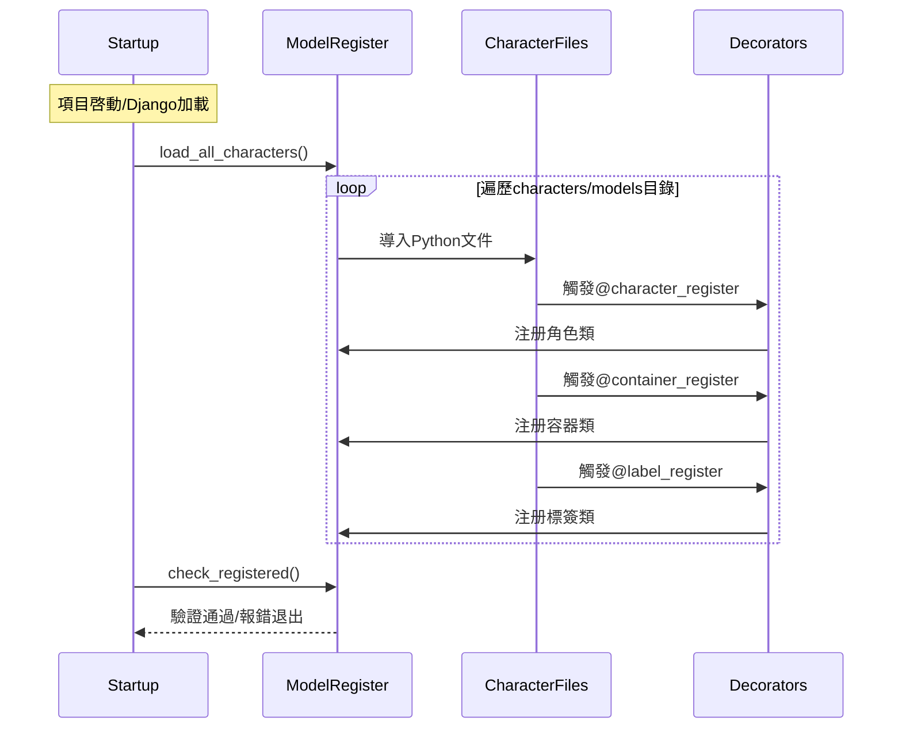
```mermaid
sequenceDiagram
    participant Startup
    participant ModelRegister
    participant CharacterFiles
    participant Decorators
    
    Note over Startup: 項目啓動/Django加載
    Startup->>ModelRegister: load_all_characters()
    
    loop 遍歷characters/models目錄
        ModelRegister->>CharacterFiles: 導入Python文件
        CharacterFiles->>Decorators: 觸發@character_register
        Decorators->>ModelRegister: 注册角色類
        
        CharacterFiles->>Decorators: 觸發@container_register
        Decorators->>ModelRegister: 注册容器類
        
        CharacterFiles->>Decorators: 觸發@label_register  
        Decorators->>ModelRegister: 注册標簽類
    end
    
    Startup->>ModelRegister: check_registered()
    ModelRegister-->>Startup: 驗證通過/報錯退出
```

### 3.2 模型注册系統檢查

確保 `admin.py` 被正確導入，以便注册所有模型到管理後臺。

```python
# apps.py
from django.apps import AppConfig  
  
from api.models.register import ModelRegister  
  
  
class ApiConfig(AppConfig):  
    default_auto_field = 'django.db.models.BigAutoField'  
    name = 'api'  
    verbose_name = "主程序"  
  
    def ready(self):  
        ModelRegister.load_all_characters()  
        ModelRegister.check_registered()
```

**管理界面訪問流程**:

```mermaid
flowchart TD
    A[訪問/admin] --> B[Django Admin登錄]
    B --> C{用戶權限驗證}
    C -- 管理員 --> D[顯示管理界面]
    C -- 非管理員 --> E[權限錯誤]
    
    D --> F[左側導航欄]
    F --> G[角色模板模型]
    F --> H[容器模型]
    F --> I[InstanceHashTable]
    F --> J[Token模型]
    
    subgraph "標簽模型"
        K[通過搜索/篩選訪問]
    end
    
    G --> L[列表視圖]
    L --> M[創建/編輯/删除]
    
    H --> N[列表視圖]
    N --> O[創建/編輯/删除]
    
    M --> P[級聯删除驗證]
    O --> P
```

## 5. 事件系統與觸發器集成

詳細的實現： [[#6. 核心模塊詳解：事件引擎 (EventBus)]]
### 5.1 工作原理
1.  **定義觸發器**: 在自定義標簽模型類中，使用 `@LabelTriggerManager.register_trigger` 裝飾器來裝飾 `trigger_0` 和 `trigger_1` 方法，幷指定其監聽模式、監聽的事件以及觸發後要發布的事件。
2.  **注册觸發器**: 項目啓動時，`LabelTriggerManager` 會掃描所有標簽類，將其觸發器函數信息記錄到全域字典 `trigger_hash_tabel` 中。
3.  **安裝實例**: 當用戶啓動事件引擎（通過調用 `StartEventBusEngine` API）時，系統會遍歷該用戶的所有角色、容器、標簽，幷將每個標簽**實例**安裝到 `trigger_hash_tabel` 中對應類名的 `"instance"` 字段下。
4.  **安裝事件總綫**: 緊接著，`LabelTriggerManager.install_to_eventbus` 被調用。它會遍歷 `trigger_hash_tabel`，根據第一步注册的監聽信息，將每個觸發器（其函數已被包裝爲一個能操作特定實例的Lambda）注册到該用戶的 `EventBus` 實例中。
5.  **事件流**: 此後，任何代碼通過 `EventBus.publish("某事件")` 發布事件時，相關監聽器（即標簽的觸發器）就會被觸發，從而改變標簽的數據。

#### 5.1.1 事件引擎工作流程圖
```mermaid
flowchart TD
    A[事件發布<br>EventBus.publish] --> B[事件進入隊列]
    B --> C{處理事件}
    C --> D[立即觸發器]
    C --> E[延遲觸發器<br>加入延遲隊列]
    C --> F[聯合觸發器<br>檢查條件]
    C --> G[模式觸發器<br>匹配模式]
    
    D --> H[執行回調函數]
    E --> I[等待指定事件數]
    I --> H
    F --> J{所有條件滿足?}
    J -- 是 --> H
    J -- 否 --> K[繼續等待]
    
    G --> L{模式匹配?}
    L -- 是 --> H
    L -- 否 --> M[重置狀態機]
```


### 5.2 如何定義一個帶觸發器的標簽

```python
# labels/models/my_labels.py
# labels/models/my_labels.py
from django.db import models
from labels.models.base_label import BaseLabel
from labels.models.label_trigger_manager import LabelTriggerManager
from api.event.event_engine import EventBus

class MaxDrawdownLabel(BaseLabel):
    # 重寫 label_value 爲浮點數類型，這才是"一標簽一模型"的體現
    label_value = models.FloatField(default=0.0, verbose_name='最大回撤')
    label_name = "最大回撤" # 也可以固定死

    @LabelTriggerManager.register_trigger(
        listener_type=EventBus.IMMEDIATE,
        listen_event="market_crash", # 監聽"市場暴跌"事件
        publish="risk_alert"    # 觸發後發布"風險警報"事件
    )
    def trigger_0(self):
        """市場暴跌，更新最大回撤"""
        # 假設這裏有一些計算邏輯
        new_drawdown = calculate_current_drawdown()
        if new_drawdown > self.label_value:
            self.label_value = new_drawdown
            self.save()
            print(f"{self.get_name()} 更新爲: {self.get_value()}")

    @LabelTriggerManager.register_trigger(
        listener_type=EventBus.IMMEDIATE,
        listen_event="reset_drawdown", # 監聽"重置回撤"事件
        publish="drawdown_reset"  # 觸發後發布"回撤重置"事件
    )
    def trigger_1(self):
        """重置最大回撤"""
        self.label_value = 0.0
        self.save()
        print(f"{self.get_name()} 已重置")

```
**關鍵點**:
*   使用 `@LabelTriggerManager.register_trigger` 裝飾器。
*   `listener_type`: 定義監聽模式（即時、延遲、聯合、模式）。
*   `listen_event`: 指定要監聽的事件名稱。
*   `publish`: （可選）指定該觸發器執行成功後要發布的新事件名稱，從而形成事件鏈。

### 5.2.1 觸發器注册與安裝序列圖
```mermaid
sequenceDiagram
    participant Developer
    participant LabelModel as 標簽模型類
    participant TriggerManager as LabelTriggerManager
    participant EventBusInst as EventBus實例
    participant APIView as StartEventBusEngine
    
    Note over Developer: 開發階段
    Developer->>LabelModel: 使用@register_trigger裝飾器
    LabelModel->>TriggerManager: 注册觸發器信息
    
    Note over APIView: 運行時階段
    APIView->>TriggerManager: install_instance(標簽實例)
    TriggerManager->>TriggerManager: 更新trigger_hash_tabel中的instance字段
    
    APIView->>TriggerManager: install_to_eventbus(eventBus)
    
    loop 遍歷所有注册的觸發器
        TriggerManager->>EventBusInst: 添加監聽器(根據觸發器類型)
        EventBusInst-->>TriggerManager: 確認添加
    end
    
    TriggerManager-->>APIView: 安裝完成
```
---

### 5.3 事件觸發與響應序列圖
```mermaid
sequenceDiagram
    participant User
    participant API
    participant EventBus
    participant LabelA as 標簽A(投資組合價值)
    participant LabelB as 標簽B(風險等級)
    
    User->>API: 發布事件(市場波動)
    API->>EventBus: publish("market_volatility")
    
    EventBus->>LabelA: 觸發trigger_0()
    LabelA->>LabelA: 更新投資組合價值
    LabelA->>LabelA: save()
    LabelA->>EventBus: publish("portfolio_updated")
    
    EventBus->>LabelB: 觸發監聽portfolio_updated的觸發器
    LabelB->>LabelB: 調整風險等級
    LabelB->>LabelB: save()
    
    EventBus-->>API: 事件處理完成
    API-->>User: 操作成功響應
```

## 6. 使用流程 (How-To)

### 6.1 系統初始化與啓動

在項目啓動時，需要確保模型注册系統正確工作：

1.  **模型注册**: 在Django的 `apps.py` 或項目初始化代碼中調用 `ModelRegister.load_all_characters()`。
2.  **注册檢查**: 調用 `ModelRegister.check_registered()` 確保至少有一個角色、容器和標簽被注册。
3.  **Admin配置**: 確保 `admin.py` 被正確導入，以便注册所有模型到管理後臺。

```python
# apps.py
from django.apps import AppConfig  
  
from api.models.register import ModelRegister  
  
  
class ApiConfig(AppConfig):  
    default_auto_field = 'django.db.models.BigAutoField'  
    name = 'api'  
    verbose_name = "主程序"  
  
    def ready(self):  
        ModelRegister.load_all_characters()  
        ModelRegister.check_registered()
```

### 6.2 管理後臺使用

1.  **訪問管理後臺**: 通過 `/admin` URL訪問Django管理界面。
2.  **管理模型**: 
    *   角色模板和容器模型會顯示在左側導航欄中。
    *   標簽模型不會顯示在導航欄，但可以通過URL直接訪問或通過關聯的容器進行管理。
3.  **數據操作**: 
    *   可以創建、編輯、删除角色、容器和標簽實例。
    *   删除操作會自動處理級聯關係（如删除容器會删除關聯的標簽）。

### 6.3 創建一個全新的角色類型
假設我們要創建一個名爲 `ArbitrageStrategy` 的角色。

**1. 定義標簽模型**
創建 `labels/models/game_labels.py`：
```python
from django.db import models
from labels.models.base_label import BaseLabel

class SymbolPairLabel(BaseLabel):
    label_value = models.CharField(max_length=50, default="BTC/USD", verbose_name='交易對')
    label_name = "交易對"

class CapitalLabel(BaseLabel):
    label_value = models.FloatField(default=10000.0, verbose_name='初始資金')
    label_name = "初始資金"

class SharpeRatioLabel(BaseLabel):
    label_value = models.FloatField(default=0.0, verbose_name='夏普比率')
    label_name = "夏普比率"
```

**2. 定義容器模型**
創建 `containers/models/game_containers.py`：
```python
from django.db import models
from containers.models.base_container import BaseContainer
from containers.models.container_label_field import ContainerLabelField
from labels.models.quant_labels import SymbolPairLabel, CapitalLabel, SharpeRatioLabel

class BasicConfigContainer(BaseContainer):
    # 關聯標簽模型
    symbol_pair = ContainerLabelField(to=SymbolPairLabel)
    capital = ContainerLabelField(to=CapitalLabel)

class PerformanceContainer(BaseContainer):
    sharpe_ratio = ContainerLabelField(to=SharpeRatioLabel)
```

**3. 定義角色模型**
創建 `characters/models/game_character.py`：
```python
from django.db import models
from strategies.models.base_strategy import BaseStrategy
from strategies.models.strategy_container_field import StrategyContainerField
from containers.models.quant_containers import BasicConfigContainer, PerformanceContainer

class ArbitrageStrategy(BaseStrategy):
    # 關聯容器模型
    basic_config = StrategyContainerField(to=BasicConfigContainer)
    performance = StrategyContainerField(to=PerformanceContainer)
```

**4. 更新數據庫**
運行Django數據庫遷移命令，創建新定義的模型所對應的數據表。
```bash
python manage.py makemigrations
python manage.py migrate
```

**5. （可選）爲標簽添加觸發器**
編輯 `game_labels.py`，如前文所述，爲 `HealthLabel` 等添加 `@LabelTriggerManager.register_trigger` 裝飾的邏輯。

#### 6.3.1 創建新角色類型流程圖
```mermaid
flowchart TD
    A[創建新角色類型] --> B[定義標簽模型]
    A --> C[定義容器模型]
    A --> D[定義角色模板模型]
    
    B --> E[重寫label_value字段]
    B --> F[添加觸發器裝飾器]
    
    C --> G[使用ContainerLabelField關聯標簽]
    
    D --> H[使用CharacterContainerField關聯容器]
    
    E --> I[數據庫遷移]
    F --> I
    G --> I
    H --> I
    
    I --> J[創建API視圖]
    J --> K[測試]
```

### 6.4 啓動事件引擎
前端在用戶登錄後或需要啓動交互功能時，應調用 `/api/eventbus/start/` (`StartEventBusEngine` 視圖)。這個視圖會：
1.  找到或創建對應用戶的 `EventBus` 實例。
2.  遍歷該用戶的所有角色、容器、標簽。
3.  調用 `LabelTriggerManager.install_instance` 爲每個標簽實例配置觸發器。
4.  調用 `LabelTriggerManager.install_to_eventbus` 將所有配置好的觸發器注册到事件總綫上。

此後，事件驅動系統即可正常工作。

### 6.5 系統啓動與事件引擎初始化圖
```mermaid
sequenceDiagram
    participant Frontend as 前端(React)
    participant Backend as 後端(Django)
    participant EventBusPool as EventBusObjectPool
    participant TriggerManager as LabelTriggerManager
    participant DB as 數據庫
    
    Frontend->>Backend: 用戶登錄
    Backend-->>Frontend: 認證成功
    
    Frontend->>Backend: 調用StartEventBusEngine API
    
    Backend->>EventBusPool: get_for_user(user_id)
    EventBusPool-->>Backend: 返回EventBus實例
    
    Backend->>DB: 查詢用戶的所有角色
    DB-->>Backend: 返回角色列表
    
    loop 遍歷所有角色
        Backend->>DB: 查詢角色的所有容器
        DB-->>Backend: 返回容器列表
        
        loop 遍歷所有容器
            Backend->>DB: 查詢容器的所有標簽
            DB-->>Backend: 返回標簽列表
            
            loop 遍歷所有標簽
                Backend->>TriggerManager: install_instance(標簽實例)
                TriggerManager-->>Backend: 確認安裝
            end
        end
    end
    
    Backend->>TriggerManager: install_to_eventbus(EventBus實例)
    TriggerManager-->>Backend: 安裝完成
    
    Backend-->>Frontend: 事件引擎啓動成功
```
---

## 7. 插件開發指南

開發新策略監控項目，本質就是創建新的Django App（或在本項目的對應app下創建新模塊），幷遵循上述 `BaseCharacter`, `BaseContainer`, `BaseLabel` 的繼承體系定義一套新的模型。

**步驟**:
1.  **規劃**: 確定新角色需要哪些數據（標簽），如何分組（容器）。
2.  **創建模型**:
    *   在 `labels/models/` 下創建 `your_plugin_labels.py`，定義所有標簽模型。
    *   在 `containers/models/` 下創建 `your_plugin_containers.py`，定義容器模型幷使用 `ContainerLabelField` 關聯上一步的標簽。
    *   在 `characters/models/` 下創建 `your_plugin_character.py`，定義角色模板模型幷使用 `CharacterContainerField` 關聯上一步的容器。
3.  **實現邏輯**:
    *   在標簽模型中重寫 `trigger_0` 和 `trigger_1` 方法，幷使用 `LabelTriggerManager.register_trigger` 裝飾器定義其事件行爲。
4.  **注册遷移**: 確保新模型文件被正確導入，然後運行 `makemigrations` 和 `migrate`。
5.  **提供API** (可選): 如果需要，創建新的API視圖來處理這個新角色類型的特定操作（如釋放技能、更換裝備）。

**注意事項**:
*   模型的定義和遷移是插件化的核心。
*   充分理解 `used_in_container` 和 `used_in_character` 字段的維護機制，避免在自定義的 `save` 或 `delete` 邏輯中破壞它。
*   觸發器裝飾器的參數配置是關鍵，需要清晰理解事件總綫的工作模式。

好的，根據您提供的詳細代碼和描述，我將爲您撰寫事件引擎 (`EventBus`) 和標簽觸發器管理器 (`LabelTriggerManager`) 這兩個核心模塊的開發文檔。這些文檔將集成到您提供的初始文檔結構中。

### 7.1 插件開發組件關係圖
```mermaid
graph TB
    subgraph "新角色插件"
        NewCharacter[新角色模板模型]
        NewContainer1[新容器模型1]
        NewContainer2[新容器模型2]
        NewLabel1[新標簽模型1]
        NewLabel2[新標簽模型2]
        NewLabel3[新標簽模型3]
        
        NewCharacter --> NewContainer1
        NewCharacter --> NewContainer2
        NewContainer1 --> NewLabel1
        NewContainer1 --> NewLabel2
        NewContainer2 --> NewLabel3
    end
    
    subgraph "核心框架"
        BaseCharacter[BaseCharacter]
        BaseContainer[BaseContainer]
        BaseLabel[BaseLabel]
    end
    
    NewCharacter --> BaseCharacter
    NewContainer1 --> BaseContainer
    NewContainer2 --> BaseContainer
    NewLabel1 --> BaseLabel
    NewLabel2 --> BaseLabel
    NewLabel3 --> BaseLabel
```
---


## 8. 核心模塊詳解：事件引擎 (EventBus)

**位置**: `api/event/event_engine.py`
**職責**: 提供一個强大的、基于隊列的事件驅動架構核心。它負責事件的發布、存儲、調度，幷根據預定義的監聽模式（Immediate, Delayed, Joint, Pattern）觸發相應的回調函數。每個用戶擁有獨立的事件總綫實例，通過 `EventBusObjectPool` 進行管理，確保了用戶間的事件隔離。

### 8.1 核心類與數據結構

**`EventBus` 類**:

*   **`is_install` (Boolean)**: 標志位，指示該事件總綫實例是否已被 `LabelTriggerManager.install_to_eventbus` 方法安裝和配置過，防止重複安裝。
*   **`event_count` (Integer)**: 全域事件計數器。從 0 開始遞增，每次處理一個新事件時加 1。用于實現延遲觸發。
*   **`event_bus` (Queue)**: 一個先進先出 (FIFO) 的事件隊列，用于存儲所有待處理的事件字符串。`maxsize=1000` 防止內存溢出。
*   **`immediate_listeners` (DefaultDict[str, List[Callable]])**: 立即監聽器字典。鍵是事件名 (`source`)，值是一個回調函數列表。當對應事件被發布時，列表中的所有回調會被**立即同步執行**。
*   **`delayed_tasks` (List[Tuple[int, Callable]])**: 延遲任務**最小堆**。每個元素是一個元組 `(trigger_at, callback)`，其中 `trigger_at` 是一個絕對的事件計數（`event_count + delay`）。堆總是保證 `trigger_at` 最小的任務在堆頂。
*   **`joint_conditions` (List[JointCondition])**: 聯合條件監聽器列表。
*   **`pattern_matchers` (List[PatternMatcher])**: 模式匹配監聽器列表。

**`JointCondition` 類**:
用于實現**聯合觸發**（所有指定事件都發生，順序無關）。
*   **`required` (Set[str])**: 需要監聽的所有事件的集合。
*   **`occurred` (Set[str])**: 已經發生的事件的集合。
*   **`callback` (Callable)**: 當 `occurred == required` 時要執行的回調函數。
*   **`on_event(event)`**: 處理新事件。如果事件在 `required` 中且未被記錄，則加入 `occurred`。如果所有事件都已發生，則觸發 `callback` 幷重置狀態。
*   **`reset()`**: 重置 `occurred` 集合。

**`PatternMatcher` 類**:
用于實現**模式觸發**（事件序列匹配特定模式，支持 `*` 通配符）。
*   **`pattern` (List[str])**: 要匹配的事件模式列表，如 `["A", "*", "B"]`。
*   **`state` (Integer)**: 當前在模式序列中的匹配位置（狀態機的狀態）。
*   **`callback` (Callable)**: 當模式完全匹配時要執行的回調函數。
*   **`on_event(event)`**: 使用狀態機邏輯處理新事件，嘗試推進匹配狀態。如果完全匹配 (`state == len(pattern)`)，則觸發 `callback` 幷重置狀態。如果匹配失敗，會嘗試從當前事件重新開始匹配。
*   **`reset()`**: 重置狀態機 (`state = 0`)。

**事件引擎 (EventBus) 內部數據結構與事件流**

**描述**: 此圖展示了 EventBus 的核心數據結構和處理一個事件的內部流程。

```mermaid
flowchart TD
    A[EventBus.publish<br>'some_event'] --> B[Event Bus Queue<br>FIFO]

    subgraph EventBusInternalState [EventBus Internal State]
        direction LR
        C[Immediate Listeners<br>Dict: event_name -> list of callbacks]
        D[Delayed Tasks<br>Min-Heap: trigger_at, callback]
        E[Joint Conditions<br>List of JointCondition objects]
        F[Pattern Matchers<br>List of PatternMatcher objects]
    end

    B -- event popped --> G{process_one_step}
    G --> H[event_count++]
    H --> I["Execute all callbacks in<br>ImmediateListeners[event]"]
    I --> J{Check Delayed Tasks<br>top.trigger_at <= event_count?}
    J -- Yes --> K[Pop & execute callback]
    K --> J
    J -- No --> L["Call on_event(event) on<br>all JointConditions"]
    L --> M["Call on_event(event) on<br>all PatternMatchers"]
    M --> N[Event Processing Done]
```

### 8.2 監聽模式 (Listener Types)

1.  **`IMMEDIATE` (立即觸發)**:
    *   **行爲**: 監聽特定事件 `source`。當 `source` 事件被處理時，所有關聯的回調函數被立即調用。
    *   **應用**: 最常用，用于對事件做出即時反應，如受傷扣血、獲得經驗。

2.  **`DELAY` (延遲觸發)**:
    *   **行爲**: 監聽特定事件 `source`。當 `source` 事件被處理時，幷不立即執行回調，而是計算一個未來的觸發點 `trigger_at = current_event_count + delay`，幷將任務放入最小堆。系統會在處理每個事件後檢查堆頂，如果 `trigger_at <= current_event_count`，則執行回調。
    *   **實現**: 借用了立即觸發器。當 `source` 事件發生時，一個包裝函數(`delayed_callback_wrapper`)被立即調用，它的作用僅僅是將真正的回調任務推入延遲堆。
    *   **應用**: 實現需要等待一段時間（以事件數爲單位）後才生效的效果，如中毒後的持續傷害、buff/debuff 的持續時間。

3.  **`JOINT` (聯合觸發)**:
    *   **行爲**: 監聽一組事件 `sources`。要求集合中的所有事件**都至少發生一次**（順序無關）。當最後一個缺失的事件發生時，回調被觸發。觸發後條件重置，可以再次觸發。
    *   **應用**: 完成一個需要多個步驟的任務，如收集多個道具後合成、同時按下多個鍵發動技能。

4.  **`PATTERN` (模式觸發)**:
    *   **行爲**: 監聽一個事件序列 `pattern`。要求事件**按順序**匹配給定的模式，`*` 可以匹配任意一個事件。匹配成功後觸發回調，然後重置狀態機。
    *   **應用**: 實現連招系統、解鎖特定成就（需要按順序執行操作）、解析命令行指令。

### 8.3 核心方法流程

**`publish(event: str)`**:
1.  將事件字符串 `event` 放入 `event_bus` 隊列。
2.  記錄日志。

**`process_one_step()`**: **事件處理的核心循環單元**。
1.  檢查隊列是否爲空，空則返回 `True`（處理完成）。
2.  檢查隊列是否已滿，滿則返回 `False`（錯誤）。
3.  `event_count++`。
4.  從隊列頭 `get()` 一個事件。
5.  **立即觸發**: 在 `immediate_listeners` 中查找該事件對應的回調列表，幷順序執行所有回調。
6.  **延遲觸發**: 檢查 `delayed_tasks` 堆頂，循環彈出幷執行所有 `trigger_at <= event_count` 的任務。
7.  **聯合觸發**: 遍歷 `joint_conditions`，對每個條件調用 `condition.on_event(current_event)`。
8.  **模式觸發**: 遍歷 `pattern_matchers`，對每個匹配器調用 `matcher.on_event(current_event)`。
9.  返回 `False`（表示還有更多事件待處理）。

**`process(maxStep=10000)`**:
循環調用 `process_one_step()` 最多 `maxStep` 次，直到其返回 `True`（隊列空）或達到循環上限（防止死循環）。

**監聽器注册方法 (`add_*_listener`)**:
這些方法用于編程式注册監聽器，通常由 `LabelTriggerManager` 在安裝階段調用。
*   `add_immediate_listener(source, callback)`
*   `add_delayed_listener(source, delay, callback)`
*   `add_joint_listener(sources, callback)`
*   `add_pattern_listener(pattern, callback)`

**裝飾器方法**:
提供更聲明式的監聽器注册方式，可用于其他部分的代碼（不僅限于標簽觸發器）。
*   `@listen_immediately(source)`
*   `@listen_delayed(source, delay)`
*   `@listen_jointly(sources)`
*   `@listen_pattern_matcher(pattern)`
*   `@publish_event(event)`: **特殊裝飾器**。它裝飾一個函數，幷返回一個包裝函數。當被裝飾的函數執行後，包裝函數會自動發布指定的事件 `event`。這用于實現**事件鏈**（一個觸發器的執行會導致新事件的發布）。

### 8.4 數據流
1.  **事件産生**: 由 API 視圖（如 `LabelTriggerView`）、或其他後臺邏輯調用 `event_bus_instance.publish("some_event")`。
2.  **事件入列**: 事件被加入 `event_bus` 隊列。
3.  **事件處理**: `process_one_step()` 被循環調用（通常在API請求的上下文中，或由後台任務調用）。
4.  **觸發回調**: 根據事件類型和監聽器配置，相應的回調函數被查找幷執行。這些回調函數是經過 `LabelTriggerManager` 包裝的，最終會調用特定標簽實例的 `trigger_0` 或 `trigger_1` 方法。
5.  **狀態變更**: 標簽實例的數據在觸發器函數中被修改（`self.label_value -= 10`）幷保存（`self.save()`），從而改變了角色的狀態。
6.  **事件鏈**: 如果觸發器裝飾了 `@publish_event`，其執行後會發布新事件，回到步驟1，形成鏈式反應。

---

## 9. 核心模塊詳解：標簽觸發器管理器 (LabelTriggerManager)

**位置**: `labels/models/label_trigger_manager.py`
**職責**: 作爲 `BaseLabel` 和 `EventBus` 之間的**橋梁**和**配置中心**。它提供了一個全域注册表，用于收集所有標簽類的觸發器信息，幷提供方法將這些靜態的觸發器函數“安裝”到動態的、用戶專屬的事件總綫實例上，幷將它們與具體的標簽實例綁定。

### 9.1 核心數據結構: `trigger_hash_tabel`

這是一個全域的、模塊級的字典，是管理器的核心。其結構設計精巧，包含了類級別的配置和實例引用。

```python
{
  "HealthLabel": { # Key: 標簽類的名稱 (str)
    "instance": health_label_instance_23, # Value: 該類的某個實例 (BaseLabel) | None
    "trigger_0": { # Key: 觸發器方法名 (str)
      "func": <function HealthLabel.trigger_0 at 0x...>, # Value: 原始的觸發器函數 (Callable)
      "listener_args": { # 該觸發器的監聽配置 (Dict)
        "listener_type": EventBus.IMMEDIATE, # 監聽模式 (int)
        "listen_event": "take_damage",       # 監聽的事件 (str/list)
        "delay": None                        # 延遲量，僅DELAY模式有效 (int/None)
      },
      "publish": "health_changed" # 觸發後要發布的事件 (str/None)
    },
    "trigger_1": {
      "func": ...,
      "listener_args": {...},
      "publish": "health_changed"
    }
  },
  "ManaLabel": {
    "instance": ...,
    "trigger_0": {...},
    "trigger_1": {...}
  }
}
```
**重要提示**: 由于 `trigger_hash_tabel` 是全域的，而 `"instance"` 字段在 `install_instance` 階段會被覆蓋爲*當前正在處理的那個用戶*的某個標簽實例，因此**絕對不能在業務邏輯中直接使用或依賴 `trigger_hash_tabel` 中 `"instance"` 的值**。它的存在只是爲了後續的 `install_to_eventbus` 步驟提供臨時存儲。

### 9.2 核心方法流程

**`register_trigger(listener_type, listen_event, publish, delay)`**:
*   **這是一個裝飾器工廠方法**。它在項目啓動時，隨著標簽模型類的定義而被執行。
*   **流程**:
    1.  接收監聽器參數。
    2.  返回一個裝飾器函數。
    3.  裝飾器函數接收被裝飾的 `trigger_0` 或 `trigger_1` 方法 (`func`)。
    4.  通過分析 `func.__qualname__` 獲取其所屬的類名 (`func_class_name`) 和方法名 (`func_name`)。
    5.  在 `trigger_hash_tabel` 中創建或更新對應類名和方法名的條目，將函數引用和監聽配置存儲起來。
    6.  將該類的 `"instance"` 字段初始化爲 `None`。
    7.  返回原始函數 `func`，不影響其正常行爲。
*   **效果**: 項目啓動後，所有被裝飾過的觸發器函數及其元信息都被自動注册到了全域查找表中。

**`install_instance(instance: BaseLabel)`**:
*   **調用時機**: 由 `StartEventBusEngine` 視圖調用，遍歷用戶的所有標簽實例時。
*   **流程**:
    1.  檢查實例是否是 `BaseLabel` 子類。
    2.  獲取實例的類名。
    3.  如果該類名在 `trigger_hash_tabel` 中存在，則用當前這個具體的**實例**覆蓋該類的 `"instance"` 字段。
*   **目的**: 爲下一步安裝事件總綫時，爲每個觸發器函數提供一個具體的操作對象（`self`）。

**`install_to_eventbus(eventBus: EventBus)`**:
*   **調用時機**: 緊接在 `install_instance` 循環之後，由 `StartEventBusEngine` 視圖調用。
*   **流程**:
    1.  檢查事件總綫是否已被安裝過，避免重複安裝。
    2.  遍歷 `trigger_hash_tabel` 中的每一個標簽類條目。
    3.  獲取該條目下的 `"instance"`。此時它應該是一個具體的實例，而不是 `None`。
    4.  遍歷該條目下的 `"trigger_0"` 和 `"trigger_1"`。
    5.  **包裝回調函數**:
        *   根據觸發器配置中的 `publish` 參數，决定是否需要使用 `eventBus.publish_event(publish)` 裝飾器來包裝原始的 `trigger_` 函數。包裝後的函數會在執行完原始邏輯後自動發布指定事件。經過`eventBus.publish_event(publish)` 包裝的函數會用于更新`trigger_hash_tabel`中對應的`func`字段，確保在用戶調用`call()`時，該所需的事件發布功能能生效
        *   創建一個 **Lambda 函數** `callback`。這個 Lambda 會捕獲當前的觸發器配置 (`current_trigger`) 和實例 (`instance`)，當被調用時，它會執行 `current_trigger["func"](instance)`。**這一步是關鍵**，它將一個普通的類方法 (`HealthLabel.trigger_0`) 和一個具體的實例 (`health_label_instance_23`) 綁定在了一起，形成了一個可以直接調用的函數對象。
    6.  **注册到事件總綫**: 根據 `listener_args` 中的配置，調用事件總綫對應的 `add_*_listener` 方法，將上一步創建好的 `callback` 函數注册進去。監聽的事件源 (`listen_event`) 就是配置中指定的事件。
*   **最終狀態**: 此後，全域 `trigger_hash_tabel` 的使命基本完成。事件總綫 (`eventBus`) 內部已經存儲了所有配置好的監聽器回調。當相應事件被發布時，這些回調就會被執行，操作的就是之前安裝的那些具體標簽實例。

**`call(label_instance: BaseLabel, action: str)`**:
*   **調用時機**: 通常由 `LabelTriggerView` 等API視圖調用，用于手動觸發某個標簽的某個動作。
*   **流程**:
    1.  校驗實例。
    2.  根據實例的類名和指定的動作 (`'trigger_0'` 或 `'trigger_1'`)，從 `trigger_hash_tabel` 中找出對應的原始函數 (`func`)。
    3.  **直接調用**這個原始函數，幷傳入 `label_instance` 作爲 `self` 參數：`func(label_instance)`。
*   **注意**: 這個方法**繞過了事件總綫**。它直接觸發標簽的觸發器邏輯，若原始函數 (`func`)在觸發器配置中的 `publish` 參數不爲None，則會向事件總綫發布指定事件

### 9.3 標簽觸發器管理器 (LabelTriggerManager) 工作流程

**描述**: 此圖展示了 `@register_trigger`, `install_instance`, `install_to_eventbus` 三個關鍵階段的協作流程和數據變化。


```mermaid
sequenceDiagram
    participant A as Project Startup
    participant LTM as LabelTriggerManager
    participant EB as EventBus (User-specific)
    participant LabelCls as Label Class (e.g., HealthLabel)
    participant LabelInst as Label Instance (e.g., health_inst_23)

    Note over A, LabelInst: PHASE 1: Registration (@register_trigger)
    A ->> LabelCls: Class definition loaded
    loop for each @register_trigger decorator
        LabelCls ->> LTM: register_trigger(listener_type, listen_event, publish, delay)(trigger_func)
        Note right of LTM: Update trigger_hash_tabel[ClassName][func_name]<br>with func ref and config.<br>Set instance = None.
    end

    Note over A, LabelInst: PHASE 2: Installation (StartEventBusEngine API Call)
    loop For each Label Instance of the User
        A ->> LTM: install_instance(label_inst)
        LTM ->> LTM: trigger_hash_tabel[label_inst.__class__.__name__]["instance"] = label_inst
    end

    A ->> LTM: install_to_eventbus(event_bus)
    LTM ->> LTM: For each class in trigger_hash_tabel:
    LTM ->> LTM: instance = triggers_info["instance"]
    LTM ->> LTM: For each trigger_0/1 in triggers_info:
    LTM ->> LTM: Create callback lambda: t["func"](inst)
    alt if publish is not None
        LTM ->> EB: eventBus.publish_event(publish)(original_func) -> decorated_func
        LTM ->> LTM: Update trigger["func"] = decorated_func
    end
    LTM ->> EB: eventBus.add_*_listener(listen_event, callback_lambda)
    Note right of EB: Callback (bound to specific instance)<br>is now registered in the user's EventBus.
```

### 9.4 數據流與協作
1.  **啓動時 (注册)**:
    *   導入標簽模型 → 執行 `@register_trigger` 裝飾器 → 填充 `trigger_hash_tabel`（靜態信息）。
2.  **用戶登錄/啓用時 (安裝)**:
    *   調用 `StartEventBusEngine` API。
    *   該視圖獲取用戶專屬的 `EventBus`。
    *   遍歷用戶的所有標簽實例 → 對每個實例調用 `install_instance` → 更新 `trigger_hash_tabel` 的 `"instance"` 字段（動態引用）。
    *   調用 `install_to_eventbus` → 讀取 `trigger_hash_tabel` → 爲每個觸發器創建綁定了實例的回調 → 將該回調注册到用戶的 `EventBus` 上。
3.  **運行時 (觸發)**:
    *   **方式A (事件驅動)**: 某處代碼 `publish("event_A")` → `EventBus` 找到監聽 `"event_A"` 的回調幷執行 → 回調函數（即綁定了實例的 `trigger_0`）執行 → 修改標簽數據。
    *   **方式B (直接調用)**: API 調用 `LabelTriggerView` → 其內部調用 `LabelTriggerManager.call(instance, 'trigger_1')` → 直接執行標簽實例的 `trigger_1` 方法。

### 9.5 事件鏈示例圖 (## 投資組合更新觸發風險評估)

**描述**: 此圖展示了一個具體的事件鏈例子，幫助理解量化策略中的響應式風控機制。

```mermaid
sequenceDiagram
    participant FE as Frontend (React)
    participant API as LabelTriggerView (Django API)
    participant LTM as LabelTriggerManager
    participant EB as User's EventBus
    participant P_Inst as PortfolioValueLabel Instance
    participant R_Inst as RiskAssessmentLabel Instance

    FE ->> API: POST /api/label/trigger/?label_uuid=portfolio_123&trigger=0
    API ->> LTM: call(portfolio_inst, 'trigger_0')
    LTM ->> P_Inst: trigger_0() // Direct call
    Note right of P_Inst: Update portfolio value<br>self.save()<br>LOGIC EXECUTED

    P_Inst ->> EB: publish("portfolio_updated") // Inside trigger_0, triggered by @publish_event decorator

    API ->> EB: process() // API view continues processing

    EB ->> EB: process_one_step(): Pops "portfolio_updated" event
    EB ->> R_Inst: Execute callback (lambda for trigger_0) // Because RiskAssessmentLabel listens to "portfolio_updated"
    Note right of R_Inst: Recalculate risk level<br>self.save()<br>LOGIC EXECUTED
    R_Inst ->> EB: publish("risk_assessed") // Optionally, if RiskAssessmentLabel also has @publish_event

    EB ->> EB: process_one_step(): May process "risk_assessed" if published...

    API -->> FE: HTTP 200 OK
```


**解釋**: 用例展示了量化策略中常見的連鎖反應：當投資組合價值發生變化時，系統自動觸發風險評估流程，確保風險控制與資産變動保持同步。

---

## 10. API 接口詳解

### 10.1 啓動事件引擎 `GET /api/eventbus/start/`

**視圖**: `StartEventBusEngine`
**權限**: `IsAuthenticated`
**流程**:
1.  獲取當前登錄用戶的 ID。
2.  從 `EventBusObjectPool` 中獲取該用戶專屬的 `EventBus` 實例（不存在則創建）。
3.  **遍歷用戶數據**:
    *   通過 Django 模型的反向關係 (`user.<related_name>_character.all()`)，找到該用戶創建的所有角色實例。
    *   對每個角色實例，使用反射 (`_meta.get_fields()`) 找到所有其關聯的容器實例。
    *   對每個容器實例，使用反射找到所有其關聯的標簽實例。
4.  **安裝觸發器**: 對找到的每一個標簽實例，調用 `LabelTriggerManager.install_instance(label_instance)`。
5.  **注册事件總綫**: 調用 `LabelTriggerManager.install_to_eventbus(eventbus)`，完成所有觸發器在事件總綫上的最終注册。
6.  返回成功響應。

**作用**: 此調用是**激活用戶事件驅動功能的必要條件**。它建立了用戶數據（標簽實例）和事件系統之間的連接。

**API 請求序列圖 (啓動事件引擎)**
**描述**: 此圖詳細展示了 `/api/eventbus/start/` API 的調用序列。

```mermaid
sequenceDiagram
    participant FE as Frontend (React)
    participant API as StartEventBusEngine (Django View)
    participant EBPool as EventBusObjectPool
    participant LTM as LabelTriggerManager
    participant DB as Database
    participant EB as EventBus Instance

    FE ->> API: GET /api/eventbus/start/
    API ->> API: user = request.user
    API ->> EBPool: get_for_user(user.id)
    EBPool ->> EBPool: Get or create EventBus for user_id
    EBPool -->> API: event_bus

    loop For each Character instance of the user
        API ->> DB: Get related Containers (via reflection)
        loop For each Container instance
            API ->> DB: Get related Labels (via reflection)
            loop For each Label instance
                API ->> LTM: install_instance(label_instance)
                LTM ->> LTM: trigger_hash_tabel[class_name][instance] = label_instance
            end
        end
    end

    API ->> LTM: install_to_eventbus(event_bus)
    LTM ->> LTM: For each class in trigger_hash_tabel: install triggers to event_bus
    LTM -->> API: Done

    API -->> FE: 200 OK: Event engine started
```

### 10.2 觸發標簽動作 `POST /api/label/trigger/?label_uuid=...&trigger=...`

**視圖**: `LabelTriggerView`
**權限**: `IsAuthenticated`
**查詢參數**:
*   `label_uuid` (必需): 要通過 `InstanceHashTable` 查找的目標標簽實例的 UUID。
*   `trigger` (必需): 要觸發的動作，必須是 `'0'` 或 `'1'`，分別對應 `trigger_0` 和 `trigger_1`。

**流程**:
1.  校驗參數。
2.  檢查對應用戶的 `EventBus` 是否已通過 `StartEventBusEngine` 啓動。
3.  使用 `InstanceHashTable.get_instance_by_uuid(label_uuid)` 通過 UUID 查找到具體的標簽實例。**這是實現跨模型動態查找的關鍵**。
4.  調用 `LabelTriggerManager.call(label_instance, f'trigger_{trigger}')` **直接執行**指定的觸發器方法。
5.  手動調用 `eventbus.process()` **處理事件隊列**。這一步至關重要，因爲直接調用 `call()` 可能觸發了一些事件（例如，觸發器函數內部可能調用了 `publish`），需要讓事件總綫處理這些新産生的事件，才能看到完整的鏈式反應效果。
6.  返回操作結果。

**作用**: 爲前端提供一個通用的接口，手動觸發某個標簽的特定動作，幷推動事件鏈的進行。例如，前端一個"執行回測"按鈕可以調用此 API 來觸發一個策略的"夏普比率"標簽的 `trigger_0`（計算績效指標）動作，這可能進一步觸發風險評估和報表生成等後續事件。

(有關第10章API接口的文檔隨項目更新中，上次更新日期： 29-8-2025)


---


<a name="English"></a>

---
## English Version
---

# Quantitative Strategy Management and Monitoring System - Core Architecture Development Documentation

## 1. Overview

The core of this project is to build a highly dynamic and scalable quantitative strategy management and monitoring system. This system automates the development, deployment, and evaluation of quantitative strategies from five aspects: batch deployment, operation, monitoring, tracking, and archiving. Its cornerstone is the **"One Label, One Model"** design philosophy. This system allows developers or advanced users to define entirely new strategy monitoring projects from scratch by creating Django models, including their data structures (Labels), organizational methods (Containers), and complex data interaction logic (event-driven Triggers).

### 1.1 Core Concepts
*   **Character**: Defines the blueprint for a quantitative strategy. Examples: `Arbitrage Strategy`, `Mean Reversion Strategy`, `Dollar-Cost Averaging Strategy`.
*   **Container**: Used for the logical grouping of quantitative strategies. Examples: `Basic Information`, `Model Parameters`, `Evaluation Metrics`. A Character is composed of multiple Containers.
*   **Label**: The most fundamental data unit of a Character, representing a specific attribute. Examples: `Trading Frequency`, `Max Drawdown`, `Last Trade Time`, `Sharpe Ratio`. Each Label is an independent Django model. Labels are placed within Containers.

```mermaid
graph TB
    User[User] --> Character[Character]
    Character --> Container1[Container 1]
    Character --> Container2[Container 2]
    Character --> Container3[Container 3]
    
    Container1 --> Label1[Label 1]
    Container1 --> Label2[Label 2]
    Container2 --> Label3[Label 3]
    Container2 --> Label4[Label 4]
    Container3 --> Label5[Label 5]
    
    Label1 --> EventBus[Event Bus]
    Label2 --> EventBus
    Label3 --> EventBus
    Label4 --> EventBus
    Label5 --> EventBus
    
    EventBus --> Label1
    EventBus --> Label2
    EventBus --> Label3
    EventBus --> Label4
    EventBus --> Label5
    
    subgraph "Event-Driven Response System"
        EventBus
    end
```
### 1.2 Architectural Relationships
```
User (User)
│
└── Owns Many (1:N) → Characters (BaseCharacter Subclass)
    │
    └── Contains Many (1:N) → Container Instances (BaseContainer Subclass)
        │
        └── Contains One (1:N) → Label Instances (BaseLabel Subclass)
```
**Relationship Constraints**:
*   One **Character Template Class** corresponds to one Character type.
*   One **Character Instance** is associated with multiple **Container Instances** via `OneToOneField`.
*   One **Container Instance** is associated with multiple **Label Instances** via `OneToOneField`.
*   One **Label Model** defines one type of data (e.g., `Trading Frequency`).
*   One **Label Instance** can only belong to one **Container**. Its `used_in_container` field records the class name of the owning Container.
*   One **Container Instance** can only belong to one **Character**. Its `used_in_character` field records the class name of the owning Character template.

### 1.3 Overview

```mermaid
classDiagram
    direction LR
    class User {
        +id
        +username
        +...
    }

    class BaseCharacter {
        +character_name
        +user (FK)
        +used_in_character (meta)
        +save()
        +delete()
        +clean()
    }

    class BaseContainer {
        +container_name
        +container_type
        +used_in_container (meta)
        +save()
        +delete()
        +clean()
    }

    class BaseLabel {
        +label_name
        +label_value
        +used_in_container (meta)
        +trigger_0()
        +trigger_1()
        +save()
        +delete()
    }

    class InstanceHashTable {
        +uuid
        +content_type (FK)
        +object_id
        +get_instance_by_uuid()
    }

    User "1" -- "*" BaseCharacter : owns
    BaseCharacter "1" -- "*" BaseContainer : contains
    BaseContainer "1" -- "*" BaseLabel : contains
    
    BaseCharacter ..> InstanceHashTable : registers in
    BaseContainer ..> InstanceHashTable : registers in
    BaseLabel ..> InstanceHashTable : registers in

    note for BaseCharacter "used_in_character: Records the class name of the container's owner"
    note for BaseContainer "used_in_container: Records the class name of the label's owner\nused_in_character: Records the class name of the character's owner"
    note for BaseLabel "used_in_container: Records the class name of the container it belongs to"
```
---

## 2. Core Models Explained: Database Structure

### 2.1 Label Model (`BaseLabel`)

**Location**: `labels/models/base_label.py`
**Responsibility**: Abstract base class for all Label models. Defines the basic structure and behavior of a Label.

**Core Fields**:
*   `label_name` (`LabelNameField`): The name of the label, e.g., "Trading Frequency", "Last Trade Time".
*   `label_value` (`LabelTextField`): The value of the label. **Note**: In actual custom Labels, you should override this field with a more appropriate type (e.g., `IntegerField`, `CharField`).
*   `label_type` (`LabelChoiceField`): The interaction type of the label, which will be reflected in the WebUI (e.g., read-only, interactive).
*   `label_display_format` (`LabelDisplayFormatField`): A format string controlling how the label is displayed on the frontend. The default format is `'<Label Name>: <Separator><Label Value>'`. Developers can customize the display style by combining `<label_name>`, `<label_value>`, and `<separator>` (for visual grouping); the system will automatically replace the placeholders. This field is validated upon save to ensure the format is valid.
*   `used_in_container` (`LabelsContainerField`): **A string field** used to record the class name of the Container instance to which this Label instance belongs. This is a crucial metadata field for maintaining the ownership relationship between Labels and Containers and is validated during Container cleanup (`clean()`).

**Core Methods**:
*   `get_name()`, `get_value()`: Final methods to get the Label's name and value.
*   `trigger_0()`, `trigger_1()`: Empty methods. Intended to be overridden in subclasses to define the Label's behavior when triggered. Often appear in pairs representing mutually exclusive operations (e.g., `Buy/Sell`).
*   `save()`: Overrides the Django model's save method. When a new Label instance is created (`self._state.adding` is `True`), it automatically registers a record in the global `InstanceHashTable`. **This mechanism is key to implementing the dynamic architecture and cross-model instance tracking**, enabling the system to be aware of and manage all created instances, regardless of their specific model.
*   `delete()`: Overrides the Django model's delete method. Before deleting the Label instance itself, it deregisters the corresponding record from the `InstanceHashTable`, maintaining data consistency in the hash table.

**Inheritance and Usage**:
To create a new custom Label, you must inherit from this `BaseLabel` abstract class and at least override the `label_value` field to define the correct data type. Additionally, you should implement the `trigger_0` and `trigger_1` methods as needed to complete the interaction logic.

### 2.2 Preset Label Fields (`label_field.py`)

**Location**: `labels/models/label_field.py`
**Responsibility**: Provides a series of preset Django model field classes, pre-configured with default metadata (like `verbose_name`) suitable for the Label system. They are primarily used for quickly and consistently declaring fields when defining specific Label models.

**Field List and Description**:

- `LabelNameField`: Inherits from `CharField`. Used for the Label name, default `verbose_name='Label Name'`.
- `LabelCharField`: Inherits from `CharField`. Used for short text values, default `verbose_name='Label Value'`.
- `LabelTextField`: Inherits from `TextField`. Used for long text values, default `verbose_name='Label Value'`.
- `LabelIntegerField`: Inherits from `IntegerField`. Used for integer values, default `verbose_name='Label Value'`.
- `LabelFloatField`: Inherits from `FloatField`. Used for float values, default `verbose_name='Label Value'`.
- `LabelDateField`, `LabelDateTimeField`, `LabelTimeField`, `LabelDurationField`: Inherit from their respective date/time fields, default `verbose_name='Label Value'`.
- `LabelUUIDField`: Inherits from `UUIDField`. Used for generating unique identifiers, default configured with `editable=False`, `unique=True`, `default=uuid.uuid4`. Typically used for scenarios requiring unique IDs.
- `LabelChoiceField`: Inherits from `CharField`. Used to define the Label type, pre-set with `choices=[('timer','Timer'),('counter','Stepper'),('read_only','Read Only')]` and corresponding `verbose_name` and `help_text`.
- `LabelsContainerField`: Inherits from `CharField`. Used for `BaseLabel.used_in_container`, default `verbose_name='Owning Container'`, and includes help text.
- `LabelDisplayFormatField`: Inherits from `CharField`. Used to define the display format, includes custom validation logic to ensure the format string contains necessary placeholders and conforms to rules.

**Usage Recommendation**:
When defining specific Label models, you can directly use these preset fields. They provide default configurations that adhere to the Label system's conventions, helping maintain consistency in field definitions across the project. For example, when customizing a "Max Drawdown" Label, its `label_value` should be overridden with `LabelFloatField(default=100)` instead of a plain `models.IntegerField`.

### 2.3 Container Model (`BaseContainer`)

**Location**: `containers/models/base_container.py`
**Responsibility**: Abstract base class for all Container models. Acts as the logical grouping and physical carrier for Labels.

**Core Fields**:
*   `container_name` (`CharField`): The name of the Container.
*   `container_type` (`CharField`): The type of the Container (e.g., display, interactive, hidden).
*   `used_in_character` (`ContainerCharacterField`): **A string field** used to record the class name of the Character template instance to which this Container instance belongs.
*   **Note**: Containers associate Label instances via specific `OneToOneField` fields (defined in subclasses).

**Core Methods**:
*   `clean()`: Overridden. Performs validation before saving the Container. It checks the `used_in_container` field of all Label instances the Container intends to associate with. If a Label is already occupied by another Container, it raises a `ValidationError`. If validation passes, it sets the `used_in_container` field of these Labels to the current Container's class name, marking them as "used".
*   `save()`: Used for instance registration, similar to `BaseLabel`.
*   `delete()`: Overridden. Very important! When a Container is deleted, it performs a cascading delete:
    1.  **Iterates through all Label instances associated with it via `OneToOneField`** and deletes those Label instances.
    2.  Deregisters itself from the `InstanceHashTable`.
    3.  Finally deletes itself.
*   `__get_all_label_from_container()`: A private method used to get a list of all Label instances associated with the current Container instance. Used by both the `clean()` and `delete()` methods.

**Container Association Field**:
`ContainerLabelField` in `container_label_field.py` is a convenience class that presets a `OneToOneField` with `on_delete=models.SET_NULL`, `null=True`, `related_name='+'`, used in Container subclasses to associate Label models.

#### 2.3.1 Container Model Deletion Cascade Diagram
```mermaid
flowchart TD
    A[Delete Container Instance] --> B[Iterate through all associated Labels<br>via OneToOneField]
    B --> C[Delete Label Instance 1]
    B --> D[Delete Label Instance 2]
    B --> E[Delete Label Instance N]
    C --> F[Remove record from InstanceHashTable]
    D --> F
    E --> F
    F --> G[Delete Container itself]
    G --> H[Remove record from InstanceHashTable]
```

### 2.4 Character Model (`BaseCharacter`)

**Location**: `characters/models/base_character.py`
**Responsibility**: Abstract base class for all Character template models. Represents a complete, instantiable Character type.

**Core Fields**:
*   `character_name` (`CharField`): The name of the Character template.
*   `user` (`ForeignKey` to `User`): The user who created and owns this Character instance.

**Core Methods**:
*   `clean()`: Overridden. Logic similar to `BaseContainer.clean()`. Validates the `used_in_character` field of all associated Container instances to ensure they are not occupied by other Characters, and marks them as used upon success.
*   `save()`: Used for instance registration.
*   `delete()`: Overridden. Deregisters itself from the `InstanceHashTable`. **Note**: It does not cascade delete Containers and Labels by default. This functionality needs to be implemented in subclasses or deletion view logic if required.
*   `__get_all_containers_from_character()`: Private method used to get a list of all Container instances associated with the current Character instance.

**Character Association Field**:
`CharacterContainerField` is a preset `OneToOneField` used in Character subclasses to associate Container models.

---
## 3. Model Registration System

### 3.1 Model Registration Mechanism (`ModelRegister`)

**Location**: `api/models/register.py`
**Responsibility**: Automatically discovers and registers all custom Label, Container, and Character template models, ensuring they are correctly recognized and managed by the system.

**Core Attributes**:
*   `registered_labels`: Stores all registered Label model classes.
*   `registered_containers`: Stores all registered Container model classes.
*   `registered_characters`: Stores all registered Character template model classes.

**Core Methods**:
*   `load_all_characters()`:
    *   **Function**: Scans all Python files in the `characters/models/characters` directory and imports them.
    *   **Mechanism**: Importing the Character model files chain-triggers the decorator registration of the Container and Label models imported within them.
    *   **Note**: Only Containers and Labels explicitly imported within the Character models will be registered and migrated.
*   `check_registered()`: Checks if there is at least one registered Character, Container, and Label model; if not, it reports an error and exits.
*   `label_register()`, `container_register()`, `character_register()`: Decorator functions used to register model classes into their respective lists.

**Usage Example**:
```python
from api.models.register import ModelRegister

@ModelRegister.label_register
class MaxDrawdownLabel(BaseLabel):
    label_value = models.IntegerField(default=100, verbose_name='Max Drawdown')
    label_name = "Max Drawdown"

@ModelRegister.container_register  
class TradeInfoContainer(BaseContainer):
    trade_info_container = ContainerLabelField(to=MaxDrawdownLabel)

@ModelRegister.character_register
class SomeTradeModel(BaseCharacter):
    trade_info_container = CharacterContainerField(to=TradeInfoContainer)
```

**Registration Flow Diagram**:
```mermaid
sequenceDiagram
    participant Startup
    participant ModelRegister
    participant CharacterFiles
    participant Decorators
    
    Note over Startup: Project Startup / Django Loads
    Startup->>ModelRegister: load_all_characters()
    
    loop Traverse characters/models directory
        ModelRegister->>CharacterFiles: Import Python files
        CharacterFiles->>Decorators: Trigger @character_register
        Decorators->>ModelRegister: Register Character class
        
        CharacterFiles->>Decorators: Trigger @container_register
        Decorators->>ModelRegister: Register Container class
        
        CharacterFiles->>Decorators: Trigger @label_register  
        Decorators->>ModelRegister: Register Label class
    end
    
    Startup->>ModelRegister: check_registered()
    ModelRegister-->>Startup: Validation Passed / Error Exit
```

### 3.2 Model Registration System Check

Ensure `admin.py` is correctly imported to register all models with the admin backend.

```python
# apps.py
from django.apps import AppConfig  
  
from api.models.register import ModelRegister  
  
  
class ApiConfig(AppConfig):  
    default_auto_field = 'django.db.models.BigAutoField'  
    name = 'api'  
    verbose_name = "Main Program"  
  
    def ready(self):  
        ModelRegister.load_all_characters()  
        ModelRegister.check_registered()
```

**Admin Interface Access Flow**:
```mermaid
flowchart TD
    A[Access /admin] --> B[Django Admin Login]
    B --> C{User Permission Check}
    C -- Admin User --> D[Display Admin Interface]
    C -- Non-Admin User --> E[Permission Error]
    
    D --> F[Left Navigation Bar]
    F --> G[Character Template Models]
    F --> H[Container Models]
    F --> I[InstanceHashTable]
    F --> J[Token Models]
    
    subgraph "Label Models"
        K[Accessed via Search/Filter]
    end
    
    G --> L[List View]
    L --> M[Create/Edit/Delete]
    
    H --> N[List View]
    N --> O[Create/Edit/Delete]
    
    M --> P[Cascade Delete Validation]
    O --> P
```

## 5. Event System and Trigger Integration

Detailed implementation: [[#6. Core Module Details: Event Engine (EventBus)]]
### 5.1 How It Works
1.  **Define Triggers**: In a custom Label model class, decorate the `trigger_0` and `trigger_1` methods with the `@LabelTriggerManager.register_trigger` decorator, specifying their listener mode, the event(s) to listen for, and the event to publish after triggering.
2.  **Register Triggers**: When the project starts, `LabelTriggerManager` scans all Label classes and records their trigger function information into the global dictionary `trigger_hash_tabel`.
3.  **Install Instances**: When a user starts the event engine (via the `StartEventBusEngine` API), the system traverses all of that user's Characters, Containers, and Labels, and installs each Label **instance** under the `"instance"` field for its corresponding class name in `trigger_hash_tabel`.
4.  **Install to Event Bus**: Immediately after, `LabelTriggerManager.install_to_eventbus` is called. It iterates through `trigger_hash_tabel` and, based on the listening information registered in step 1, registers each trigger (its function wrapped into a Lambda capable of operating on the specific instance) into the user's `EventBus` instance.
5.  **Event Flow**: Thereafter, when any code publishes an event via `EventBus.publish("some_event")`, the relevant listeners (i.e., the Label's triggers) are triggered, thereby modifying the Label's data.

#### 5.1.1 Event Engine Workflow Diagram
```mermaid
flowchart TD
    A[Publish Event<br>EventBus.publish] --> B[Event Enters Queue]
    B --> C{Process Event}
    C --> D[Immediate Trigger]
    C --> E[Delayed Trigger<br>Add to Delay Queue]
    C --> F[Joint Trigger<br>Check Conditions]
    C --> G[Pattern Trigger<br>Match Pattern]
    
    D --> H[Execute Callback Function]
    E --> I[Wait for Specified Event Count]
    I --> H
    F --> J{All Conditions Met?}
    J -- Yes --> H
    J -- No --> K[Continue Waiting]
    
    G --> L{Pattern Matched?}
    L -- Yes --> H
    L -- No --> M[Reset State Machine]
```


### 5.2 How to Define a Label with Triggers

```python
# labels/models/my_labels.py
from django.db import models
from labels.models.base_label import BaseLabel
from labels.models.label_trigger_manager import LabelTriggerManager
from api.event.event_engine import EventBus

class MaxDrawdownLabel(BaseLabel):
    # Override label_value to be a FloatField, truly embodying "One Label, One Model"
    label_value = models.FloatField(default=0.0, verbose_name='Max Drawdown')
    label_name = "Max Drawdown" # Can also be fixed

    @LabelTriggerManager.register_trigger(
        listener_type=EventBus.IMMEDIATE,
        listen_event="market_crash", # Listen for "market_crash" event
        publish="risk_alert"    # Publish "risk_alert" event after triggering
    )
    def trigger_0(self):
        """Market crashes, update max drawdown"""
        # Assume some calculation logic here
        new_drawdown = calculate_current_drawdown()
        if new_drawdown > self.label_value:
            self.label_value = new_drawdown
            self.save()
            print(f"{self.get_name()} updated to: {self.get_value()}")

    @LabelTriggerManager.register_trigger(
        listener_type=EventBus.IMMEDIATE,
        listen_event="reset_drawdown", # Listen for "reset_drawdown" event
        publish="drawdown_reset"  # Publish "drawdown_reset" event after triggering
    )
    def trigger_1(self):
        """Reset max drawdown"""
        self.label_value = 0.0
        self.save()
        print(f"{self.get_name()} has been reset")

```
**Key Points**:
*   Use the `@LabelTriggerManager.register_trigger` decorator.
*   `listener_type`: Defines the listening mode (Immediate, Delayed, Joint, Pattern).
*   `listen_event`: Specifies the event name(s) to listen for.
*   `publish`: (Optional) Specifies the name of the new event to publish after this trigger executes successfully, forming an event chain.

### 5.2.1 Trigger Registration and Installation Sequence Diagram
```mermaid
sequenceDiagram
    participant Developer
    participant LabelModel as Label Model Class
    participant TriggerManager as LabelTriggerManager
    participant EventBusInst as EventBus Instance
    participant APIView as StartEventBusEngine
    
    Note over Developer: Development Phase
    Developer->>LabelModel: Use @register_trigger decorator
    LabelModel->>TriggerManager: Register trigger information
    
    Note over APIView: Runtime Phase
    APIView->>TriggerManager: install_instance(Label Instance)
    TriggerManager->>TriggerManager: Update 'instance' field in trigger_hash_tabel
    
    APIView->>TriggerManager: install_to_eventbus(eventBus)
    
    loop For all registered triggers
        TriggerManager->>EventBusInst: Add listener (based on trigger type)
        EventBusInst-->>TriggerManager: Confirmation
    end
    
    TriggerManager-->>APIView: Installation Complete
```
---

### 5.3 Event Triggering and Response Sequence Diagram
```mermaid
sequenceDiagram
    participant User
    participant API
    participant EventBus
    participant LabelA as Label A (Portfolio Value)
    participant LabelB as Label B (Risk Level)
    
    User->>API: Publish Event (Market Volatility)
    API->>EventBus: publish("market_volatility")
    
    EventBus->>LabelA: Trigger trigger_0()
    LabelA->>LabelA: Update portfolio value
    LabelA->>LabelA: save()
    LabelA->>EventBus: publish("portfolio_updated")
    
    EventBus->>LabelB: Trigger trigger listening to "portfolio_updated"
    LabelB->>LabelB: Adjust risk level
    LabelB->>LabelB: save()
    
    EventBus-->>API: Event processing complete
    API-->>User: Operation successful response
```

## 6. Usage Process (How-To)

### 6.1 System Initialization and Startup

Ensure the model registration system works correctly upon project startup:

1.  **Model Registration**: Call `ModelRegister.load_all_characters()` in Django's `apps.py` or project initialization code.
2.  **Registration Check**: Call `ModelRegister.check_registered()` to ensure at least one Character, Container, and Label is registered.
3.  **Admin Configuration**: Ensure `admin.py` is correctly imported to register all models with the admin backend.

```python
# apps.py
from django.apps import AppConfig  
  
from api.models.register import ModelRegister  
  
  
class ApiConfig(AppConfig):  
    default_auto_field = 'django.db.models.BigAutoField'  
    name = 'api'  
    verbose_name = "Main Program"  
  
    def ready(self):  
        ModelRegister.load_all_characters()  
        ModelRegister.check_registered()
```

### 6.2 Using the Admin Backend

1.  **Access Admin Backend**: Access the Django admin interface via the `/admin` URL.
2.  **Manage Models**:
    *   Character templates and Container models will appear in the left navigation bar.
    *   Label models will not appear in the navigation bar but can be accessed directly via URL or managed through their associated Containers.
3.  **Data Operations**:
    *   You can create, edit, and delete Character, Container, and Label instances.
    *   Delete operations automatically handle cascading relationships (e.g., deleting a Container deletes its associated Labels).

### 6.3 Creating a New Character Type
Suppose we want to create a Character named `ArbitrageStrategy`.

**1. Define Label Models**
Create `labels/models/quant_labels.py`:
```python
from django.db import models
from labels.models.base_label import BaseLabel

class SymbolPairLabel(BaseLabel):
    label_value = models.CharField(max_length=50, default="BTC/USD", verbose_name='Symbol Pair')
    label_name = "Symbol Pair"

class CapitalLabel(BaseLabel):
    label_value = models.FloatField(default=10000.0, verbose_name='Initial Capital')
    label_name = "Initial Capital"

class SharpeRatioLabel(BaseLabel):
    label_value = models.FloatField(default=0.0, verbose_name='Sharpe Ratio')
    label_name = "Sharpe Ratio"
```

**2. Define Container Models**
Create `containers/models/quant_containers.py`:
```python
from django.db import models
from containers.models.base_container import BaseContainer
from containers.models.container_label_field import ContainerLabelField
from labels.models.quant_labels import SymbolPairLabel, CapitalLabel, SharpeRatioLabel

class BasicConfigContainer(BaseContainer):
    # Associate Label models
    symbol_pair = ContainerLabelField(to=SymbolPairLabel)
    capital = ContainerLabelField(to=CapitalLabel)

class PerformanceContainer(BaseContainer):
    sharpe_ratio = ContainerLabelField(to=SharpeRatioLabel)
```

**3. Define Character Model**
Create `characters/models/quant_character.py`:
```python
from django.db import models
from characters.models.base_character import BaseCharacter
from characters.models.character_container_field import CharacterContainerField
from containers.models.quant_containers import BasicConfigContainer, PerformanceContainer

class ArbitrageStrategy(BaseCharacter):
    # Associate Container models
    basic_config = CharacterContainerField(to=BasicConfigContainer)
    performance = CharacterContainerField(to=PerformanceContainer)
```

**4. Update Database**
Run Django database migration commands to create the database tables for the newly defined models.
```bash
python manage.py makemigrations
python manage.py migrate
```

**5. (Optional) Add Triggers to Labels**
Edit `quant_labels.py`, as described earlier, to add `@LabelTriggerManager.register_trigger` decorator logic for `SharpeRatioLabel`, etc.

#### 6.3.1 New Character Type Creation Flowchart
```mermaid
flowchart TD
    A[Create New Character Type] --> B[Define Label Models]
    A --> C[Define Container Models]
    A --> D[Define Character Template Model]
    
    B --> E[Override label_value field]
    B --> F[Add trigger decorators]
    
    C --> G[Use ContainerLabelField to associate Labels]
    
    D --> H[Use CharacterContainerField to associate Containers]
    
    E --> I[Database Migrations]
    F --> I
    G --> I
    H --> I
    
    I --> J[Create API Views]
    J --> K[Test]
```

### 6.4 Starting the Event Engine
The frontend should call `/api/eventbus/start/` (`StartEventBusEngine` view) after user login or when interactive functionality needs to be started. This view will:
1.  Find or create the `EventBus` instance for the corresponding user.
2.  Traverse all of the user's Characters, Containers, and Labels.
3.  Call `LabelTriggerManager.install_instance` to configure triggers for each Label instance.
4.  Call `LabelTriggerManager.install_to_eventbus` to register all configured triggers onto the event bus.

Thereafter, the event-driven system is operational.

### 6.5 System Startup and Event Engine Initialization Diagram
```mermaid
sequenceDiagram
    participant Frontend as Frontend (React)
    participant Backend as Backend (Django)
    participant EventBusPool as EventBusObjectPool
    participant TriggerManager as LabelTriggerManager
    participant DB as Database
    
    Frontend->>Backend: User Login
    Backend-->>Frontend: Authentication Success
    
    Frontend->>Backend: Call StartEventBusEngine API
    
    Backend->>EventBusPool: get_for_user(user_id)
    EventBusPool-->>Backend: Return EventBus instance
    
    Backend->>DB: Query user's all Characters
    DB-->>Backend: Return Character list
    
    loop For all Characters
        Backend->>DB: Query Character's all Containers
        DB-->>Backend: Return Container list
        
        loop For all Containers
            Backend->>DB: Query Container's all Labels
            DB-->>Backend: Return Label list
            
            loop For all Labels
                Backend->>TriggerManager: install_instance(Label Instance)
                TriggerManager-->>Backend: Confirmation
            end
        end
    end
    
    Backend->>TriggerManager: install_to_eventbus(EventBus instance)
    TriggerManager-->>Backend: Installation Complete
    
    Backend-->>Frontend: Event Engine Started Successfully
```
---

## 7. Plugin Development Guide

Developing a new strategy monitoring project essentially involves creating a new Django App (or creating new modules within the corresponding apps of this project) and defining a new set of models following the inheritance hierarchy of `BaseCharacter`, `BaseContainer`, and `BaseLabel`.

**Steps**:
1.  **Planning**: Determine what data (Labels) the new Character needs and how to group them (Containers).
2.  **Create Models**:
    *   Create `your_plugin_labels.py` under `labels/models/`, define all Label models.
    *   Create `your_plugin_containers.py` under `containers/models/`, define Container models and use `ContainerLabelField` to associate the Labels from the previous step.
    *   Create `your_plugin_character.py` under `characters/models/`, define the Character template model and use `CharacterContainerField` to associate the Containers from the previous step.
3.  **Implement Logic**:
    *   Override the `trigger_0` and `trigger_1` methods in the Label models and use the `LabelTriggerManager.register_trigger` decorator to define their event behavior.
4.  **Register & Migrate**: Ensure the new model files are correctly imported, then run `makemigrations` and `migrate`.
5.  **Provide API** (Optional): If needed, create new API views to handle specific operations for this new Character type (e.g., run backtest, adjust parameters).

**Considerations**:
*   Model definition and migration are the core of pluginization.
*   Fully understand the maintenance mechanism of the `used_in_container` and `used_in_character` fields to avoid breaking it in custom `save` or `delete` logic.
*   Configuration of the trigger decorator parameters is crucial; a clear understanding of the event bus's working modes is required.

Good, based on the detailed code and description you provided, I will write the development documentation for the two core modules: the Event Engine (`EventBus`) and the Label Trigger Manager (`LabelTriggerManager`). These documents will be integrated into the initial documentation structure you provided.

### 7.1 Plugin Development Component Relationship Diagram
```mermaid
graph TB
    subgraph "New Character Plugin"
        NewCharacter[New Character Template Model]
        NewContainer1[New Container Model 1]
        NewContainer2[New Container Model 2]
        NewLabel1[New Label Model 1]
        NewLabel2[New Label Model 2]
        NewLabel3[New Label Model 3]
        
        NewCharacter --> NewContainer1
        NewCharacter --> NewContainer2
        NewContainer1 --> NewLabel1
        NewContainer1 --> NewLabel2
        NewContainer2 --> NewLabel3
    end
    
    subgraph "Core Framework"
        BaseCharacter[BaseCharacter]
        BaseContainer[BaseContainer]
        BaseLabel[BaseLabel]
    end
    
    NewCharacter --> BaseCharacter
    NewContainer1 --> BaseContainer
    NewContainer2 --> BaseContainer
    NewLabel1 --> BaseLabel
    NewLabel2 --> BaseLabel
    NewLabel3 --> BaseLabel
```
---


## 8. Core Module Details: Event Engine (EventBus)

**Location**: `api/event/event_engine.py`
**Responsibility**: Provides a powerful, queue-based core for an event-driven architecture. It is responsible for publishing, storing, and dispatching events, and triggering corresponding callback functions based on predefined listener modes (Immediate, Delayed, Joint, Pattern). Each user has an independent event bus instance managed by `EventBusObjectPool`, ensuring event isolation between users.

### 8.1 Core Classes and Data Structures

**`EventBus` Class**:

*   **`is_install` (Boolean)**: Flag indicating whether this event bus instance has been installed and configured by the `LabelTriggerManager.install_to_eventbus` method, preventing re-installation.
*   **`event_count` (Integer)**: Global event counter. Starts at 0 and increments each time a new event is processed. Used to implement delayed triggering.
*   **`event_bus` (Queue)**: A First-In-First-Out (FIFO) event queue for storing all pending event strings. `maxsize=1000` prevents memory overflow.
*   **`immediate_listeners` (DefaultDict[str, List[Callable]])**: Immediate listener dictionary. Keys are event names (`source`), values are lists of callback functions. When the corresponding event is published, all callbacks in the list are **executed immediately and synchronously**.
*   **`delayed_tasks` (List[Tuple[int, Callable]])**: Delayed task **min-heap**. Each element is a tuple `(trigger_at, callback)`, where `trigger_at` is an absolute event count (`event_count + delay`). The heap always ensures the task with the smallest `trigger_at` is at the top.
*   **`joint_conditions` (List[JointCondition])**: Joint condition listener list.
*   **`pattern_matchers` (List[PatternMatcher])**: Pattern matching listener list.

**`JointCondition` Class**:
Used to implement **Joint Triggering** (all specified events have occurred, order无关).
*   **`required` (Set[str])**: Set of all events that need to be listened for.
*   **`occurred` (Set[str])**: Set of events that have already occurred.
*   **`callback` (Callable)**: Callback function to execute when `occurred == required`.
*   **`on_event(event)`**: Processes a new event. If the event is in `required` and hasn't been recorded, add it to `occurred`. If all events have occurred, trigger the `callback` and reset the state.
*   **`reset()`**: Resets the `occurred` set.

**`PatternMatcher` Class**:
Used to implement **Pattern Triggering** (event sequence matches a specific pattern, supports `*` wildcard).
*   **`pattern` (List[str])**: List of event patterns to match, e.g., `["A", "*", "B"]`.
*   **`state` (Integer)**: Current matching position in the pattern sequence (state of the state machine).
*   **`callback` (Callable)**: Callback function to execute when the pattern is fully matched.
*   **`on_event(event)`**: Processes new events using state machine logic, attempting to advance the matching state. If fully matched (`state == len(pattern)`), triggers the `callback` and resets the state. If matching fails, it tries to restart matching from the current event.
*   **`reset()`**: Resets the state machine (`state = 0`).

**Event Engine (EventBus) Internal Data Structure and Event Flow**

**Description**: This diagram shows the core data structures of the EventBus and the internal flow of processing an event.

```mermaid
flowchart TD
    A[EventBus.publish<br>'some_event'] --> B[Event Bus Queue<br>FIFO]

    subgraph EventBusInternalState [EventBus Internal State]
        direction LR
        C[Immediate Listeners<br>Dict: event_name -> list of callbacks]
        D[Delayed Tasks<br>Min-Heap: trigger_at, callback]
        E[Joint Conditions<br>List of JointCondition objects]
        F[Pattern Matchers<br>List of PatternMatcher objects]
    end

    B -- event popped --> G{process_one_step}
    G --> H[event_count++]
    H --> I["Execute all callbacks in<br>ImmediateListeners[event]"]
    I --> J{Check Delayed Tasks<br>top.trigger_at <= event_count?}
    J -- Yes --> K[Pop & execute callback]
    K --> J
    J -- No --> L["Call on_event(event) on<br>all JointConditions"]
    L --> M["Call on_event(event) on<br>all PatternMatchers"]
    M --> N[Event Processing Done]
```

### 8.2 Listener Modes (Listener Types)

1.  **`IMMEDIATE` (Immediate Trigger)**:
    *   **Behavior**: Listens for a specific event `source`. When the `source` event is processed, all associated callback functions are called immediately.
    *   **Application**: Most common, used for immediate reactions to events, e.g., taking damage, gaining experience.

2.  **`DELAY` (Delayed Trigger)**:
    *   **Behavior**: Listens for a specific event `source`. When the `source` event is processed, the callback is not executed immediately. Instead, a future trigger point `trigger_at = current_event_count + delay` is calculated, and the task is placed into the min-heap. The system checks the top of the heap after processing each event; if `trigger_at <= current_event_count`, the callback is executed.
    *   **Implementation**: Borrows the immediate trigger. When the `source` event occurs, a wrapper function (`delayed_callback_wrapper`) is called immediately; its only purpose is to push the real callback task into the delay heap.
    *   **Application**: Implements effects that need to take effect after a period of time (measured in number of events), e.g., ongoing damage after poisoning, buff/debuff duration.

3.  **`JOINT` (Joint Trigger)**:
    *   **Behavior**: Listens for a set of events `sources`. Requires that **all** events in the set have occurred **at least once** (order无关). The callback is triggered when the last missing event occurs. The condition resets after triggering and can trigger again.
    *   **Application**: Completing a task requiring multiple steps, e.g., synthesizing after collecting multiple items, activating a skill by pressing multiple keys simultaneously.

4.  **`PATTERN` (Pattern Trigger)**:
    *   **Behavior**: Listens for an event sequence `pattern`. Requires events to match the given pattern **in order**; `*` can match any single event. The callback is triggered upon successful matching, and then the state machine resets.
    *   **Application**: Implementing combo systems, unlocking specific achievements (requiring operations in sequence), parsing command line instructions.

### 8.3 Core Method Flow

**`publish(event: str)`**:
1.  Puts the event string `event` into the `event_bus` queue.
2.  Logs the event.

**`process_one_step()`**: **The core loop unit for event processing**.
1.  Checks if the queue is empty; if empty, returns `True` (processing complete).
2.  Checks if the queue is full; if full, returns `False` (error).
3.  `event_count++`.
4.  `get()` an event from the head of the queue.
5.  **Immediate Trigger**: Looks up the list of callbacks corresponding to this event in `immediate_listeners` and executes all callbacks in sequence.
6.  **Delayed Trigger**: Checks the top of the `delayed_tasks` heap, and in a loop, pops and executes all tasks where `trigger_at <= event_count`.
7.  **Joint Trigger**: Iterates through `joint_conditions`, calling `condition.on_event(current_event)` for each condition.
8.  **Pattern Trigger**: Iterates through `pattern_matchers`, calling `matcher.on_event(current_event)` for each matcher.
9.  Returns `False` (indicating more events are pending).

**`process(maxStep=10000)`**:
Loops calling `process_one_step()` up to `maxStep` times, until it returns `True` (queue empty) or the loop limit is reached (preventing infinite loops).

**Listener Registration Methods (`add_*_listener`)**:
These methods are used to programmatically register listeners, typically called by `LabelTriggerManager` during the installation phase.
*   `add_immediate_listener(source, callback)`
*   `add_delayed_listener(source, delay, callback)`
*   `add_joint_listener(sources, callback)`
*   `add_pattern_listener(pattern, callback)`

**Decorator Methods**:
Provide a more declarative way to register listeners, usable in other parts of the code (not limited to Label triggers).
*   `@listen_immediately(source)`
*   `@listen_delayed(source, delay)`
*   `@listen_jointly(sources)`
*   `@listen_pattern_matcher(pattern)`
*   `@publish_event(event)`: **Special decorator**. It decorates a function and returns a wrapper function. After the decorated function executes, the wrapper function automatically publishes the specified event `event`. This is used to implement **event chains** (a trigger's execution leads to the publication of a new event).

### 8.4 Data Flow
1.  **Event Generation**: Called by API views (e.g., `LabelTriggerView`) or other backend logic via `event_bus_instance.publish("some_event")`.
2.  **Event Enqueuing**: The event is added to the `event_bus` queue.
3.  **Event Processing**: `process_one_step()` is called in a loop (typically within the context of an API request or by a background task).
4.  **Trigger Callback**: Based on the event type and listener configuration, the corresponding callback function is looked up and executed. These callback functions are wrapped by `LabelTriggerManager` and ultimately call the `trigger_0` or `trigger_1` method of a specific Label instance.
5.  **State Change**: The Label instance's data is modified within the trigger function (`self.label_value -= 10`) and saved (`self.save()`), thereby changing the Character's state.
6.  **Event Chain**: If the trigger is decorated with `@publish_event`, its execution publishes a new event, returning to step 1 and forming a chain reaction.

---

## 9. Core Module Details: Label Trigger Manager (LabelTriggerManager)

**Location**: `labels/models/label_trigger_manager.py`
**Responsibility**: Acts as the **bridge** and **configuration center** between `BaseLabel` and `EventBus`. It provides a global registry for collecting trigger information from all Label classes and provides methods to "install" these static trigger functions onto dynamic, user-specific event bus instances, binding them to concrete Label instances.

### 9.1 Core Data Structure: `trigger_hash_tabel`

This is a global, module-level dictionary, the core of the manager. Its structure is ingeniously designed to include both class-level configuration and instance references.

```python
{
  "HealthLabel": { # Key: Label class name (str)
    "instance": health_label_instance_23, # Value: An instance of this class (BaseLabel) | None
    "trigger_0": { # Key: Trigger method name (str)
      "func": <function HealthLabel.trigger_0 at 0x...>, # Value: The original trigger function (Callable)
      "listener_args": { # The trigger's listening configuration (Dict)
        "listener_type": EventBus.IMMEDIATE, # Listening mode (int)
        "listen_event": "take_damage",       # Event(s) to listen for (str/list)
        "delay": None                        # Delay amount, only for DELAY mode (int/None)
      },
      "publish": "health_changed" # Event to publish after triggering (str/None)
    },
    "trigger_1": {
      "func": ...,
      "listener_args": {...},
      "publish": "health_changed"
    }
  },
  "ManaLabel": {
    "instance": ...,
    "trigger_0": {...},
    "trigger_1": {...}
  }
}
```
**Important Note**: Since `trigger_hash_tabel` is global, and the `"instance"` field is overwritten during the `install_instance` phase with a specific Label instance belonging to *the user currently being processed*, you **must NOT use or rely on the value of `"instance"` in `trigger_hash_tabel` directly in business logic**. Its existence is solely to provide temporary storage for the subsequent `install_to_eventbus` step.

### 9.2 Core Method Flow

**`register_trigger(listener_type, listen_event, publish, delay)`**:
*   **This is a decorator factory method**. It is executed when the project starts, as the Label model classes are defined.
*   **Flow**:
    1.  Receives listener parameters.
    2.  Returns a decorator function.
    3.  The decorator function receives the decorated `trigger_0` or `trigger_1` method (`func`).
    4.  Obtains its owning class name (`func_class_name`) and method name (`func_name`) by parsing `func.__qualname__`.
    5.  Creates or updates the entry for the corresponding class name and method name in `trigger_hash_tabel`, storing the function reference and listening configuration.
    6.  Initializes the `"instance"` field for this class to `None`.
    7.  Returns the original function `func`, not affecting its normal behavior.
*   **Effect**: After project startup, all decorated trigger functions and their meta-information are automatically registered into the global lookup table.

**`install_instance(instance: BaseLabel)`**:
*   **Called When**: Called by the `StartEventBusEngine` view when iterating through all of a user's Label instances.
*   **Flow**:
    1.  Checks if the instance is a subclass of `BaseLabel`.
    2.  Gets the instance's class name.
    3.  If this class name exists in `trigger_hash_tabel`, overwrites the `"instance"` field for this class with the current concrete **instance**.
*   **Purpose**: To provide a specific object (`self`) for each trigger function in the next step of installing to the event bus.

**`install_to_eventbus(eventBus: EventBus)`**:
*   **Called When**: Called by the `StartEventBusEngine` view immediately after the `install_instance` loop.
*   **Flow**:
    1.  Checks if the event bus has already been installed to avoid re-installation.
    2.  Iterates through each Label class entry in `trigger_hash_tabel`.
    3.  Gets the `"instance"` under this entry. It should now be a concrete instance, not `None`.
    4.  Iterates through the `"trigger_0"` and `"trigger_1"` under this entry.
    5.  **Wrap Callback Function**:
        *   Based on the `publish` parameter in the trigger configuration, decide whether to wrap the original `trigger_` function using the `eventBus.publish_event(publish)` decorator. The wrapped function will automatically publish the specified event after executing the original logic. The function wrapped by `eventBus.publish_event(publish)` is used to update the `func` field in the corresponding `trigger_hash_tabel`, ensuring that the required event publishing functionality is effective when the user calls `call()`.
        *   Creates a **Lambda function** `callback`. This Lambda captures the current trigger configuration (`current_trigger`) and instance (`instance`). When called, it executes `current_trigger["func"](instance)`. **This step is key**. It binds a normal class method (`HealthLabel.trigger_0`) to a concrete instance (`health_label_instance_23`), forming a directly callable function object.
    6.  **Register to Event Bus**: Based on the configuration in `listener_args`, calls the corresponding `add_*_listener` method of the event bus to register the `callback` function created in the previous step. The event source (`listen_event`) to listen for is the event specified in the configuration.
*   **Final State**: Thereafter, the mission of the global `trigger_hash_tabel` is essentially complete. The event bus (`eventBus`) internally stores all configured listener callbacks. When the corresponding events are published, these callbacks will be executed, operating on the previously installed concrete Label instances.

**`call(label_instance: BaseLabel, action: str)`**:
*   **Called When**: Typically called by API views like `LabelTriggerView` to manually trigger a specific action of a Label.
*   **Flow**:
    1.  Validates the instance.
    2.  Based on the instance's class name and the specified action (`'trigger_0'` or `'trigger_1'`), finds the corresponding original function (`func`) from `trigger_hash_tabel`.
    3.  **Directly calls** this original function, passing `label_instance` as the `self` parameter: `func(label_instance)`.
*   **Note**: This method **bypasses the event bus**. It directly triggers the Label's trigger logic. If the original function (`func`) has a non-None `publish` parameter in its trigger configuration, it will publish the specified event to the event bus.

### 9.3 Label Trigger Manager (LabelTriggerManager) Workflow

**Description**: This diagram shows the collaborative workflow and data changes across the three key phases: `@register_trigger`, `install_instance`, `install_to_eventbus`.

```mermaid
sequenceDiagram
    participant A as Project Startup
    participant LTM as LabelTriggerManager
    participant EB as EventBus (User-specific)
    participant LabelCls as Label Class (e.g., HealthLabel)
    participant LabelInst as Label Instance (e.g., health_inst_23)

    Note over A, LabelInst: PHASE 1: Registration (@register_trigger)
    A ->> LabelCls: Class definition loaded
    loop for each @register_trigger decorator
        LabelCls ->> LTM: register_trigger(listener_type, listen_event, publish, delay)(trigger_func)
        Note right of LTM: Update trigger_hash_tabel[ClassName][func_name]<br>with func ref and config.<br>Set instance = None.
    end

    Note over A, LabelInst: PHASE 2: Installation (StartEventBusEngine API Call)
    loop For each Label Instance of the User
        A ->> LTM: install_instance(label_inst)
        LTM ->> LTM: trigger_hash_tabel[label_inst.__class__.__name__]["instance"] = label_inst
    end

    A ->> LTM: install_to_eventbus(event_bus)
    LTM ->> LTM: For each class in trigger_hash_tabel:
    LTM ->> LTM: instance = triggers_info["instance"]
    LTM ->> LTM: For each trigger_0/1 in triggers_info:
    LTM ->> LTM: Create callback lambda: t["func"](inst)
    alt if publish is not None
        LTM ->> EB: eventBus.publish_event(publish)(original_func) -> decorated_func
        LTM ->> LTM: Update trigger["func"] = decorated_func
    end
    LTM ->> EB: eventBus.add_*_listener(listen_event, callback_lambda)
    Note right of EB: Callback (bound to specific instance)<br>is now registered in the user's EventBus.
```

### 9.4 Data Flow and Collaboration
1.  **At Startup (Registration)**:
    *   Import Label models → Execute `@register_trigger` decorators → Populate `trigger_hash_tabel` (static information).
2.  **At User Login/Enablement (Installation)**:
    *   Call `StartEventBusEngine` API.
    *   The view gets the user-specific `EventBus`.
    *   Iterates through all of the user's Label instances → Calls `install_instance` for each instance → Updates the `"instance"` field in `trigger_hash_tabel` (dynamic reference).
    *   Calls `install_to_eventbus` → Reads `trigger_hash_tabel` → Creates callbacks bound to instances for each trigger → Registers these callbacks to the user's `EventBus`.
3.  **At Runtime (Triggering)**:
    *   **Method A (Event-driven)**: Some code `publish("event_A")` → `EventBus` finds callbacks listening for `"event_A"` and executes them → Callback function (i.e., `trigger_0` bound to an instance) executes → Modifies Label data.
    *   **Method B (Direct Call)**: API calls `LabelTriggerView` → Its internals call `LabelTriggerManager.call(instance, 'trigger_1')` → Directly executes the Label instance's `trigger_1` method.

### 9.5 Event Chain Example Diagram (## Portfolio Update Triggers Risk Assessment)

**Description**: This diagram shows a concrete event chain example to help understand the reactive risk control mechanism in quantitative strategies.

```mermaid
sequenceDiagram
    participant FE as Frontend (React)
    participant API as LabelTriggerView (Django API)
    participant LTM as LabelTriggerManager
    participant EB as User's EventBus
    participant P_Inst as PortfolioValueLabel Instance
    participant R_Inst as RiskAssessmentLabel Instance

    FE ->> API: POST /api/label/trigger/?label_uuid=portfolio_123&trigger=0
    API ->> LTM: call(portfolio_inst, 'trigger_0')
    LTM ->> P_Inst: trigger_0() // Direct call
    Note right of P_Inst: Update portfolio value<br>self.save()<br>LOGIC EXECUTED

    P_Inst ->> EB: publish("portfolio_updated") // Inside trigger_0, triggered by @publish_event decorator

    API ->> EB: process() // API view continues processing

    EB ->> EB: process_one_step(): Pops "portfolio_updated" event
    EB ->> R_Inst: Execute callback (lambda for trigger_0) // Because RiskAssessmentLabel listens to "portfolio_updated"
    Note right of R_Inst: Recalculate risk level<br>self.save()<br>LOGIC EXECUTED
    R_Inst ->> EB: publish("risk_assessed") // Optionally, if RiskAssessmentLabel also has @publish_event

    EB ->> EB: process_one_step(): May process "risk_assessed" if published...

    API -->> FE: HTTP 200 OK
```


**Explanation**: The use case demonstrates a common chain reaction in quantitative strategies: when the portfolio value changes, the system automatically triggers a risk assessment process, ensuring risk control keeps pace with asset movements.

---

## 10. API Interface Details

### 10.1 Start Event Engine `GET /api/eventbus/start/`

**View**: `StartEventBusEngine`
**Permission**: `IsAuthenticated`
**Flow**:
1.  Gets the currently logged-in user's ID.
2.  Gets the user-specific `EventBus` instance from `EventBusObjectPool` (creates it if it doesn't exist).
3.  **Traverse User Data**:
    *   Using Django model's reverse relationships (`user.<related_name>_character.all()`), finds all Character instances created by this user.
    *   For each Character instance, uses reflection (`_meta.get_fields()`) to find all its associated Container instances.
    *   For each Container instance, uses reflection to find all its associated Label instances.
4.  **Install Triggers**: For each found Label instance, calls `LabelTriggerManager.install_instance(label_instance)`.
5.  **Register Event Bus**: Calls `LabelTriggerManager.install_to_eventbus(eventbus)`, completing the final registration of all triggers on the event bus.
6.  Returns a success response.

**Purpose**: This call is **necessary to activate the user's event-driven functionality**. It establishes the connection between the user's data (Label instances) and the event system.

**API Request Sequence Diagram (Start Event Engine)**
**Description**: This diagram details the call sequence of the `/api/eventbus/start/` API.

```mermaid
sequenceDiagram
    participant FE as Frontend (React)
    participant API as StartEventBusEngine (Django View)
    participant EBPool as EventBusObjectPool
    participant LTM as LabelTriggerManager
    participant DB as Database
    participant EB as EventBus Instance

    FE ->> API: GET /api/eventbus/start/
    API ->> API: user = request.user
    API ->> EBPool: get_for_user(user.id)
    EBPool ->> EBPool: Get or create EventBus for user_id
    EBPool -->> API: event_bus

    loop For each Character instance of the user
        API ->> DB: Get related Containers (via reflection)
        loop For each Container instance
            API ->> DB: Get related Labels (via reflection)
            loop For each Label instance
                API ->> LTM: install_instance(label_instance)
                LTM ->> LTM: trigger_hash_tabel[class_name][instance] = label_instance
            end
        end
    end

    API ->> LTM: install_to_eventbus(event_bus)
    LTM ->> LTM: For each class in trigger_hash_tabel: install triggers to event_bus
    LTM -->> API: Done

    API -->> FE: 200 OK: Event engine started
```

### 10.2 Trigger Label Action `POST /api/label/trigger/?label_uuid=...&trigger=...`

**View**: `LabelTriggerView`
**Permission**: `IsAuthenticated`
**Query Parameters**:
*   `label_uuid` (Required): The UUID of the target Label instance to look up via `InstanceHashTable`.
*   `trigger` (Required): The action to trigger, must be `'0'` or `'1'`, corresponding to `trigger_0` and `trigger_1` respectively.

**Flow**:
1.  Validates parameters.
2.  Checks if the corresponding user's `EventBus` has been started via `StartEventBusEngine`.
3.  Uses `InstanceHashTable.get_instance_by_uuid(label_uuid)` to find the specific Label instance by UUID. **This is key to achieving cross-model dynamic lookup**.
4.  Calls `LabelTriggerManager.call(label_instance, f'trigger_{trigger}')` to **directly execute** the specified trigger method.
5.  Manually calls `eventbus.process()` to **process the event queue**. This step is crucial because the direct call to `call()` might have triggered some events (e.g., the trigger function might have called `publish` internally); letting the event bus process these newly generated events is necessary to see the complete chain reaction effect.
6.  Returns the operation result.

**Purpose**: Provides a generic interface for the frontend to manually trigger a specific action of a Label and advance the event chain. For example, a "Run Backtest" button on the frontend could call this API to trigger the `trigger_0` action (calculate performance metrics) of a strategy's "Sharpe Ratio" Label, which might further trigger subsequent events like risk assessment and report generation.

(Documentation for Chapter 10 API Interfaces is being updated along with the project. Last update: 29-8-2025)

---


